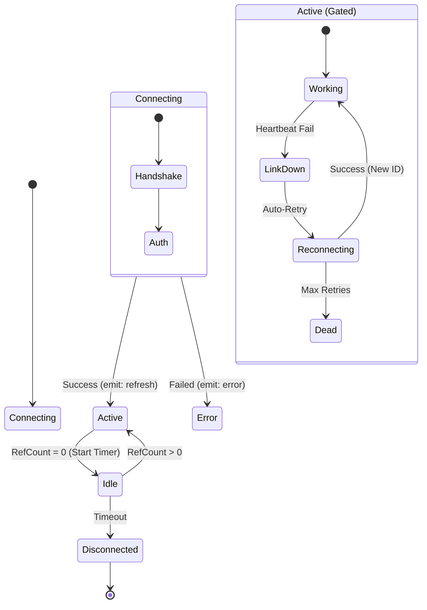
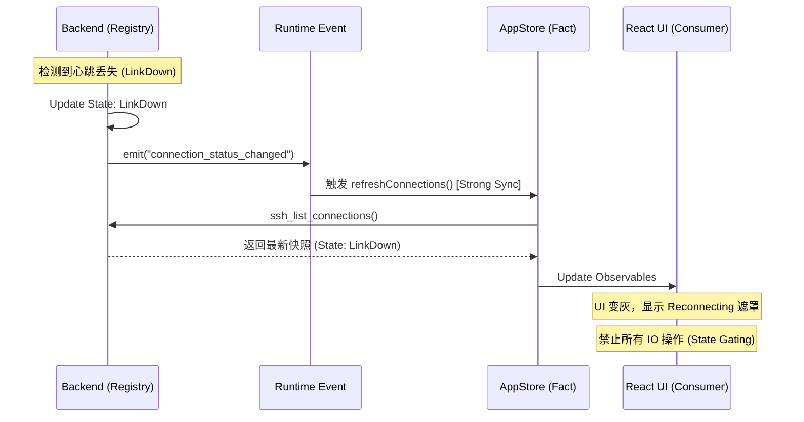
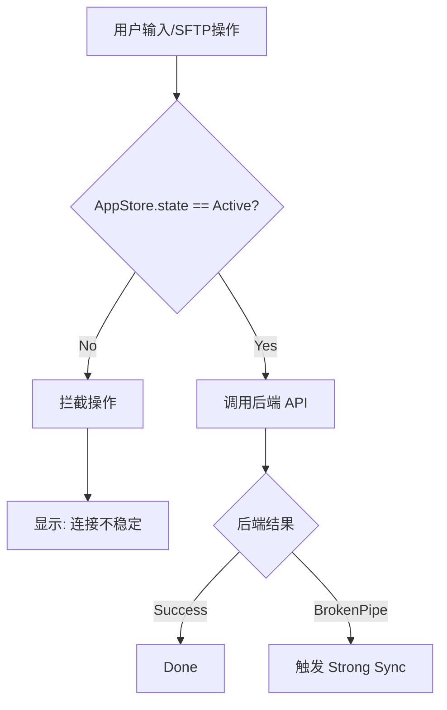

# SSH Connection Pool (v1.4.0)

> **v1.4.0 核心架构**: 采用 "Strong Consistency Sync"（强一致性同步）与 "Key-Driven Reset"（键驱动重置）模式，确保前端视图与后端连接池状态的绝对对齐。

## 🎯 核心设计理念

在 v1.4.0 中，SSH 连接池不仅是后端的资源管理器，更是前端组件生命周期的**事实来源 (Source of Truth)**。

### 1. 强一致性同步 (Strong Consistency Sync)
- **绝对单一来源**：前端不再维护连接状态的"副本"，而是通过 `AppStore` 实时映射后端 `Registry` 的快照。
- **被动触发，主动拉取**：任何连接状态变更（如断开、重连）会触发 `refreshConnections()`，强制前端获取最新状态。

### 2. Key-Driven 自动重置
- **物理级销毁**：React 组件（终端、SFTP）使用 `key={sessionId + connectionId}`。当连接发生物理重置（如重连生成新 ID）时，组件树会被强制销毁并重建。
- **自动愈合**：通过此机制，消除了"旧组件持有死句柄"的一致性风险。

### 3. 生命周期门禁 (State Gating)
- **严格 IO 检查**：所有 IO 操作前必须经过 `connectionState === 'active'` 检查，否则直接拒绝，防止僵尸写入。

---

## 🏗️ 架构拓扑：多 Store 联动

连接池在 "Store 架构" 中的位置：

```mermaid
flowchart TD
    subgraph Frontend ["Frontend (Logic Layer)"]
        Tree[SessionTreeStore] -- "1. Intent (User Action)" --> API
        UI[React Components] -- "4. Render (Key=ID)" --> AppStore
    end

    subgraph Backend ["Backend (Registry)"]
        Reg[SshConnectionRegistry]
        Ref[RefCount System]
        Pool[Connection Pool]
    end

    subgraph State ["Shared Fact"]
        AppStore[AppStore (Fact)]
    end

    API[Tauri Command] -- "2. Execute" --> Reg
    Reg -- "3. Events (link_down/up)" --> AppStore
    AppStore -- "Sync" --> UI

    Reg <--> Pool
```

---

## 🔒 引用计数与生命周期管理

OxideTerm v1.4.0 依然保留了基于引用计数的资源管理，但增强了与前端组件的同步逻辑。

### 引用计数规则

| 消费者 (Consumer) | 行为模式 | Side Effect (v1.4.0) |
|-------------------|----------|----------------------|
| **Terminal Tab** | `add_ref` / `release` | tab 销毁时立即触发 `release`，并通过 `strong-sync` 更新 UI 状态 |
| **SFTP Panel** | `add_ref` / `release` | 依赖 `active` 状态门禁，连接断开时自动锁定界面 |
| **Port Forward** | `add_ref` / `release` | 独立于 Tab 存在，只要规则活动，连接保持 `Active` |

### 状态转换图 (v1.4.0 Strict Mode)

强调后端状态如何驱动前端行为：



---

## 🔄 核心机制详解

### 1. Strong Consistency Sync 流程

当后端连接池发生状态变更时，必须严格遵循以下同步流程：



### 2. Key-Driven Resilience (键驱动自愈)

这是 v1.4.0 处理“重连后句柄失效”问题的核心策略。

#### 问题场景
旧版本中，SSH 重连后生成了新的 `ConnectionID`，但前端终端组件仍持有旧的 `Handle`，导致输入无响应。

#### 解决方案

在 React 组件层：
```tsx
// 伪代码示例
<TerminalView 
  key={`${sessionId}-${connectionId}`} // <--- 核心：Key 包含连接 ID
  sessionId={sessionId} 
  connectionId={connectionId} 
/>
```

**重连流程**：
1. 后端重连成功，`ConnectionID` 变更 (例如 `conn_A` -> `conn_B`)。
2. `AppStore` 同步获取新 ID。
3. React 检测到 `key` 变化 (`sess_1-conn_A` -> `sess_1-conn_B`)。
4. **旧组件销毁**：清理旧句柄、取消订阅。
5. **新组件挂载**：获取新句柄，恢复 Shell 界面。

---

## 🛡️ 错误处理与门禁系统

v1.4.0 引入了严格的 **"State Gating" (状态门禁)** 机制。所有可能产生 IO 的操作（写入、resize、SFTP 操作）都必须经过门禁。

### 门禁逻辑

```rust
// 伪代码逻辑
macro_rules! check_gate {
    ($connection) => {
        if $connection.state != ConnectionState::Active {
            return Err(Error::GateClosed("Connection not active"));
        }
    }
}
```

### 前端防御示意



---

## 📊 连接池配置规范

v1.4.0 统一了配置结构，移除冗余字段。

```typescript
interface ConnectionPoolConfig {
    /** 空闲超时 (秒)，0 表示永不超时 */
    idle_timeout: number;
    
    /** 最大并发连接数限制 */
    max_connections: number;
    
    /** 是否启用 TCP KeepAlive */
    tcp_keepalive: boolean;
    
    /** 心跳间隔 (秒) */
    heartbeat_interval: number;
}
```

## 🧹 历史债务清理

- **已移除**: `ActiveConnectionCache` (前端缓存)，现直接依赖 `AppStore`。
- **已移除**: `reconnect_handle` 手动管理，现由后端自动托管。
- **已移除**: 前端侧的 `ping` 逻辑，完全依赖后端事件驱动。

---

*文档版本: v1.4.0 (Key-Driven Strict Mode)*
