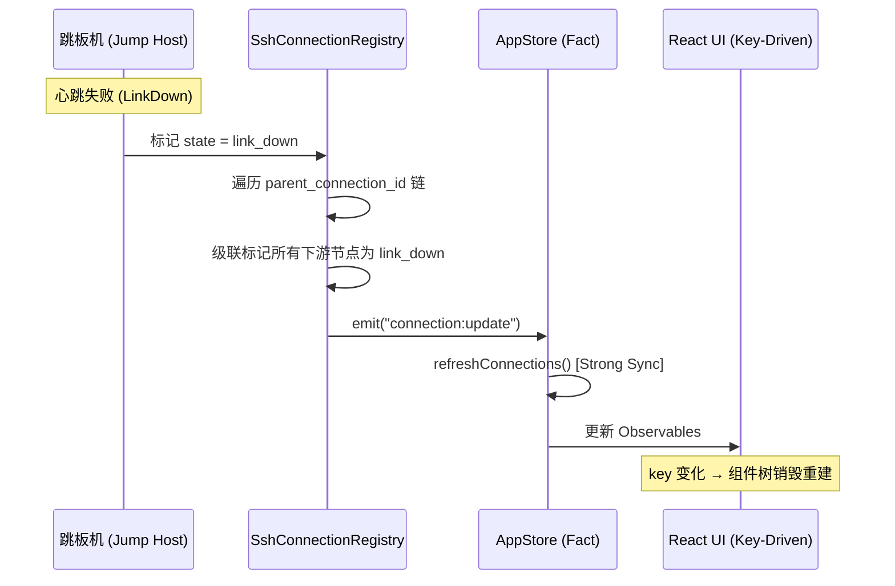
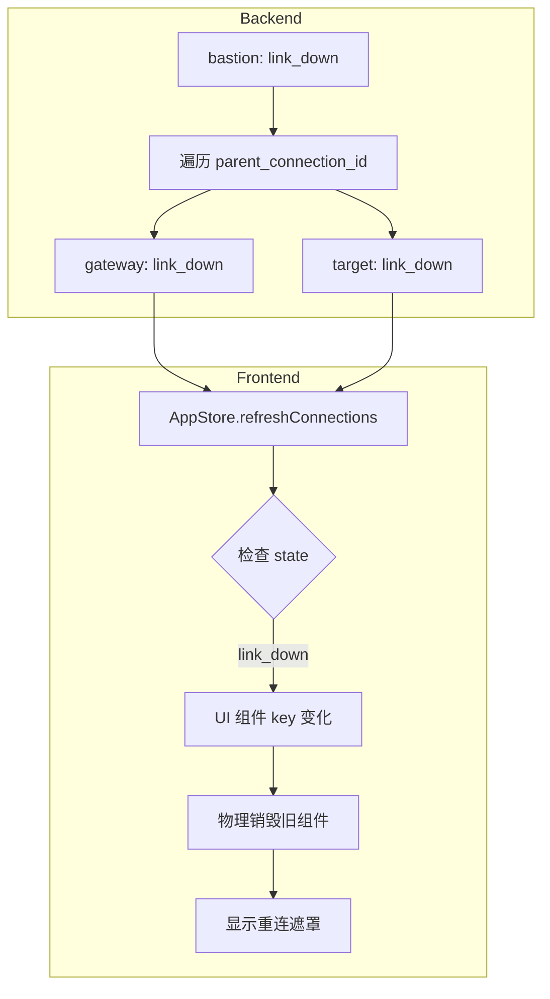

# 网络拓扑与 ProxyJump - 智能路由多跳连接 (v1.4.0)

> 通过拓扑图自动计算最优路径，支持无限级跳板机级联、动态节点钻入，以及 **级联故障自愈**。

## 🎯 核心概念

OxideTerm 提供两种方式管理多跳 SSH 连接：

1. **ProxyJump (proxy_chain)**：配置时静态指定跳板机链路
2. **Network Topology**：自动构建拓扑图，动态计算最优路径

### v1.4.0 架构对齐

在 v1.4.0 的 **Strong Consistency Sync** 架构下，网络拓扑模块遵循以下准则：

| 准则 | 实现 |
|------|------|
| **级联状态传播** | 当链路中任一跳板机断开，所有下游节点的连接状态同步标记为 `link_down` |
| **Key-Driven 销毁** | 前端组件使用 `key={sessionId-connectionId}`，链路断开时物理级销毁整棵组件树 |
| **路径记忆** | 重连后自动恢复之前的工作目录（SFTP）和端口转发规则 |

### 什么是 ProxyJump？

ProxyJump 是 OpenSSH 的标准功能，允许通过一个或多个跳板机（jump host / bastion）连接到目标服务器。

**传统 SSH 命令**：
```bash
# 单跳
ssh -J jumphost target

# 多跳
ssh -J jump1,jump2,jump3 target

# 完整格式
ssh -J admin@jump.example.com:2222 user@target.internal
```

**OxideTerm 实现**：将 ProxyJump 链路配置化，存储在 `proxy_chain` 字段中，支持无限级级联。

---

## 🌐 架构概览

```
┌────────────────────────────────────────────────────────────┐
│  Local Machine                                             │
│  ├── NetworkTopology                                       │
│  │   ├── nodes: 所有已保存的连接节点                      │
│  │   └── edges: 节点间的可达性关系                        │
│  │                                                         │
│  ├── Dijkstra 算法                                         │
│  │   └── 计算最短路径：local → jump1 → jump2 → target     │
│  │                                                         │
│  └── SshConnectionRegistry                                 │
│      └── establish_tunneled_connection()                   │
│          └── 通过父连接的 direct-tcpip 建立隧道           │
└────────────────────────────────────────────────────────────┘
```

### 状态同步流程 (v1.4.0 Strong Sync)



---

## 📦 proxy_chain 配置格式

### 数据结构

```rust
pub struct SavedConnection {
    pub id: String,
    pub name: String,
    pub host: String,
    pub port: u16,
    pub username: String,
    pub auth: SavedAuth,
    
    // ProxyJump 跳板机链路
    pub proxy_chain: Vec<ProxyHopConfig>,
    
    // 其他配置...
}

pub struct ProxyHopConfig {
    pub host: String,
    pub port: u16,
    pub username: String,
    pub auth: SavedAuth,
}
```

### 配置示例

#### 示例 1：单跳配置

```json
{
  "id": "prod-db",
  "name": "Production Database",
  "host": "db.internal",
  "port": 22,
  "username": "dba",
  "auth": { "type": "key", "key_path": "~/.ssh/id_prod" },
  
  "proxy_chain": [
    {
      "host": "bastion.example.com",
      "port": 22,
      "username": "admin",
      "auth": { "type": "agent" }
    }
  ]
}
```

**等价的 SSH 命令**：
```bash
ssh -J admin@bastion.example.com dba@db.internal
```

---

#### 示例 2：多跳配置（HPC 环境）

```json
{
  "id": "hpc-compute",
  "name": "Supercomputer Node",
  "host": "node123.cluster",
  "port": 22,
  "username": "researcher",
  "auth": { "type": "key", "key_path": "~/.ssh/id_hpc" },
  
  "proxy_chain": [
    {
      "host": "login.university.edu",
      "port": 22,
      "username": "student",
      "auth": { "type": "password", "keychain_id": "oxideterm-xxx" }
    },
    {
      "host": "gateway.cluster",
      "port": 22,
      "username": "admin",
      "auth": { "type": "agent" }
    }
  ]
}
```

**等价的 SSH 命令**：
```bash
ssh -J student@login.university.edu,admin@gateway.cluster researcher@node123.cluster
```

**连接流程**：
```
本地 → login.university.edu → gateway.cluster → node123.cluster
       (跳板机 1)              (跳板机 2)          (目标服务器)
```

---

#### 示例 3：复杂认证链路

```json
{
  "id": "nested-service",
  "name": "Deep Internal Service",
  "host": "10.0.3.50",
  "port": 22,
  "username": "service",
  "auth": { "type": "password", "keychain_id": "oxideterm-yyy" },
  
  "proxy_chain": [
    {
      "host": "public.gateway.com",
      "port": 2222,
      "username": "vpn_user",
      "auth": { "type": "key", "key_path": "~/.ssh/id_vpn", "has_passphrase": true }
    },
    {
      "host": "internal.gateway",
      "port": 22,
      "username": "admin",
      "auth": { "type": "certificate", "key_path": "~/.ssh/id_cert", "cert_path": "~/.ssh/id_cert-cert.pub" }
    },
    {
      "host": "10.0.2.10",
      "port": 22,
      "username": "operator",
      "auth": { "type": "agent" }
    }
  ]
}
```

**特点**：
- 跳板机 1：非标准端口 (2222) + 带密码的私钥
- 跳板机 2：SSH 证书认证
- 跳板机 3：SSH Agent
- 目标服务器：密码认证

---

## 🗺️ Network Topology（拓扑图）

### 自动构建拓扑

OxideTerm 从保存的连接配置中**自动生成**拓扑图：

#### 规则

1. **节点 (Nodes)**：每个保存的连接 = 一个节点
2. **边 (Edges)**：从 `proxy_chain` 推断可达性
   - 无 `proxy_chain` → `local → 目标`
   - 有 `proxy_chain` → `local → hop1 → hop2 → ... → 目标`

#### 示例

**保存的连接**：

```json
[
  {
    "id": "bastion",
    "name": "Jump Host",
    "host": "bastion.example.com",
    "port": 22,
    "username": "admin",
    "auth": { "type": "agent" },
    "proxy_chain": []
  },
  {
    "id": "db-server",
    "name": "Database Server",
    "host": "db.internal",
    "port": 22,
    "username": "dba",
    "auth": { "type": "key", "key_path": "~/.ssh/id_db" },
    "proxy_chain": [
      {
        "host": "bastion.example.com",
        "port": 22,
        "username": "admin",
        "auth": { "type": "agent" }
      }
    ]
  }
]
```

**生成的拓扑图**：

```
Nodes:
  - bastion (bastion.example.com:22)
  - db-server (db.internal:22)

Edges:
  - local → bastion (cost: 1)
  - bastion → db-server (cost: 1)
```

**可视化**：

```
┌───────┐      ┌─────────┐      ┌───────────┐
│ local │ ───► │ bastion │ ───► │ db-server │
└───────┘      └─────────┘      └───────────┘
```

---

### Dijkstra 路径计算

OxideTerm 使用 **Dijkstra 算法**计算从 `local` 到目标节点的最短路径。

#### 算法特点

- **Cost**：每条边的代价（默认为 1，可自定义）
- **最短路径**：总 cost 最小的路径
- **自动规避**：如果某条路径不可用，自动选择替代路径

#### 示例：复杂拓扑

```
┌───────┐
│ local │
└───┬───┘
    │
    ├────────────────┬─────────────────┐
    │                │                 │
    ▼                ▼                 ▼
┌─────────┐      ┌──────┐        ┌─────────┐
│ bastion │      │ vpn  │        │ direct  │
└────┬────┘      └───┬──┘        └────┬────┘
     │               │                 │
     ├───────────────┤                 │
     │               │                 │
     ▼               ▼                 ▼
┌─────────┐      ┌──────┐        ┌─────────┐
│   hpc   │      │  db  │        │  web    │
└─────────┘      └──────┘        └─────────┘
```

**路径计算**：

| 目标 | 最短路径 | 总 Cost |
|------|---------|---------|
| `hpc` | local → bastion → hpc | 2 |
| `db` | local → vpn → db | 2 |
| `web` | local → direct → web | 2 |

**如果 bastion 不可用**：
- 目标 `hpc` 的路径变为：`local → vpn → hpc` (假设存在边)

---

### 自定义边覆盖

用户可以通过配置文件添加或排除边：

#### 配置文件位置

```
~/Library/Application Support/oxideterm/topology_edges.json (macOS)
~/.config/oxideterm/topology_edges.json (Linux)
%APPDATA%\OxideTerm\topology_edges.json  (Windows)
```

#### 配置格式

```json
{
  "custom_edges": [
    {
      "from": "bastion",
      "to": "web",
      "cost": 1
    }
  ],
  "excluded_edges": [
    {
      "from": "local",
      "to": "direct",
      "cost": 1
    }
  ]
}
```

**效果**：
- `custom_edges`：添加新的可达性关系（即使配置中不存在）
- `excluded_edges`：移除自动生成的边（例如：禁止直连某些服务器）

---

## 🔧 动态钻入（Tunneled Connection）

### 什么是动态钻入？

在已连接的跳板机上，**动态建立**到另一台服务器的新连接，无需预先配置。

### 工作原理

```
本地 ──SSH──► 跳板机
              ↓
              SSH (通过 direct-tcpip)
              ↓
            目标服务器
```

**关键技术**：
- 使用父连接的 `direct-tcpip` channel
- 在 channel 上建立新的 SSH 连接
- 父连接标记为 `parent_connection_id`

### 使用场景

1. **探索未知网络**：先连到跳板机，再逐步探索内网服务器
2. **临时连接**：不想保存到配置的一次性连接
3. **调试路由**：测试某个跳板机是否能到达目标

### API 调用

```rust
let new_connection_id = registry.establish_tunneled_connection(
    parent_connection_id,  // 已连接的跳板机 ID
    target_config,         // 目标服务器配置
).await?;
```

---

## ⚡ 级联故障处理 (v1.4.0)

当多跳链路中的某个节点断开时，v1.4.0 架构确保整条链路的状态一致性和前端组件的自动自愈。

### 问题场景

```
local → bastion → gateway → target
              ↑
         心跳失败！
```

当 `bastion` 断开时，`gateway` 和 `target` 的连接也会失效（因为它们依赖 `bastion` 的 `direct-tcpip` 隧道）。

### 解决方案：级联状态传播



### 实现细节

1. **后端级联标记**：
   ```rust
   // 当检测到 link_down 时
   fn propagate_link_down(&self, connection_id: &str) {
       // 找到所有以此连接为 parent 的下游连接
       let children = self.find_children(connection_id);
       for child_id in children {
           self.set_state(&child_id, ConnectionState::LinkDown);
           self.propagate_link_down(&child_id); // 递归
       }
   }
   ```

2. **前端 Key-Driven 销毁**：
   ```tsx
   // 伪代码：连接 ID 变化时，整个终端组件树重建
   <TerminalView
     key={`${sessionId}-${connectionId}`}
     sessionId={sessionId}
   />
   ```

3. **路径记忆与恢复**：
   - SFTP 当前路径存入 `PathMemoryMap[sessionId]`
   - 重连成功后，新组件挂载时自动恢复路径

### 状态门禁

在级联故障期间，所有 IO 操作被 **State Gating** 拦截：

```typescript
// 前端检查
if (appStore.getConnectionState(sessionId) !== 'active') {
  // 拒绝操作，显示 "连接不稳定" 提示
  return;
}
```

---

## 📊 拓扑可视化

### 节点信息

```typescript
interface TopologyNodeInfo {
  id: string;
  host: string;
  port: number;
  username: string;
  displayName?: string;
  authType: string;
  isLocal: boolean;
  neighbors: string[];         // 可直接到达的节点列表
  tags: string[];
  savedConnectionId?: string;  // 关联的保存连接 ID
}
```

### 边信息

```typescript
interface TopologyEdge {
  from: string;   // 源节点 ID ("local" 表示本地)
  to: string;     // 目标节点 ID
  cost: number;   // 边的代价
}
```

### 路由结果

```typescript
interface RouteResult {
  path: string[];      // 中间节点 (不包括 local 和 target)
  totalCost: number;   // 总代价
}
```

**示例**：

```typescript
// 请求路由到 "prod-db"
const route = await invoke('expand_auto_route', { targetId: 'prod-db' });

// 返回
{
  path: ["bastion", "gateway"],
  totalCost: 3
}

// 解释：local → bastion → gateway → prod-db
```

---

## 🎨 使用场景

### 场景 1：企业 VPN 网络

```
本地 → 公网 VPN → 内网网关 → 各个服务器
```

**配置**：
- 保存一个 VPN 连接（无 proxy_chain）
- 其他服务器的 `proxy_chain` 指向 VPN

**优势**：
- 自动推断：所有内网服务器都需要通过 VPN
- 路径计算：自动选择 VPN 作为跳板机

---

### 场景 2：HPC 集群

```
本地 → 大学登录节点 → 集群网关 → 计算节点
```

**配置**：
- 登录节点：无 proxy_chain
- 集群网关：`proxy_chain = [登录节点]`
- 计算节点：`proxy_chain = [登录节点, 集群网关]`

**优势**：
- 拓扑图自动显示层级结构
- 可视化节点间的依赖关系

---

### 场景 3：多云环境

```
本地 
  ├─► AWS 跳板机 → AWS 服务器
  ├─► Azure 跳板机 → Azure 服务器
  └─► GCP 跳板机 → GCP 服务器
```

**配置**：
- 每个云的跳板机：无 proxy_chain（直连）
- 云内服务器：`proxy_chain` 指向对应跳板机

**优势**：
- 拓扑图清晰展示多云结构
- 路径计算自动选择正确的跳板机

---

## 🛠️ 高级功能

### 1. 节点复用

如果 `proxy_chain` 中的跳板机已保存为连接，拓扑图会**复用**该节点，避免重复。

**示例**：

```json
// 保存的连接 1
{
  "id": "bastion",
  "name": "Bastion",
  "host": "bastion.example.com",
  "port": 22,
  "username": "admin",
  "auth": { "type": "agent" },
  "proxy_chain": []
}

// 保存的连接 2
{
  "id": "web-server",
  "name": "Web Server",
  "host": "web.internal",
  "port": 22,
  "username": "www",
  "auth": { "type": "key", "key_path": "~/.ssh/id_web" },
  "proxy_chain": [
    {
      "host": "bastion.example.com",  // 匹配已保存连接
      "port": 22,
      "username": "admin",
      "auth": { "type": "agent" }
    }
  ]
}
```

**生成的拓扑**：

```
Nodes:
  - bastion (saved_connection_id: "bastion")
  - web-server (saved_connection_id: "web-server")

Edges:
  - local → bastion
  - bastion → web-server
```

**优势**：
- 拓扑图节点数减少
- 可直接使用已保存的认证信息

---

### 2. 自动生成临时节点

如果 `proxy_chain` 中的跳板机**未保存**，拓扑图会自动生成临时节点。

**示例**：

```json
{
  "id": "db",
  "name": "Database",
  "host": "db.internal",
  "proxy_chain": [
    {
      "host": "temp-jump.example.com",  // 未保存的跳板机
      "port": 22,
      "username": "temp",
      "auth": { "type": "password", "keychain_id": "xxx" }
    }
  ]
}
```

**生成的节点**：

```
temp@temp-jump.example.com:22
  ├── id: "temp:temp-jump.example.com:22"
  ├── tags: ["auto-generated"]
  └── saved_connection_id: null
```

**优势**：
- 无需为每个跳板机创建保存连接
- 拓扑图仍然完整

---

### 3. Cost 自定义

默认每条边的 cost = 1，但可以通过 `custom_edges` 自定义：

```json
{
  "custom_edges": [
    {
      "from": "local",
      "to": "slow-vpn",
      "cost": 10  // 高延迟路径
    },
    {
      "from": "local",
      "to": "fast-fiber",
      "cost": 1   // 低延迟路径
    }
  ]
}
```

**效果**：
- 路径计算会优先选择 `fast-fiber`
- 即使 `slow-vpn` 路径更短（跳数少）

---

## 🔍 故障排查

### Q: 拓扑图中找不到某个连接？

A: 检查：
- 连接是否已保存？
- `proxy_chain` 配置是否正确？
- 节点 ID 是否匹配？

### Q: 路径计算失败（No route found）？

A: 可能的原因：
- 目标节点不可达（孤立节点）
- 缺少必要的边
- 所有路径都被 `excluded_edges` 排除

解决方案：
- 检查 `proxy_chain` 配置
- 添加 `custom_edges` 补充可达性

### Q: 拓扑图中出现重复节点？

A: 如果跳板机的 host:port:username 不完全匹配，会生成多个节点。

解决方案：
- 确保 `proxy_chain` 中的跳板机信息与保存连接一致
- 或允许重复（不影响功能）

---

## 📚 API 参考

### 构建拓扑

```rust
let connections = config.get_all_connections();
let topology = NetworkTopology::build_from_connections(&connections);
```

### 计算路由

```rust
let route = topology.compute_route("target-id")?;
println!("Path: {:?}", route.path);       // ["jump1", "jump2"]
println!("Total cost: {}", route.total_cost);  // 3
```

### 获取所有节点

```rust
let nodes = topology.get_all_nodes();
for node in nodes {
    println!("{}: {} neighbors", node.id, node.neighbors.len());
}
```

### 添加自定义边

```rust
NetworkTopology::add_custom_edge(
    "bastion".to_string(),
    "db".to_string(),
    1
)?;
```

### 排除边

```rust
NetworkTopology::exclude_edge(
    "local".to_string(),
    "untrusted".to_string()
)?;
```

---

## 🎯 最佳实践

### 1. 保存常用跳板机

将频繁使用的跳板机保存为独立连接，拓扑图会自动复用。

### 2. 使用有意义的名称

节点 ID 和 display_name 使用描述性名称，便于拓扑可视化。

### 3. 标记临时连接

使用 `tags` 标记临时或测试连接：

```json
{
  "tags": ["temp", "test", "auto-generated"]
}
```

### 4. 定期清理

删除不再使用的连接和自定义边，保持拓扑图简洁。

### 5. 合理设置 Cost

根据实际网络延迟和带宽设置 cost，让路径计算更准确。

---

*文档版本: v1.4.0 | 最后更新: 2026-02-04*
