# OxideTerm 核心系统参考文档

> **项目版本**: v0.20.1  
> **文档状态**: 合并自 10 份独立参考文档  
> **最后更新**: 2026-03-24

---

## 目录

- [1. SSH 连接池与状态管理](#1-ssh-连接池与状态管理)
- [2. 网络拓扑与 ProxyJump](#2-网络拓扑与-proxyjump)
- [3. 重连编排器](#3-重连编排器)
- [4. 端口转发](#4-端口转发)
- [5. SFTP 文件管理](#5-sftp-文件管理)
- [6. 远程代理（Remote Agent）](#6-远程代理remote-agent)
- [7. SSH Agent 认证](#7-ssh-agent-认证)
- [8. 资源监控器（Resource Profiler）](#8-资源监控器resource-profiler)
- [9. 远程环境探测器（Environment Detector）](#9-远程环境探测器environment-detector)
- [10. IDE 模式（轻量级远程开发）](#10-ide-模式轻量级远程开发)
- [附录](#附录)

---

## 1. SSH 连接池与状态管理

> 合并来源: `CONNECTION_POOL.md` (v1.4.0)  
> 代码验证: 2026-03-24

SSH 连接池不仅是后端的资源管理器，更是前端组件生命周期的**事实来源 (Source of Truth)**。整体采用 **Strong Consistency Sync**（强一致性同步）与 **Key-Driven Reset**（键驱动重置）模式，确保前端视图与后端连接池状态的绝对对齐。

### 1.1 核心设计理念

#### 1.1.1 强一致性同步 (Strong Consistency Sync)

- **绝对单一来源**：前端不再维护连接状态的"副本"，而是通过 `AppStore` 实时映射后端 `Registry` 的快照。
- **被动触发，主动拉取**：任何连接状态变更（如断开、重连）会触发 `refreshConnections()`，强制前端获取最新状态。

#### 1.1.2 Key-Driven 自动重置

- **物理级销毁**：React 组件（终端、SFTP）使用 `key={sessionId + connectionId}`。当连接发生物理重置（如重连生成新 ID）时，组件树会被强制销毁并重建。
- **自动愈合**：通过此机制，消除了"旧组件持有死句柄"的一致性风险。

#### 1.1.3 生命周期门禁 (State Gating)

- **严格 IO 检查**：所有 IO 操作前必须经过 `connectionState === 'active'` 检查，否则直接拒绝，防止僵尸写入。

### 1.2 架构拓扑：多 Store 联动

OxideTerm 前端采用 18 个专用 Zustand Store 协同工作。连接池在 Store 架构中的位置如下：

```mermaid
flowchart TD
    subgraph Frontend ["Frontend (Logic Layer)"]
        Tree[SessionTreeStore] -- "1. Intent (User Action)" --> API
        UI[React Components] -- "4. Render (Key=ID)" --> AppStore
    end

    subgraph Backend ["Backend (Registry)"]
        Reg[SshConnectionRegistry]
        Ref[RefCount System]
        Pool[Connection Pool]
    end

    subgraph State ["Shared Fact"]
        AppStore[AppStore (Fact)]
    end

    API[Tauri Command] -- "2. Execute" --> Reg
    Reg -- "3. Events (link_down/up)" --> AppStore
    AppStore -- "Sync" --> UI

    Reg <--> Pool
```

18 个 Store 的功能分工：

| Store | 职责 |
|-------|------|
| `sessionTreeStore` | 用户意图（会话树结构、连接流） |
| `appStore` | 连接事实（`connections` Map，后端状态映射） |
| `localTerminalStore` | 本地 PTY 生命周期 |
| `ideStore` | IDE 模式状态 |
| `reconnectOrchestratorStore` | 自动重连管道编排 |
| `transferStore` | SFTP 传输队列 |
| `pluginStore` | 插件运行时状态 |
| `profilerStore` | 资源分析器 |
| `aiChatStore` | OxideSens AI 聊天状态 |
| `settingsStore` | 应用设置 |
| `broadcastStore` | 广播输入到多个终端面板 |
| `commandPaletteStore` | 命令面板状态 |
| `eventLogStore` | 连接生命周期事件日志 |
| `launcherStore` | 平台应用启动器 |
| `recordingStore` | 会话录制与回放 |
| `updateStore` | 自动更新生命周期 |
| `agentStore` | 远程 Agent 管理 |
| `ragStore` | RAG 知识检索状态 |

### 1.3 引用计数与生命周期管理

基于引用计数的资源管理确保连接在无消费者时自动回收。

#### 引用计数规则

| 消费者 (Consumer) | 行为模式 | Side Effect |
|-------------------|----------|-------------|
| **Terminal Tab** | `add_ref` / `release` | Tab 销毁时立即触发 `release`，并通过 Strong Sync 更新 UI 状态 |
| **SFTP Panel** | `add_ref` / `release` | 依赖 `active` 状态门禁，连接断开时自动锁定界面 |
| **Port Forward** | `add_ref` / `release` | 独立于 Tab 存在，只要规则活动，连接保持 `Active` |

#### 状态转换图

后端状态驱动前端行为的完整状态机：

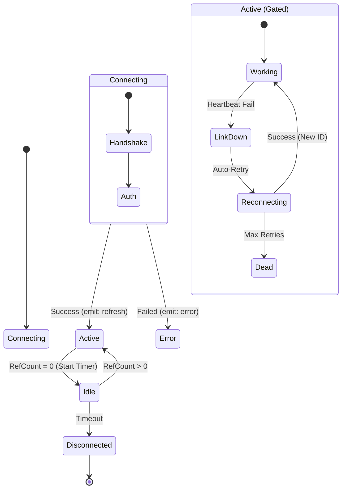

Rust 后端定义的 `ConnectionState` 枚举值：

| 状态 | 含义 |
|------|------|
| `Connecting` | 连接中 |
| `Active` | 已连接，有活跃使用者 |
| `Idle` | 已连接，无使用者，等待超时 |
| `LinkDown` | 链路断开（心跳失败），等待重连 |
| `Reconnecting` | 正在重连 |
| `Disconnecting` | 正在断开 |
| `Disconnected` | 已断开 |

### 1.4 核心机制详解

#### 1.4.1 Strong Consistency Sync 流程

当后端连接池发生状态变更时，必须严格遵循以下同步流程：

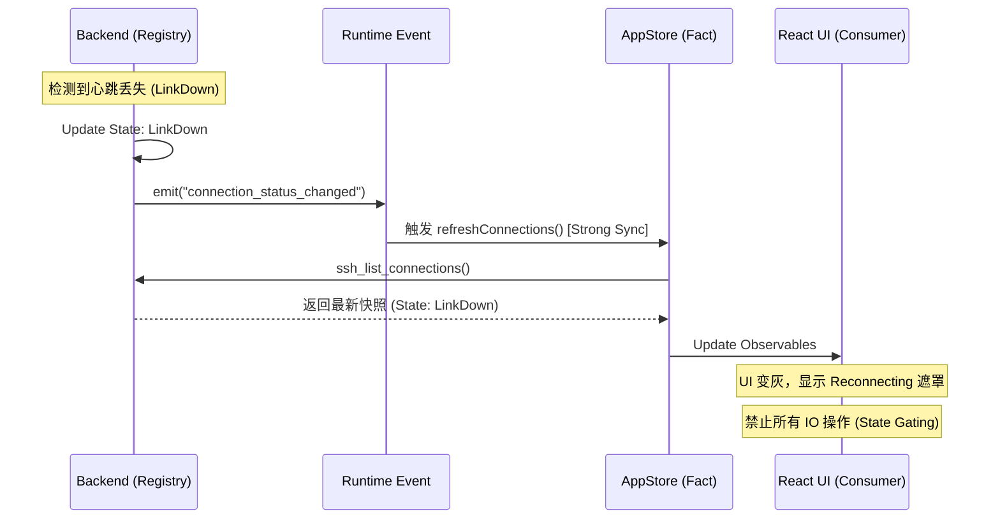

#### 1.4.2 Key-Driven Resilience（键驱动自愈）

##### 问题场景

旧版本中，SSH 重连后生成了新的 `ConnectionID`，但前端终端组件仍持有旧的 `Handle`，导致输入无响应。

##### 解决方案

在 React 组件层：
```tsx
<TerminalView 
  key={`${sessionId}-${connectionId}`}  // Key 包含连接 ID
  sessionId={sessionId} 
  connectionId={connectionId} 
/>
```

**重连流程**：
1. 后端重连成功，`ConnectionID` 变更（例如 `conn_A` → `conn_B`）。
2. `AppStore` 同步获取新 ID。
3. React 检测到 `key` 变化（`sess_1-conn_A` → `sess_1-conn_B`）。
4. **旧组件销毁**：清理旧句柄、取消订阅。
5. **新组件挂载**：获取新句柄，恢复 Shell 界面。

### 1.5 错误处理与门禁系统

所有可能产生 IO 的操作（写入、resize、SFTP 操作）都必须经过状态门禁。

#### 后端门禁逻辑

```rust
macro_rules! check_gate {
    ($connection) => {
        if $connection.state != ConnectionState::Active {
            return Err(Error::GateClosed("Connection not active"));
        }
    }
}
```

#### 前端防御示意

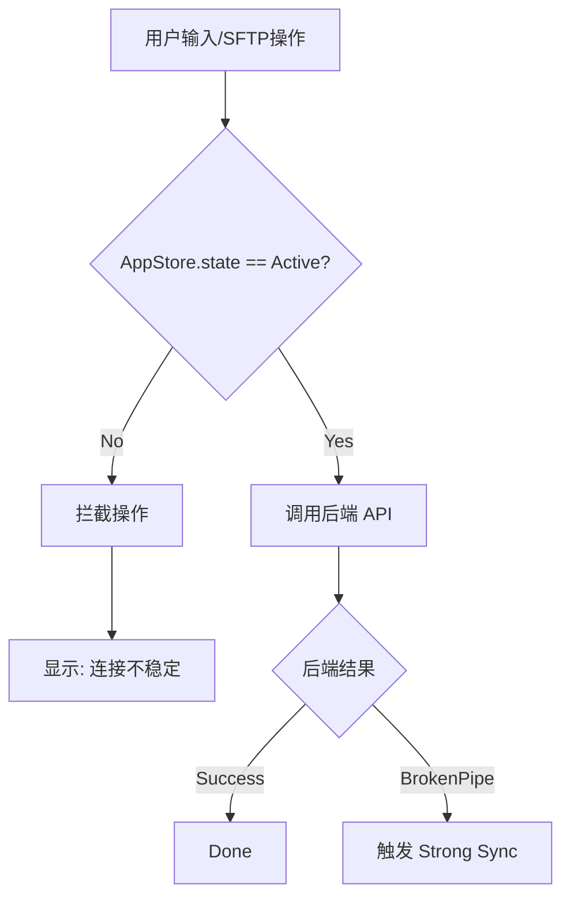

### 1.6 连接池配置规范

TypeScript 类型（`src/types/index.ts`）：

```typescript
export interface ConnectionPoolConfig {
  idleTimeoutSecs: number;
  maxConnections: number;
  protectOnExit: boolean;
}
```

Rust 结构体（`src-tauri/src/ssh/connection_registry.rs`）：

```rust
#[derive(Debug, Clone, Serialize, Deserialize)]
pub struct ConnectionPoolConfig {
    /// 空闲超时时间（秒）
    #[serde(default = "default_idle_timeout_secs")]
    pub idle_timeout_secs: u64,

    /// 最大连接数（0 = 无限制）
    #[serde(default)]
    pub max_connections: usize,

    /// 是否在应用退出时保护连接（graceful shutdown）
    #[serde(default = "default_true")]
    pub protect_on_exit: bool,
}
```

默认值：

| 字段 | 默认值 | 说明 |
|------|--------|------|
| `idleTimeoutSecs` | 1800 | 30 分钟空闲超时 |
| `maxConnections` | 0 | 无限制 |
| `protectOnExit` | true | 退出时优雅关闭 |

### 1.7 历史债务清理

| 项目 | 状态 | 说明 |
|------|------|------|
| `ActiveConnectionCache` | ✅ 已移除 | 前端缓存，现直接依赖 `AppStore` |
| `reconnect_handle` 手动管理 | ✅ 已移除 | 重连由前端 `reconnectOrchestratorStore` 编排（v1.6.2+），后端 auto-reconnect 已标记为 NEUTRALIZED STUB |
| 前端侧 `ping` 逻辑 | ✅ 已移除 / ⚠️ 部分回归 | 原始前端 ping 逻辑已移除，完全依赖后端事件驱动。但 v1.11.1 新增了 `probeConnections` / `probeSingleConnection` IPC 命令，用于 Grace Period 阶段的连接存活探测（非常规心跳，仅在重连管道中使用） |

---

## 2. 网络拓扑与 ProxyJump

> 合并来源: `NETWORK_TOPOLOGY.md` (v1.4.0)  
> 代码验证: 2026-03-24

OxideTerm 通过拓扑图自动计算最优路径，支持无限级跳板机级联、动态节点钻入，以及级联故障自愈。

### 2.1 核心概念

OxideTerm 提供两种方式管理多跳 SSH 连接：

1. **ProxyJump (`proxy_chain`)**：配置时静态指定跳板机链路
2. **Network Topology**：自动构建拓扑图，动态计算最优路径

在 Strong Consistency Sync 架构下，网络拓扑模块遵循以下准则：

| 准则 | 实现 |
|------|------|
| **级联状态传播** | 当链路中任一跳板机断开，所有下游节点的连接状态同步标记为 `link_down` |
| **Key-Driven 销毁** | 前端组件使用 `key={sessionId-connectionId}`，链路断开时物理级销毁整棵组件树 |
| **路径记忆** | 重连后自动恢复之前的工作目录（SFTP）和端口转发规则 |

#### 什么是 ProxyJump？

ProxyJump 是 OpenSSH 的标准功能，允许通过一个或多个跳板机（jump host / bastion）连接到目标服务器。

```bash
# 单跳
ssh -J jumphost target

# 多跳
ssh -J jump1,jump2,jump3 target

# 完整格式
ssh -J admin@jump.example.com:2222 user@target.internal
```

OxideTerm 将 ProxyJump 链路配置化，存储在 `proxy_chain` 字段中，支持无限级级联。

### 2.2 架构概览

```
┌────────────────────────────────────────────────────────────┐
│  Local Machine                                             │
│  ├── NetworkTopology                                       │
│  │   ├── nodes: 所有已保存的连接节点                      │
│  │   └── edges: 节点间的可达性关系                        │
│  │                                                         │
│  ├── Dijkstra 算法                                         │
│  │   └── 计算最短路径：local → jump1 → jump2 → target     │
│  │                                                         │
│  └── SshConnectionRegistry                                 │
│      └── establish_tunneled_connection()                   │
│          └── 通过父连接的 direct-tcpip 建立隧道           │
└────────────────────────────────────────────────────────────┘
```

#### 状态同步流程 (Strong Consistency Sync)

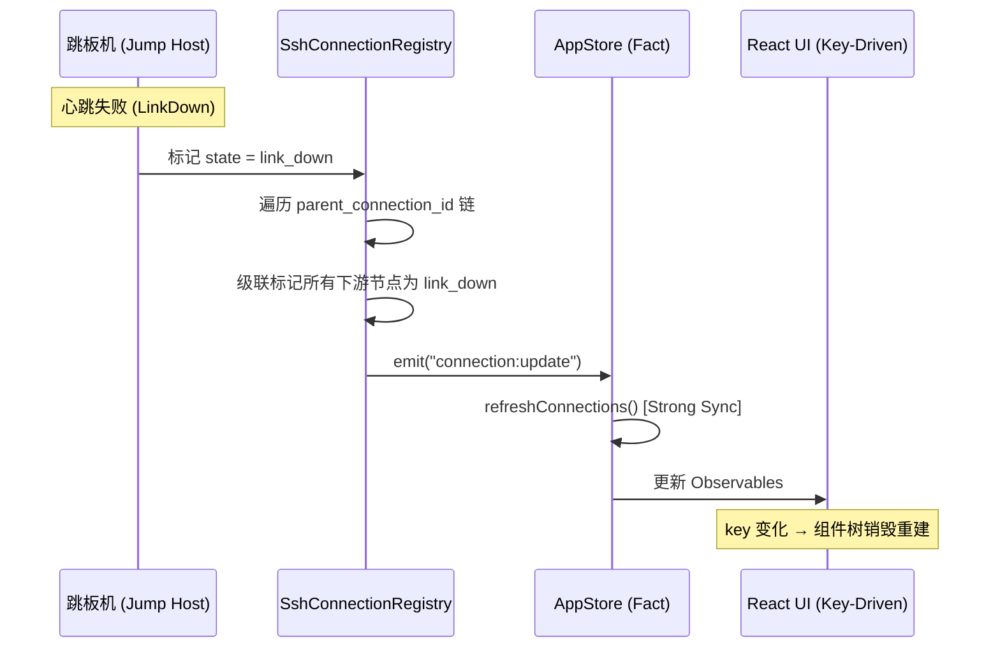

### 2.3 proxy_chain 配置格式

#### 数据结构

```rust
pub struct SavedConnection {
    pub id: String,
    pub name: String,
    pub host: String,
    pub port: u16,
    pub username: String,
    pub auth: SavedAuth,
    
    // ProxyJump 跳板机链路
    pub proxy_chain: Vec<ProxyHopConfig>,
}

pub struct ProxyHopConfig {
    pub host: String,
    pub port: u16,
    pub username: String,
    pub auth: SavedAuth,
}
```

#### 示例 1：单跳配置（Bastion → 数据库）

```json
{
  "id": "prod-db",
  "name": "Production Database",
  "host": "db.internal",
  "port": 22,
  "username": "dba",
  "auth": { "type": "key", "key_path": "~/.ssh/id_prod" },
  
  "proxy_chain": [
    {
      "host": "bastion.example.com",
      "port": 22,
      "username": "admin",
      "auth": { "type": "agent" }
    }
  ]
}
```

等价的 SSH 命令：
```bash
ssh -J admin@bastion.example.com dba@db.internal
```

#### 示例 2：多跳配置（HPC 环境）

```json
{
  "id": "hpc-compute",
  "name": "Supercomputer Node",
  "host": "node123.cluster",
  "port": 22,
  "username": "researcher",
  "auth": { "type": "key", "key_path": "~/.ssh/id_hpc" },
  
  "proxy_chain": [
    {
      "host": "login.university.edu",
      "port": 22,
      "username": "student",
      "auth": { "type": "password", "keychain_id": "oxideterm-xxx" }
    },
    {
      "host": "gateway.cluster",
      "port": 22,
      "username": "admin",
      "auth": { "type": "agent" }
    }
  ]
}
```

等价的 SSH 命令：
```bash
ssh -J student@login.university.edu,admin@gateway.cluster researcher@node123.cluster
```

连接流程：
```
本地 → login.university.edu → gateway.cluster → node123.cluster
       (跳板机 1)              (跳板机 2)          (目标服务器)
```

#### 示例 3：复杂认证链路（4 跳不同认证方式）

```json
{
  "id": "nested-service",
  "name": "Deep Internal Service",
  "host": "10.0.3.50",
  "port": 22,
  "username": "service",
  "auth": { "type": "password", "keychain_id": "oxideterm-yyy" },
  
  "proxy_chain": [
    {
      "host": "public.gateway.com",
      "port": 2222,
      "username": "vpn_user",
      "auth": { "type": "key", "key_path": "~/.ssh/id_vpn", "has_passphrase": true }
    },
    {
      "host": "internal.gateway",
      "port": 22,
      "username": "admin",
      "auth": { "type": "certificate", "key_path": "~/.ssh/id_cert", "cert_path": "~/.ssh/id_cert-cert.pub" }
    },
    {
      "host": "10.0.2.10",
      "port": 22,
      "username": "operator",
      "auth": { "type": "agent" }
    }
  ]
}
```

特点：
- 跳板机 1：非标准端口 (2222) + 带密码的私钥
- 跳板机 2：SSH 证书认证
- 跳板机 3：SSH Agent
- 目标服务器：密码认证

### 2.4 Network Topology 自动构建

#### 构建规则

1. **节点 (Nodes)**：每个保存的连接 = 一个节点
2. **边 (Edges)**：从 `proxy_chain` 推断可达性
   - 无 `proxy_chain` → `local → 目标`
   - 有 `proxy_chain` → `local → hop1 → hop2 → ... → 目标`

#### 示例

**保存的连接**：

```json
[
  {
    "id": "bastion",
    "name": "Jump Host",
    "host": "bastion.example.com",
    "port": 22,
    "username": "admin",
    "auth": { "type": "agent" },
    "proxy_chain": []
  },
  {
    "id": "db-server",
    "name": "Database Server",
    "host": "db.internal",
    "port": 22,
    "username": "dba",
    "auth": { "type": "key", "key_path": "~/.ssh/id_db" },
    "proxy_chain": [
      {
        "host": "bastion.example.com",
        "port": 22,
        "username": "admin",
        "auth": { "type": "agent" }
      }
    ]
  }
]
```

**生成的拓扑图**：

```
Nodes:
  - bastion (bastion.example.com:22)
  - db-server (db.internal:22)

Edges:
  - local → bastion (cost: 1)
  - bastion → db-server (cost: 1)
```

**可视化**：

```
┌───────┐      ┌─────────┐      ┌───────────┐
│ local │ ───► │ bastion │ ───► │ db-server │
└───────┘      └─────────┘      └───────────┘
```

#### API 调用

```rust
let connections = config.get_all_connections();
let topology = NetworkTopology::build_from_connections(&connections);
```

### 2.5 Dijkstra 路径计算

OxideTerm 使用 **Dijkstra 算法**计算从 `local` 到目标节点的最短路径。

#### 算法特点

- **Cost**：每条边的代价（默认为 1，可自定义）
- **最短路径**：总 cost 最小的路径
- **自动规避**：如果某条路径不可用，自动选择替代路径

#### 示例：复杂拓扑

```
┌───────┐
│ local │
└───┬───┘
    │
    ├────────────────┬─────────────────┐
    │                │                 │
    ▼                ▼                 ▼
┌─────────┐      ┌──────┐        ┌─────────┐
│ bastion │      │ vpn  │        │ direct  │
└────┬────┘      └───┬──┘        └────┬────┘
     │               │                 │
     ├───────────────┤                 │
     │               │                 │
     ▼               ▼                 ▼
┌─────────┐      ┌──────┐        ┌─────────┐
│   hpc   │      │  db  │        │  web    │
└─────────┘      └──────┘        └─────────┘
```

**路径计算结果**：

| 目标 | 最短路径 | 总 Cost |
|------|---------|---------|
| `hpc` | local → bastion → hpc | 2 |
| `db` | local → vpn → db | 2 |
| `web` | local → direct → web | 2 |

当 bastion 不可用时，目标 `hpc` 的路径自动切换为 `local → vpn → hpc`（假设存在该边）。

### 2.6 自定义边覆盖

用户可以通过配置文件添加或排除边。

#### 配置文件位置

| 平台 | 路径 |
|------|------|
| macOS | `~/Library/Application Support/oxideterm/topology_edges.json` |
| Linux | `~/.config/oxideterm/topology_edges.json` |
| Windows | `%APPDATA%\OxideTerm\topology_edges.json` |

#### 配置格式

```json
{
  "custom_edges": [
    {
      "from": "bastion",
      "to": "web",
      "cost": 1
    }
  ],
  "excluded_edges": [
    {
      "from": "local",
      "to": "direct",
      "cost": 1
    }
  ]
}
```

- `custom_edges`：添加新的可达性关系（即使配置中不存在的边）
- `excluded_edges`：移除自动生成的边（例如禁止直连某些服务器）

Cost 自定义示例：

```json
{
  "custom_edges": [
    { "from": "local", "to": "slow-vpn", "cost": 10 },
    { "from": "local", "to": "fast-fiber", "cost": 1 }
  ]
}
```

路径计算会优先选择 `fast-fiber`，即使 `slow-vpn` 路径更短（跳数少）。

### 2.7 动态钻入（Tunneled Connection）

在已连接的跳板机上**动态建立**到另一台服务器的新连接，无需预先配置。

#### 工作原理

```
本地 ──SSH──► 跳板机
              ↓
              SSH (通过 direct-tcpip)
              ↓
            目标服务器
```

关键技术：
- 使用父连接的 `direct-tcpip` channel
- 在 channel 上建立新的 SSH 连接
- 父连接标记为 `parent_connection_id`

#### API 调用

```rust
let new_connection_id = registry.establish_tunneled_connection(
    parent_connection_id,  // 已连接的跳板机 ID
    target_config,         // 目标服务器配置
).await?;
```

#### 使用场景

1. **探索未知网络**：先连到跳板机，再逐步探索内网服务器
2. **临时连接**：不想保存到配置的一次性连接
3. **调试路由**：测试某个跳板机是否能到达目标

### 2.8 级联故障处理

当多跳链路中的某个节点断开时，架构确保整条链路的状态一致性和前端组件的自动自愈。

#### 问题场景

```
local → bastion → gateway → target
              ↑
         心跳失败！
```

当 `bastion` 断开时，`gateway` 和 `target` 的连接也会失效（因为它们依赖 `bastion` 的 `direct-tcpip` 隧道）。

#### 解决方案：级联状态传播

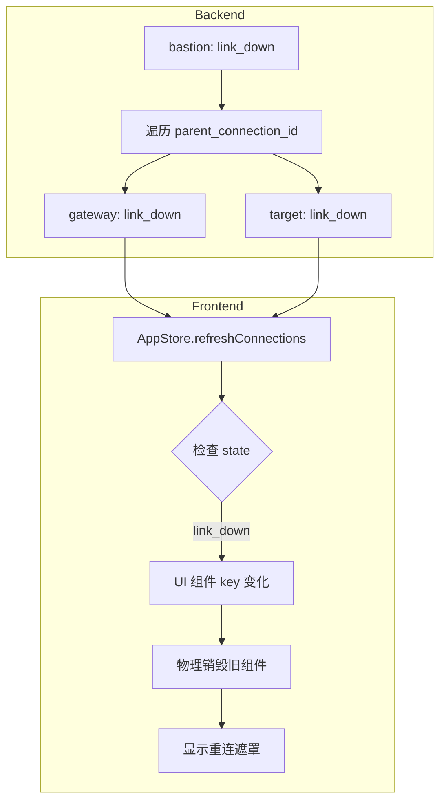

#### 实现细节

**1. 后端级联标记**：

```rust
fn propagate_link_down(&self, connection_id: &str) {
    // 找到所有以此连接为 parent 的下游连接
    let children = self.find_children(connection_id);
    for child_id in children {
        self.set_state(&child_id, ConnectionState::LinkDown);
        self.propagate_link_down(&child_id); // 递归
    }
}
```

**2. 前端 Key-Driven 销毁**：

```tsx
<TerminalView
  key={`${sessionId}-${connectionId}`}
  sessionId={sessionId}
/>
```

**3. 路径记忆与恢复**：
- SFTP 当前路径存入 `PathMemoryMap[sessionId]`
- 重连成功后，新组件挂载时自动恢复路径

**4. 状态门禁**：

在级联故障期间，所有 IO 操作被 State Gating 拦截：

```typescript
if (appStore.getConnectionState(sessionId) !== 'active') {
  // 拒绝操作，显示 "连接不稳定" 提示
  return;
}
```

### 2.9 拓扑可视化

#### 类型定义

**节点信息**：

```typescript
interface TopologyNodeInfo {
  id: string;
  host: string;
  port: number;
  username: string;
  displayName?: string;
  authType: string;
  isLocal: boolean;
  neighbors: string[];         // 可直接到达的节点列表
  tags: string[];
  savedConnectionId?: string;  // 关联的保存连接 ID
}
```

**边信息**：

```typescript
interface TopologyEdge {
  from: string;   // 源节点 ID ("local" 表示本地)
  to: string;     // 目标节点 ID
  cost: number;   // 边的代价
}
```

**路由结果**：

```typescript
interface RouteResult {
  path: string[];      // 中间节点（不包括 local 和 target）
  totalCost: number;   // 总代价
}
```

**示例**：

```typescript
const route = await invoke('expand_auto_route', { targetId: 'prod-db' });
// 返回: { path: ["bastion", "gateway"], totalCost: 3 }
// 解释: local → bastion → gateway → prod-db
```

### 2.10 使用场景

#### 场景 1：企业 VPN 网络

```
本地 → 公网 VPN → 内网网关 → 各个服务器
```

- 保存一个 VPN 连接（无 `proxy_chain`）
- 其他服务器的 `proxy_chain` 指向 VPN
- 拓扑自动推断所有内网服务器都需要通过 VPN

#### 场景 2：HPC 集群

```
本地 → 大学登录节点 → 集群网关 → 计算节点
```

- 登录节点：无 `proxy_chain`
- 集群网关：`proxy_chain = [登录节点]`
- 计算节点：`proxy_chain = [登录节点, 集群网关]`
- 拓扑图自动显示层级结构和依赖关系

#### 场景 3：多云环境

```
本地 
  ├─► AWS 跳板机 → AWS 服务器
  ├─► Azure 跳板机 → Azure 服务器
  └─► GCP 跳板机 → GCP 服务器
```

- 每个云的跳板机：无 `proxy_chain`（直连）
- 云内服务器：`proxy_chain` 指向对应跳板机
- 拓扑图清晰展示多云结构，路径计算自动选择正确的跳板机

### 2.11 高级功能

#### 2.11.1 节点复用

如果 `proxy_chain` 中的跳板机已保存为连接，拓扑图会**复用**该节点（通过 `saved_connection_id` 关联），避免重复。

匹配条件：跳板机的 `host:port:username` 与已保存连接完全一致。

```json
// 保存的连接: bastion
{ "id": "bastion", "host": "bastion.example.com", "port": 22, "username": "admin" }

// 另一个连接的 proxy_chain 引用了相同的 host:port:username
"proxy_chain": [
  { "host": "bastion.example.com", "port": 22, "username": "admin", "auth": { "type": "agent" } }
]
// → 拓扑图复用 "bastion" 节点，而非生成重复节点
```

#### 2.11.2 临时节点自动生成

如果 `proxy_chain` 中的跳板机**未保存**为连接，拓扑图会自动生成临时节点：

```
temp@temp-jump.example.com:22
  ├── id: "temp:temp-jump.example.com:22"
  ├── tags: ["auto-generated"]
  └── saved_connection_id: null
```

无需为每个跳板机创建保存连接，拓扑图仍然完整。

---

## 3. 重连编排器

> 合并来源: `RECONNECT_ORCHESTRATOR_PLAN.md`  
> 实现版本: v1.6.2，v1.11.1 新增 Grace Period  
> 代码验证: 2026-03-24（基于 `src/store/reconnectOrchestratorStore.ts` 实际代码）

### 3.1 设计背景与目标

#### 设计原因

1. **后端 auto-reconnect 已移除**（标记为 `NEUTRALIZED STUB`）。前端必须编排重连。
2. `useConnectionEvents` 此前仅有防抖 + `reconnectCascade` 调用，缺少重连后的服务恢复（端口转发、SFTP、IDE）。
3. 每次重连创建**新的 `connectionId`**（UUID），旧连接被放弃。
4. `resetNodeState` 是焦土模式重置：关闭终端（销毁 forwarding manager 和持久化规则）、清除所有 session ID、重置节点状态为 `pending`。
5. 终端恢复由 Key-Driven Reset（`key={sessionId-connectionId}`）自动处理，编排器不管终端生命周期。
6. 端口转发和 SFTP 传输需要在重连成功后显式恢复。

#### 设计目标

1. **单一重连大脑**：队列管理、节流、重试、可观测性集中在一个 Store 中。
2. **幂等可取消**：每个节点只有一个活跃 job，无重复工作。
3. **确定性恢复序列**：Snapshot → Grace Period → SSH → Forwards → SFTP → IDE。
4. **保留用户意图**：不恢复用户手动停止的转发；不恢复未保存的文件内容。

#### 非目标

1. ~~无后端改动~~ **（v1.11.1 更新）**：新增 `probe_connections` / `probe_single_connection` IPC 命令用于 Grace Period 支持。
2. 不自动恢复 `disconnected`（硬断开）事件——仅处理 `link_down`。
3. 不做内容级 IDE 恢复（只重新打开文件标签页）。
4. 不管理终端会话（由 Key-Driven Reset 处理）。

### 3.2 架构

#### 核心类型

**`ReconnectPhase` — 管道阶段枚举**：

```typescript
type ReconnectPhase =
  | 'queued'            // 已入队，等待执行
  | 'snapshot'          // 捕获重置前数据
  | 'grace-period'      // (v1.11.1) 尝试恢复现有连接
  | 'ssh-connect'       // 执行 reconnectCascade
  | 'await-terminal'    // 等待 Key-Driven Reset 重建终端
  | 'restore-forwards'  // 恢复端口转发规则
  | 'resume-transfers'  // 恢复 SFTP 传输
  | 'restore-ide'       // 恢复 IDE 文件标签页
  | 'verify'            // 验证恢复结果
  | 'done'              // 完成
  | 'failed'            // 失败
  | 'cancelled';        // 已取消
```

**`ReconnectJob` — 重连任务**：

```typescript
type ReconnectJob = {
  nodeId: string;
  nodeName: string;           // 用于 toast 消息
  status: ReconnectPhase;
  attempt: number;
  maxAttempts: number;        // 默认 5，可通过 settingsStore 配置
  startedAt: number;
  endedAt?: number;
  error?: string;
  snapshot: ReconnectSnapshot;
  abortController: AbortController;
  restoredCount: number;      // 已恢复的服务数量（用于 toast）
  phaseHistory: PhaseEvent[]; // 仅追加的阶段事件日志，用于调试
};
```

**`ReconnectSnapshot` — 重连快照**：

```typescript
type ReconnectSnapshot = {
  nodeId: string;
  snapshotAt: number;    // 快照时间戳，用于检测用户后续操作
  
  // 端口转发规则，在 resetNodeState 销毁前捕获
  forwardRules: Array<{
    nodeId: string;
    rules: ForwardRule[];   // 仅 active/suspended 规则，不含 stopped
  }>;
  
  // 旧终端 session ID（用于查询未完成的 SFTP 传输）
  oldTerminalSessionIds: string[];
  
  // 按 nodeId 分组的旧终端 session ID 映射
  perNodeOldSessionIds: Map<string, string[]>;
  
  // 未完成的 SFTP 传输，在 resetNodeState 销毁旧 session 前捕获
  incompleteTransfers: Array<{
    oldSessionId: string;
    transfers: IncompleteTransferInfo[];
  }>;
  
  // 按节点的旧 SSH connectionId 映射，用于 Grace Period 探测
  oldConnectionIds: Map<string, string>;
  
  // IDE 状态（如果 IDE 标签页为此节点打开）
  ideSnapshot?: {
    projectPath: string;
    tabPaths: string[];
    connectionId: string;      // 用于拓扑解析
    dirtyContents: Record<string, string>;  // 快照时的脏文件内容
  };
};
```

**`OrchestratorState` — Store 状态**：

```typescript
interface OrchestratorState {
  jobs: Map<string, ReconnectJob>;
  /** 可序列化视图，供 React 订阅 */
  jobEntries: Array<[string, ReconnectJob]>;
}

interface OrchestratorActions {
  scheduleReconnect: (nodeId: string) => void;
  cancel: (nodeId: string) => void;
  cancelAll: () => void;
  clearCompleted: () => void;
  getJob: (nodeId: string) => ReconnectJob | undefined;
}
```

> **注意**：实际代码中 State 不包含 `isRunning` 字段。并发控制通过 `jobs` Map 的幂等特性和内部锁机制实现。

### 3.3 队列策略

| 策略 | 细节 |
|------|------|
| **防抖** | 500ms 窗口收集多个 `link_down` 节点，选择最浅根节点 |
| **幂等** | 如果 `jobs.has(nodeId)` 且状态非终态（`done`/`failed`/`cancelled`），跳过 |
| **并发** | 1（复用已有的 `chainLock` 机制） |
| **重试** | 指数退避 + ±20% 随机抖动 |

退避算法：
```
delay = min(baseDelayMs × BACKOFF_MULTIPLIER^(attempt-1), maxDelayMs) × (0.8 ~ 1.2)
```

重连配置可通过 `settingsStore` 覆盖默认值（`enabled`、`maxAttempts`、`baseDelayMs`、`maxDelayMs`）。

### 3.4 Pipeline 详情

#### Phase 0: `snapshot`（关键前置步骤）

**必须在 `reconnectCascade` 之前执行**，因为 `resetNodeState` 会销毁 forward 规则和旧 session。

1. 收集 `oldTerminalSessionIds`：从 `nodeTerminalMap.get(nodeId)` 及其后代节点获取。
2. 构建 `perNodeOldSessionIds` 映射（nodeId → 旧 session ID 列表）。
3. 对每个旧 session ID：
   - 调用 `api.listPortForwards(sessionId)` 快照转发规则。
   - 过滤：仅保留 `status !== 'stopped'` 的规则（尊重用户意图）。
4. 快照未完成的 SFTP 传输（`nodeSftpListIncompleteTransfers`）。
5. 收集 `oldConnectionIds`（每个受影响节点的旧 `connectionId`）。
6. 检查 `ideStore`：如果当前项目的 nodeId 匹配，保存 `{ projectPath, tabPaths, connectionId, dirtyContents }`。
7. 以 `snapshotAt` 时间戳存储快照（用于后续的用户意图检测）。

#### Phase 0.5: `grace-period`（v1.11.1 新增）

**在执行破坏性重连之前，尝试恢复现有连接。**

此阶段解决"焦土模式"问题：立即重连会杀死 TUI 应用（yazi、vim、htop），因为旧 SSH session 被销毁。

逻辑：
1. 从快照中获取 `oldConnectionIds`。
2. 每 `GRACE_PROBE_INTERVAL_MS`（3 秒）循环探测，最长持续 `GRACE_PERIOD_MS`（30 秒）：
   - 调用 `api.probeSingleConnection(oldConnectionId)` — 发送 SSH keepalive ping。
   - 如果结果为 `"alive"`：
     - 清除每个受影响节点的 `link_down` 状态。
     - 恢复子节点状态。
     - 显示"连接已恢复 — 会话保留"toast。
     - 返回 `true` → **跳过所有后续阶段**（无需破坏性重连）。
   - 如果结果为 `"dead"` 或 API 错误：继续探测直到超时。
3. 30 秒超时后：返回 `false` → 进入 `ssh-connect`（破坏性重连）。

**适用场景**：如果网络中断时间 < 30 秒（常见于 Wi-Fi 切换、睡眠/唤醒、短暂断线），SSH TCP 连接在服务端可能仍然存活。探测可以无损恢复，保留运行中的程序。

#### Phase 1: `ssh-connect`

1. 调用 `reconnectCascade(rootNodeId)`，内部执行：
   - `resetNodeState()` 逐节点执行（销毁终端、转发、session）
   - `connectNodeInternal()` 逐节点执行（创建新 SSH 连接，分配新 UUID）
   - 递归重连后代节点
   - `fetchTree()` 更新会话树
2. 成功：新 `connectionId` 设置到各节点的 `rawNodes` 中。
3. 失败：标记 job 为 `failed`，显示错误 toast。

#### Phase 2: `await-terminal`

React Key-Driven Reset 自动处理终端创建：
- `AppLayout` 渲染 `TerminalView` 时使用 `key={sessionId-connectionId}`。
- `connectionId` 变化 → 旧组件卸载 → 新组件挂载 → 调用 `createTerminalForNode`。

编排器等待新的 `terminalSessionId` 出现：
1. 确定哪些节点**需要**终端 session（快照中有转发或未完成传输的节点）。
2. 每 500ms 轮询 `rawNodes[nodeId].terminalSessionId`，超时 10 秒。
3. 对需要 session 但无终端标签页的节点，显式调用 `createTerminalForNode()` 确保存在有效 session。
4. 构建 `oldSessionId → newSessionId` 映射（基于 `perNodeOldSessionIds` + 当前状态，确定性映射）。

#### Phase 3: `restore-forwards`

1. 收集当前存活的转发规则，避免重复或恢复用户手动停止的规则。
2. 对快照中的每个 `forwardRules` 条目：
   - 查找 old → new session ID 映射。
   - 如果该节点无新 session，跳过。
   - 对每条规则（排除 `stopped`）：
     - 如果已存在相同 `type:bind_address:bind_port` 的转发，跳过。
     - 调用 `api.createPortForward({ sessionId: newSessionId, ...rule })`。
     - 失败：记录警告，继续。
     - 成功：递增 `restoredCount`。
3. 每条规则之间检查 `abortController.signal`。

#### Phase 4: `resume-transfers`

1. 使用 Phase 0 中预捕获的未完成传输数据（`snapshot.incompleteTransfers`）。
2. 确保所有受影响节点的 SFTP 会话已初始化（必要时调用 `openSftpForNode`）。
3. 对每个未完成传输条目：
   - 调用 `nodeSftpResumeTransfer(nodeId, transferId)`。
   - 失败：记录警告，继续。
   - 成功：更新 `transferStore`，递增 `restoredCount`。
4. 每个传输之间检查 `abortController.signal`。

#### Phase 5: `restore-ide`

1. 如果 `snapshot.ideSnapshot` 存在：
   - 通过 `topologyResolver.getNodeId(ideSnapshot.connectionId)` 查找目标节点。
   - 从当前节点状态获取新 `connectionId`。
   - **用户意图检测**：以下情况跳过恢复：
     - `ideStore.project` 存在且 `rootPath` 不同（用户已切换项目）。
     - `ideStore.project` 存在且 `rootPath` 相同（已在打开状态）。
     - `ideStore.lastClosedAt > snapshot.snapshotAt`（用户主动关闭了 IDE）。
   - 调用 `ideStore.openProject(nodeId, projectPath)`。
   - 对每个缓存的标签路径：调用 `ideStore.openFile(path)`。
   - **不恢复** `content`/`originalContent`（文件将从远程重新获取）。

### 3.5 集成点

| 集成位置 | 变更 |
|----------|------|
| **`useConnectionEvents`** | 简化：移除 `pendingReconnectNodes`、`reconnectDebounceTimer`、`isReconnecting`、`reconnectRetryCount`。`link_down` 处理器委托给 `orchestrator.scheduleReconnect(nodeId)` |
| **`TabBar`** | 使用 `orchestratorStore.jobs.get(nodeId)?.status` 替代 `session?.state === 'reconnecting'`。手动重连按钮调用 `orchestrator.scheduleReconnect(nodeId)`，取消按钮调用 `orchestrator.cancel(nodeId)` |
| **`sessionTreeStore`** | `cancelPendingReconnect(nodeId)` 调用点替换为 `orchestrator.cancel(nodeId)`。`reconnectCascade` 本身不变（编排器调用它） |
| **`appStore`** | 移除死代码 `cancelReconnect()`（后端 auto-reconnect 已禁用） |
| **`ideStore`** | `partialize` 中增加 `cachedProjectPath`、`cachedTabPaths`、`cachedNodeId` |

### 3.6 可观测性

Toast 通知（通过 `useToastStore`），所有消息使用 i18n key（`connections` 命名空间，11 种语言）：

| 事件 | 级别 | i18n Key |
|------|------|----------|
| 任务开始 | `info` | `connections.reconnect.starting` — "{nodeName} 正在恢复连接..." |
| SSH 成功 | `info` | `connections.reconnect.ssh_restored` — "SSH 连接已恢复" |
| 全部完成 | `success` | `connections.reconnect.completed` — "连接已恢复，{count} 个服务已重建" |
| 失败 | `error` | `connections.reconnect.failed` — "连接恢复失败: {error}"（附重试按钮） |
| 已取消 | `info` | `connections.reconnect.cancelled` — "已取消重连" |

阶段事件日志（`phaseHistory`）：仅追加模式，每个 job 最多保留 `MAX_PHASE_HISTORY`（64）条记录，支持时间旅行调试。

### 3.7 实现常量

> 以下值来自 `src/store/reconnectOrchestratorStore.ts` 实际代码。带 `DEFAULT_` 前缀的常量可通过 `settingsStore` 覆盖。

| 常量 | 值 | 说明 |
|------|-----|------|
| `DEBOUNCE_MS` | 500 | 防抖窗口 |
| `DEFAULT_MAX_ATTEMPTS` | 5 | 最大重试次数，可通过 settingsStore 配置 |
| `DEFAULT_BASE_RETRY_DELAY_MS` | 1,000 | 基础重试延迟 |
| `DEFAULT_MAX_RETRY_DELAY_MS` | 15,000 | 最大重试延迟上限 |
| `BACKOFF_MULTIPLIER` | 1.5 | 指数退避乘数 |
| `MAX_RETAINED_JOBS` | 200 | 终态 job 最大保留数量（LRU 淘汰） |
| `AUTO_CLEANUP_DELAY_MS` | 30,000 | 终态 job 自动清理延迟 |
| `MAX_PHASE_HISTORY` | 64 | 每个 job 的阶段历史上限 |
| `GRACE_PERIOD_MS` | 30,000 | Grace Period 最大等待时间（v1.11.1） |
| `GRACE_PROBE_INTERVAL_MS` | 3,000 | Grace Period 探测间隔（v1.11.1） |

### 3.8 关键约束

1. **快照时序**：`resetNodeState` 关闭终端时会触发 `forwarding_registry.remove()`，**永久销毁**转发规则和持久化数据。快照**必须**在 `reconnectCascade` 调用之前完成。
2. **Session 映射**：由于重连总是创建新的 `connectionId`，旧 session 成为孤儿。新 session 必须从头创建。
3. **SFTP 传输存续**：`node_sftp_list_incomplete_transfers` 按 `nodeId` 查询。进度数据与 `close_terminal` 独立存储，重连后可在同一节点恢复。
4. **转发 API 限制**：后端 `pause_forwards`/`restore_forwards` 存在但未暴露给前端 API 层。使用 `listPortForwards` + `createPortForward` 替代。
5. **`connectNodeWithAncestors` 内部调用**：该函数内部调用 `resetNodeState`，两者之间无钩子。快照必须在进入 `reconnectCascade` **之前**完成。

### 3.9 验证清单

- [x] Link down → job 入队并携带快照 → SSH 重连 → 服务恢复 → toast 通知
- [x] 运行中取消 → job cancelled，后续阶段跳过，toast 通知
- [x] 500ms 内多次 link_down 事件 → 防抖合并到最浅根节点
- [x] 幂等：相同 nodeId 重复入队 → 第二次跳过
- [x] Suspended 转发规则在新 session 上恢复；用户手动停止的转发**不**恢复
- [x] SFTP 未完成传输在新 session 上恢复（使用旧 session 查询）
- [x] IDE 项目与文件标签页重新打开（内容从远程重新获取，非缓存）
- [x] 终端通过 Key-Driven Reset 自动恢复（编排器不参与）
- [x] `pnpm i18n:check` 通过（所有新增 key 覆盖 11 种语言）
- [x] Grace Period 内 SSH keepalive 成功 → 直接恢复，不销毁 TUI 应用

---

## 4. 端口转发

> 合并来源: `PORT_FORWARDING.md` (v1.4.0)

### 4.1 概述

OxideTerm 端口转发系统支持三种 SSH 隧道模式——本地转发、远程转发和动态转发（SOCKS5），并在连接断开重连后自动恢复所有转发规则。所有转发操作通过 `nodeId` 路由，遵循节点主权架构。

#### 核心特性

| 特性 | 版本 | 说明 |
|------|------|------|
| Link Resilience | v1.4.0 | SSH 连接断开重连后，自动恢复所有转发规则 |
| 强一致性同步 | v1.4.0 | 规则变更强制触发 AppStore 刷新 |
| 实时流量监控 | v1.4.0 | 基于 Tauri Event 的实时流量统计（Bytes In/Out） |
| 状态门禁 | v1.4.0 | UI 操作严格受连接状态（Active）保护 |
| 死亡报告 | v1.4.1 | 转发任务异常退出时主动上报 |
| SSH 断连广播 | v1.4.1 | HandleController 提供 `subscribe_disconnect()` |
| Suspended 状态 | v1.4.1 | `ForwardStatus::Suspended` |
| 无锁 Channel I/O | v1.4.2 | 消息传递模式消除锁竞争 |
| 子任务信号传播 | v1.4.2 | shutdown 广播信号 |
| 全链路超时保护 | v1.4.2 | `FORWARD_IDLE_TIMEOUT`（300s） |

### 4.2 架构与数据流

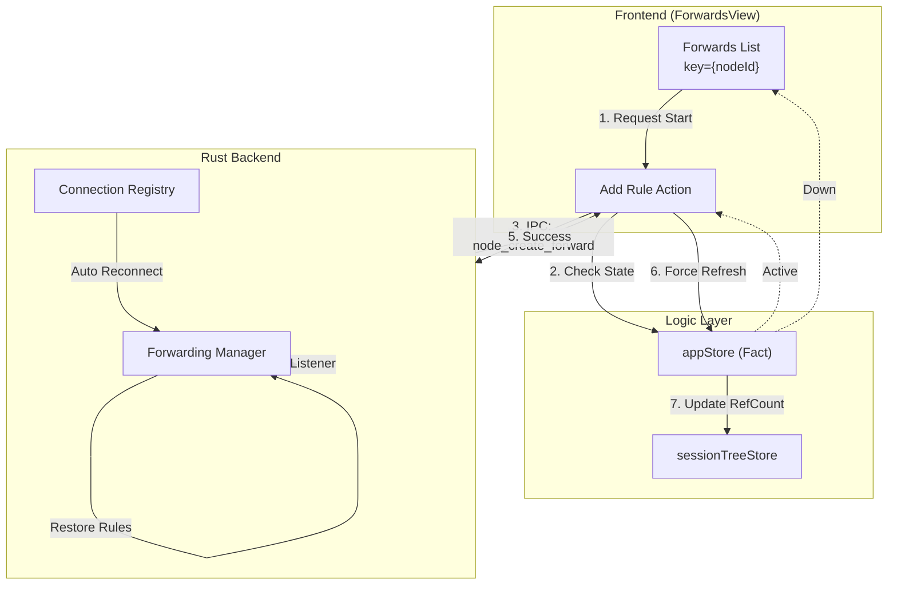

**数据流说明：**

1. 用户在 `ForwardsView` 发起添加转发请求
2. 前端检查 `appStore` 中连接状态是否为 `Active`
3. 状态门禁通过后，通过 IPC 调用 `node_create_forward`
4. 后端 `ForwardingManager` 创建监听器
5. 成功后返回前端
6. 前端强制刷新 AppStore 以同步规则列表
7. 更新 `sessionTreeStore` 中的引用计数
8. 断线重连时，`Registry` 通知 `ForwardingManager` 自动恢复规则

### 4.3 Key-Driven 重置机制

转发组件遵循项目级的 Key-Driven Reset 不变量（参见第 1 章系统不变量）。当连接重建时，`nodeId` 对应的状态变更驱动组件重渲染，触发规则刷新：

```tsx
const nodeState = useNodeState(nodeId);

useEffect(() => {
  if (nodeId && nodeState.readiness === 'ready') {
    refreshRules();
  }
}, [nodeId, nodeState.readiness]);
```

当 SSH 连接断开并重连后：
- 后端生成新的 `connectionId`
- 前端组件通过 `useNodeState` 感知状态变化
- 自动调用 `refreshRules()` 拉取最新规则列表
- 所有之前 `Suspended` 状态的规则恢复为 `Active`

### 4.4 转发类型

#### 4.4.1 本地转发（Local Forward）

将本地端口映射到远程服务，最常见的使用场景。

**典型场景：** 本机 `localhost:8080` → 远程 MySQL 服务 `3306`

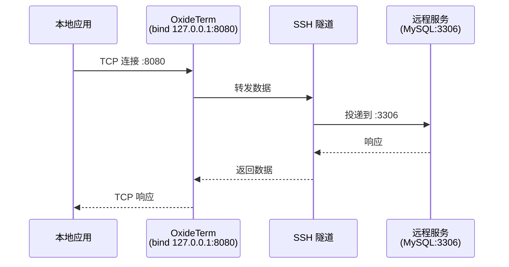

#### 4.4.2 远程转发（Remote Forward）

将远程端口映射回本地服务，适用于需要从远程访问本地开发服务器的场景。

**典型场景：** 远程 `0.0.0.0:8080` → 本地开发服务器 `localhost:3000`

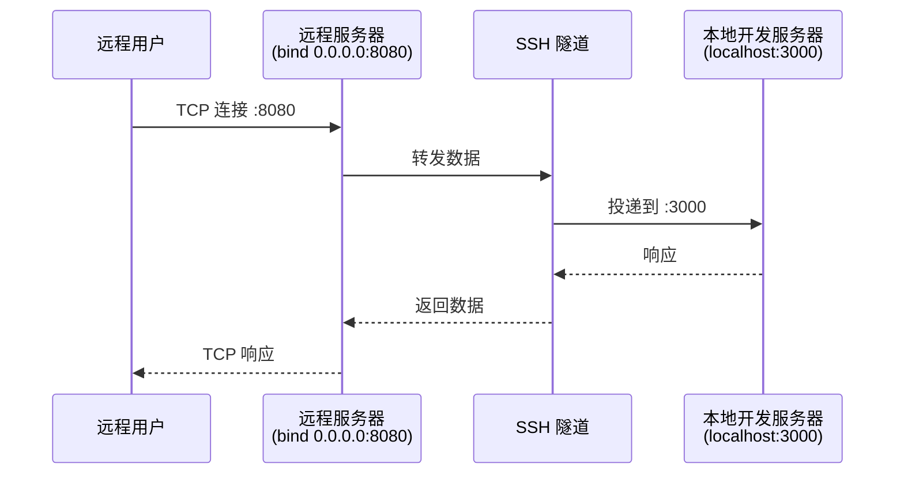

#### 4.4.3 动态转发（Dynamic Forward / SOCKS5）

在本地创建 SOCKS5 代理，所有通过该代理的流量经由 SSH 隧道传输。

**典型场景：** `localhost:1080` 作为 SOCKS5 代理

```
浏览器/应用 → SOCKS5 代理 (localhost:1080) → SSH 隧道 → 远程网络
```

动态转发不需要指定 `target_host` 和 `target_port`，目标地址由 SOCKS5 协议动态解析。

### 4.5 界面交互

#### 4.5.1 转发列表

```
┌─────────────────────────────────────────────────────────┐
│  Port Forwarding                              [+ Add]   │
├─────────────────────────────────────────────────────────┤
│  🟢 Local  127.0.0.1:8080 → mysql.internal:3306        │
│     ↑ 1.2 MB  ↓ 3.4 MB            [Stop] [Delete]     │
│                                                         │
│  🟢 Remote 0.0.0.0:8080 → localhost:3000               │
│     ↑ 0.5 MB  ↓ 0.8 MB            [Stop] [Delete]     │
│                                                         │
│  🔴 Local  127.0.0.1:5432 → db.internal:5432           │
│     Error: EADDRINUSE              [Restart] [Delete]   │
│                                                         │
│  🟡 Dynamic localhost:1080 (SOCKS5)                     │
│     Suspended (reconnecting...)                         │
└─────────────────────────────────────────────────────────┘
```

#### 4.5.2 流量监控与状态同步

- 流量统计每 **2 秒** 聚合一次，通过 Tauri Event 推送至前端
- 每条规则显示 Bytes In / Bytes Out 实时数据
- 状态变更（`starting` → `active` → `stopped` / `error` / `suspended`）实时反映在 UI

### 4.6 API 参考

> **注意：** 所有端口转发 API 已迁移至 `nodeId` 路由体系。后端命令采用 `node_` 前缀。

#### 4.6.1 创建转发

```typescript
import { api } from '@/lib/api';

// 创建本地转发
const response = await api.nodeCreateForward({
  node_id: nodeId,
  forward_type: 'local',
  bind_address: '127.0.0.1',
  bind_port: 8080,
  target_host: 'localhost',
  target_port: 3000,
  description: 'Dev server tunnel',
  check_health: true,  // 可选：启用健康检查
});
```

#### 4.6.2 规则管理

```typescript
// 列出所有转发规则
const rules = await api.nodeListForwards(nodeId);

// 停止转发
await api.nodeStopForward(nodeId, forwardId);

// 删除转发
await api.nodeDeleteForward(nodeId, forwardId);

// 重启转发
await api.nodeRestartForward(nodeId, forwardId);
```

#### 4.6.3 完整 API 表

| 前端函数 | 后端命令 | 说明 |
|---------|---------|------|
| `api.nodeListForwards(nodeId)` | `node_list_forwards` | 列出所有转发规则 |
| `api.nodeCreateForward(request)` | `node_create_forward` | 创建转发规则 |
| `api.nodeStopForward(nodeId, id)` | `node_stop_forward` | 停止转发 |
| `api.nodeDeleteForward(nodeId, id)` | `node_delete_forward` | 删除转发 |
| `api.nodeRestartForward(nodeId, id)` | `node_restart_forward` | 重启转发 |

#### 4.6.4 ForwardRule 实体定义

```typescript
type ForwardType = 'local' | 'remote' | 'dynamic';

interface ForwardRule {
  id: string;
  forward_type: ForwardType;
  bind_address: string;
  bind_port: number;
  target_host: string;
  target_port: number;
  status: 'starting' | 'active' | 'stopped' | 'error' | 'suspended';
  description?: string;
}

interface ForwardResponse {
  success: boolean;
  forward?: ForwardRuleDto;
  error?: string;
}
```

### 4.7 故障排除与自愈

#### 4.7.1 自动重连行为

当 SSH 连接断开时，转发系统执行以下自愈流程：

```
LinkDown → 所有规则标记 Suspended
    → 重连成功
        → 逐条恢复规则
            → Restored (Active)
    → 重连失败
        → 保持 Suspended 等待下次重连
```

重连恢复是重连编排器（Reconnect Orchestrator，参见第 3 章）的 `restore-forwards` 阶段的一部分。编排器确保转发恢复在 SSH 连接建立且终端就绪之后执行。

#### 4.7.2 死亡报告机制 (v1.4.1)

转发任务异常退出时，后端通过 `ExitReason` 枚举上报退出原因：

```rust
enum ExitReason {
    Normal,              // 正常关闭
    SshDisconnect,       // SSH 连接断开
    BindError(String),   // 端口绑定失败
    IoError(String),     // I/O 错误
    Timeout,             // 超时
}
```

死亡报告通过 Tauri Event 发射至前端，前端更新对应规则的状态并显示错误信息。

`HandleController` 提供 `subscribe_disconnect()` 接口，允许转发任务订阅 SSH 断连事件，实现快速感知和状态转换。

#### 4.7.3 无锁 Channel I/O 架构 (v1.4.2)

为消除端口转发中的锁竞争问题，v1.4.2 采用了基于消息传递的无锁架构：

```
local_reader → mpsc → ssh_io → mpsc → local_writer
                                  ↑
                            shutdown_rx (广播信号)
```

- **`local_reader`**：从本地 TCP socket 读取数据，发送至 mpsc channel
- **`ssh_io`**：SSH 通道数据转发，消费本地数据并写入 SSH，同时从 SSH 读取并发送至 local_writer
- **`local_writer`**：从 mpsc channel 消费数据，写入本地 TCP socket
- **`shutdown_rx`**：tokio broadcast channel，用于向所有子任务传播关闭信号

全链路超时保护：`FORWARD_IDLE_TIMEOUT` = 300 秒，空闲连接超时后自动清理。

#### 4.7.4 常见错误处理

| 错误 | 原因 | 处理方式 |
|------|------|---------|
| `EADDRINUSE` | 端口已被占用 | 提示用户更换端口或关闭占用该端口的进程 |
| `EACCES` | 权限不足（绑定 <1024 端口） | 在 macOS/Linux 上需要 root 权限或使用 >1024 的端口 |
| Remote Port Forward Failed | 远程服务器拒绝转发请求 | 检查远程 `sshd_config` 中 `GatewayPorts` 配置 |
| SSH connection lost | SSH 连接中断 | 自动进入 Suspended 状态，等待重连编排器恢复 |

### 4.8 安全最佳实践

1. **最小权限绑定** — 默认绑定 `127.0.0.1` 而非 `0.0.0.0`，避免暴露端口到外部网络
2. **连接池复用** — 转发规则共享 SSH 连接，通过引用计数管理。当 `ref_count` 降为 0 且 `keep_alive = false` 时启动空闲计时器
3. **端口验证** — 创建规则前验证端口合法性（1-65535）
4. **超时保护** — 空闲连接 300 秒超时自动清理，防止资源泄漏

---

## 5. SFTP 文件管理

> 合并来源: `SFTP.md` (v1.4.0)

### 5.1 功能概述

OxideTerm 内置完整的 SFTP 文件管理器，提供类似本地文件管理器的操作体验。核心能力：

- **双窗格视图** — 本地与远程文件并排浏览
- **拖拽传输** — 支持文件和文件夹的拖拽上传/下载
- **智能预览** — 支持文本、图片、视频、音频、PDF 等格式的在线预览
- **传输队列** — 带进度条、暂停/继续/取消/重试的传输管理
- **键盘操作** — 快捷键支持高效操作
- **State Gating** — 所有操作受连接状态保护

### 5.2 界面说明

#### 5.2.1 双窗格布局

```
┌────────────────────────────┬────────────────────────────┐
│  Local Files               │  Remote Files              │
│  ┌─ Home ─ Up ─ Refresh ─┐│  ┌─ Home ─ Up ─ Refresh ─┐│
│  │ 📁 Documents          │ │  │ 📁 /var/www/html     │ │
│  │ 📁 Downloads          │ │  │ 📁 /home/user        │ │
│  │ 📄 config.json   12KB │ │  │ 📄 index.html   5KB  │ │
│  │ 📄 readme.md     3KB  │ │  │ 📄 app.js       25KB │ │
│  └────────────────────────┘│  └────────────────────────┘│
│  Path: ~/Documents         │  Path: /var/www/html       │
├────────────────────────────┴────────────────────────────┤
│  Transfer Queue: 2 active, 3 queued, 15 completed       │
│  ████████████░░░░ config.json → /var/www/ 75% 1.2MB/s   │
└─────────────────────────────────────────────────────────┘
```

#### 5.2.2 工具栏

| 按钮 | 功能 |
|------|------|
| Home | 回到起始目录（本地：Home 目录；远程：登录目录） |
| Up | 返回上级目录 |
| Refresh | 刷新当前目录列表 |
| New Folder | 创建新文件夹 |
| Search | 在当前目录下搜索文件名 |

#### 5.2.3 排序

支持按以下维度排序（升序/降序）：
- 名称
- 大小
- 修改时间

文件夹始终排在文件之前。

### 5.3 文件操作

#### 5.3.1 基本操作

| 操作 | 触发方式 |
|------|---------|
| 打开文件夹 | 双击 |
| 选择文件 | 单击 |
| 多选 | Ctrl/Cmd + 单击 |
| 连续选择 | Shift + 单击 |
| 全选 | Ctrl/Cmd + A |
| 预览 | 空格键 / 右键菜单 |
| 重命名 | F2 / 右键菜单 |
| 删除 | Delete 键 / 右键菜单 |

#### 5.3.2 传输操作

| 操作 | 触发方式 |
|------|---------|
| 上传 | 从本地窗格拖拽到远程窗格 |
| 下载 | 从远程窗格拖拽到本地窗格 |
| 右键上传/下载 | 右键菜单 → Upload / Download |
| 双击传输 | 双击文件直接传输到对侧窗格的当前目录 |

#### 5.3.3 批量操作

选择多个文件后，可批量执行：
- 批量下载/上传
- 批量删除
- 批量传输加入队列

### 5.4 文件预览

SFTP 文件管理器支持丰富的文件格式在线预览：

#### 5.4.1 格式支持表

| 类别 | 支持格式 | 最大大小 | 说明 |
|------|---------|---------|------|
| **文本/代码** | `.txt`, `.md`, `.json`, `.xml`, `.yaml`, `.toml`, `.ini`, `.conf`, `.log`, `.csv`, `.js`, `.ts`, `.py`, `.rs`, `.go`, `.java`, `.c`, `.cpp`, `.sh` 等（19 种语言高亮） | 1 MB | CodeMirror 渲染，支持语法高亮 |
| **图片** | PNG, JPG/JPEG, GIF, WebP, SVG, BMP, ICO | 10 MB | 内嵌查看器，支持缩放 |
| **视频** | MP4, WebM, OGG, MOV, MKV | 50 MB | 内嵌播放器，支持播放控制 |
| **音频** | MP3, WAV, OGG, FLAC, AAC, M4A | 50 MB | 内嵌播放器 |
| **PDF** | PDF | 10 MB | 内嵌 PDF 查看器 |
| **Office** | DOC/DOCX, XLS/XLSX, PPT/PPTX | 10 MB | 需安装 LibreOffice |
| **Hex 视图** | 任意二进制文件 | 默认 16 KB | 十六进制查看，可增量加载更多数据 |

预览通过 `nodeSftpPreview` API 实现，可选 `maxSize` 参数控制预览数据量。预览产生的临时文件通过 `cleanupSftpPreviewTemp` API 清理。

### 5.5 传输管理

#### 5.5.1 传输队列

传输队列由 `transferStore`（Zustand store）管理，分四个分组：

| 分组 | 说明 |
|------|------|
| 进行中 | 当前正在传输的文件 |
| 等待中 | 排队等待传输的文件 |
| 已完成 | 最近完成的传输记录（保留最新 50 条） |
| 失败 | 传输失败的文件，可重试 |

#### 5.5.2 进度显示

```
┌──────────────────────────────────────────────────┐
│  ████████████░░░░  config.json                   │
│  75%  1.2 MB / 1.6 MB  Speed: 1.2 MB/s          │
│                            [Pause] [Cancel]      │
├──────────────────────────────────────────────────┤
│  ██████████████████ styles.css          ✓ Done   │
│  100%  256 KB / 256 KB                           │
├──────────────────────────────────────────────────┤
│  ░░░░░░░░░░░░░░░░ bundle.js                     │
│  Queued                                          │
└──────────────────────────────────────────────────┘
```

#### 5.5.3 传输控制

| 操作 | API | 说明 |
|------|-----|------|
| 暂停 | `sftpPauseTransfer(transferId)` | 暂停正在进行的传输 |
| 继续 | `sftpResumeTransfer(transferId)` | 恢复暂停的传输 |
| 取消 | `sftpCancelTransfer(transferId)` | 取消传输并清理 |
| 重试 | 重新入队 | 对失败的传输重新执行 |

#### 5.5.4 并发控制

- 默认最大并发数：**3**
- 可通过 `sftpUpdateSettings` 调整 `maxConcurrent` 和 `speedLimitKbps`
- 传输统计通过 `sftpTransferStats` 查询（active / queued / completed）

#### 5.5.5 Tar 加速传输

对于目录传输，SFTP 支持基于 `tar` 的加速模式，将整个目录打包后传输以减少 SFTP 小文件开销：

```typescript
// 1. 探测远程服务器是否支持 tar
const hasTar = await nodeSftpTarProbe(nodeId);

// 2. 探测最佳压缩算法
const compression = await nodeSftpTarCompressionProbe(nodeId);
// 返回: 'zstd' | 'gzip' | 'none'

// 3. 使用 tar 加速上传
const fileCount = await nodeSftpTarUpload(
  nodeId, localPath, remotePath, transferId, compression
);

// 4. 使用 tar 加速下载
const fileCount = await nodeSftpTarDownload(
  nodeId, remotePath, localPath, transferId, compression
);
```

#### 5.5.6 断点续传

```typescript
// 列出未完成的传输
const incomplete = await nodeSftpListIncompleteTransfers(nodeId);

// 恢复传输
await nodeSftpResumeTransfer(nodeId, transferId);
```

### 5.6 连接鲁棒性架构 (v1.4.0)

SFTP 文件管理器遵循项目级系统不变量，实现了完整的连接鲁棒性保障。

#### 5.6.1 State Gating（状态门禁）

所有 SFTP 操作在执行前必须通过连接状态检查：

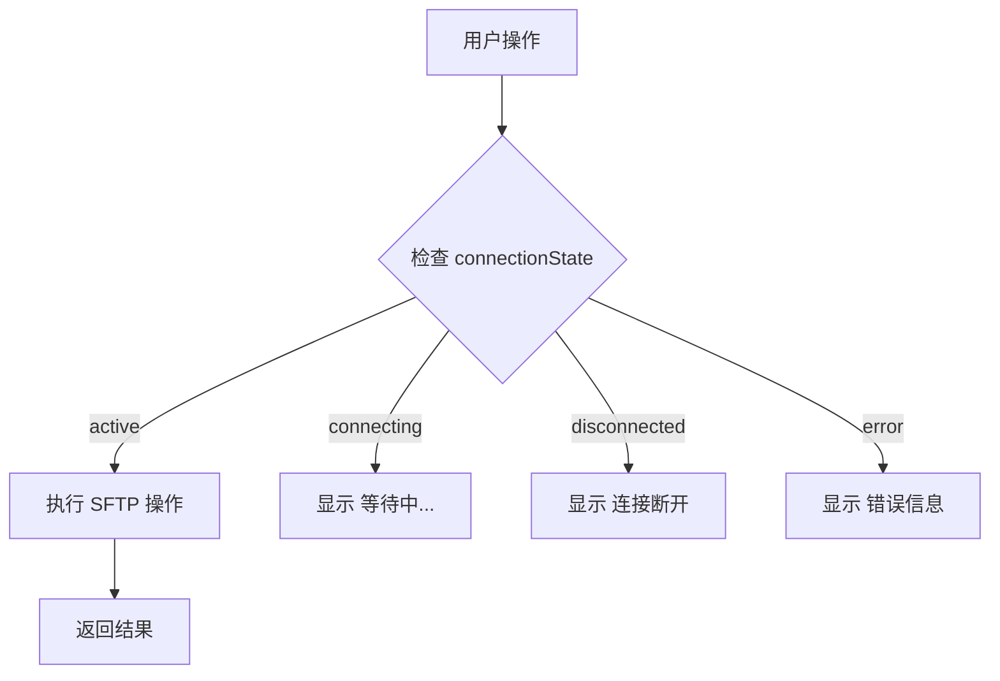

#### 5.6.2 Key-Driven Reset（键驱动重置）

连接重建时，SFTP 组件自动重置并恢复：

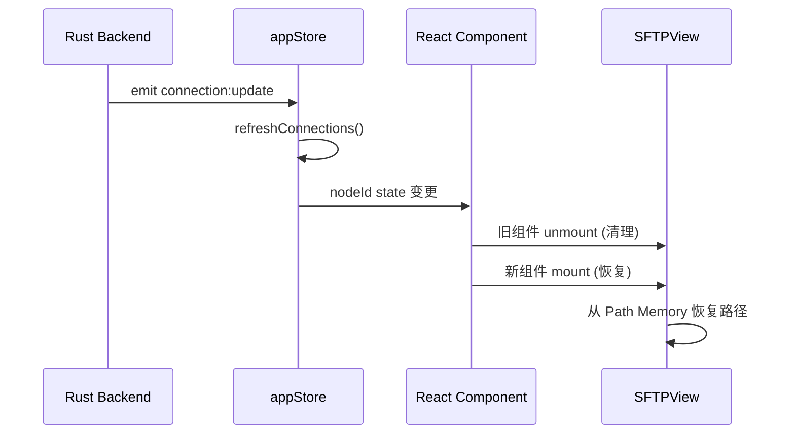

#### 5.6.3 Path Memory（路径记忆）

```typescript
// sftpPathMemory: Map<nodeId, { local: string, remote: string }>
```

当连接断开并重连后，SFTP 组件会从 `sftpPathMemory` 中恢复用户之前浏览的远程路径，避免每次重连都回到根目录。

#### 5.6.4 强一致性同步数据流

```mermaid
graph LR
    TREE["sessionTreeStore<br/>(用户操作)"]
    REG["Connection Registry<br/>(后端)"]
    APP["appStore<br/>(事实层)"]
    VIEW["ForwardsView / SFTPView"]
    SFTP["SFTP Session"]

    TREE -->|创建连接| REG
    REG -->|connection:update| TREE
    TREE -->|refreshConnections()| APP
    APP -->|props/hooks| VIEW
    VIEW -->|nodeSftpInit| SFTP
```

#### 5.6.5 TransferQueue 状态门禁

`transferStore` 在节点断线时自动中断该节点所有进行中的传输，标记为失败状态。重连后用户可通过断点续传 API 恢复。

### 5.7 API 参考

#### 5.7.1 完整 API 表

| 前端函数 | 后端命令 | 说明 |
|---------|---------|------|
| `nodeSftpInit(nodeId)` | `node_sftp_init` | 初始化 SFTP 会话 |
| `nodeSftpListDir(nodeId, path)` | `node_sftp_list_dir` | 列出目录内容 |
| `nodeSftpStat(nodeId, path)` | `node_sftp_stat` | 获取文件元信息 |
| `nodeSftpPreview(nodeId, path, maxSize?)` | `node_sftp_preview` | 预览文件内容 |
| `nodeSftpPreviewHex(nodeId, path, ...)` | `node_sftp_preview_hex` | Hex 预览 |
| `nodeSftpWrite(nodeId, path, content, encoding?)` | `node_sftp_write` | 写入文件内容 |
| `nodeSftpDownload(nodeId, remotePath, localPath, transferId?)` | `node_sftp_download` | 下载单文件 |
| `nodeSftpUpload(nodeId, localPath, remotePath, transferId?)` | `node_sftp_upload` | 上传单文件 |
| `nodeSftpDelete(nodeId, path)` | `node_sftp_delete` | 删除文件 |
| `nodeSftpDeleteRecursive(nodeId, path)` | `node_sftp_delete_recursive` | 递归删除 |
| `nodeSftpMkdir(nodeId, path)` | `node_sftp_mkdir` | 创建目录 |
| `nodeSftpRename(nodeId, ...)` | `node_sftp_rename` | 重命名/移动 |
| `nodeSftpDownloadDir(nodeId, remotePath, localPath, transferId?)` | `node_sftp_download_dir` | 下载目录 |
| `nodeSftpUploadDir(nodeId, localPath, remotePath, transferId?)` | `node_sftp_upload_dir` | 上传目录 |
| `nodeSftpTarProbe(nodeId)` | `node_sftp_tar_probe` | 探测 tar 支持 |
| `nodeSftpTarCompressionProbe(nodeId)` | `node_sftp_tar_compression_probe` | 探测压缩算法 |
| `nodeSftpTarUpload(nodeId, localPath, remotePath, transferId?, compression?)` | `node_sftp_tar_upload` | Tar 加速上传 |
| `nodeSftpTarDownload(nodeId, remotePath, localPath, transferId?, compression?)` | `node_sftp_tar_download` | Tar 加速下载 |
| `nodeSftpListIncompleteTransfers(nodeId)` | `node_sftp_list_incomplete_transfers` | 列出未完成传输 |
| `nodeSftpResumeTransfer(nodeId, transferId)` | `node_sftp_resume_transfer` | 恢复传输 |
| `cleanupSftpPreviewTemp(path?)` | `cleanup_sftp_preview_temp` | 清理预览临时文件 |

#### 5.7.2 传输控制 API（全局，不按 nodeId）

| 前端函数 | 后端命令 | 说明 |
|---------|---------|------|
| `sftpCancelTransfer(transferId)` | `sftp_cancel_transfer` | 取消传输 |
| `sftpPauseTransfer(transferId)` | `sftp_pause_transfer` | 暂停传输 |
| `sftpResumeTransfer(transferId)` | `sftp_resume_transfer` | 恢复传输 |
| `sftpTransferStats()` | `sftp_transfer_stats` | 传输统计 |
| `sftpUpdateSettings(maxConcurrent?, speedLimitKbps?)` | `sftp_update_settings` | 更新传输设置 |

#### 5.7.3 返回值说明

**`nodeSftpWrite` 返回值：**

```typescript
{
  mtime: number | null;     // 修改时间戳
  size: number | null;      // 文件大小
  encodingUsed: string;     // 实际使用的编码
  atomicWrite: boolean;     // 是否使用了原子写入
}
```

当后端检测到目标文件系统支持原子写入时，`atomicWrite` 为 `true`，写入通过 `tmpfile → rename` 模式保证数据完整性。

---

## 6. 远程代理（Remote Agent）

> 合并来源: `REMOTE_AGENT.md`

### 6.1 概述

OxideTerm Remote Agent 是一个无依赖的静态链接 Rust 二进制（约 600–670 KB），通过 SSH exec 通道部署到远程服务器并运行。它为 IDE 模式提供高性能的远程文件操作，在 Agent 不可用时自动降级至 SFTP。

#### 核心优势

| 能力 | 说明 |
|------|------|
| 原子写入 | 通过 `tmpfile → rename` 保证文件写入完整性 |
| inotify 监视 | 实时检测远程文件变更 |
| 哈希冲突检测 | SHA-256 `expected_hash` 防止覆盖他人修改 |
| 服务器端搜索 | `grep` 在远程执行，减少数据传输 |
| 深层目录树预取 | `listTree` 递归获取目录结构 |
| 符号索引 | 远程项目符号索引、补全和定义查找 |

### 6.2 架构

```
OxideTerm 应用 (Tauri + React)
  ├── IDE 前端组件
  │     ├── IdeTree (文件树)
  │     ├── IdeEditor (代码编辑)
  │     └── IdeSearch (全局搜索)
  │
  ├── agentService.ts (门面层, 14 函数)
  │     └── Agent → SFTP 自动降级
  │
  ├── api.ts (底层 IPC 调用)
  │
  └── Rust 后端
        ├── AgentTransport (SSH exec 通道通信)
        ├── AgentDeployer (自动部署 + 架构检测)
        └── AgentRegistry (实例生命周期管理)
              │
              └── SSH exec 通道 ───── 远程主机
                                        └── oxideterm-agent
                                              ├── main.rs (请求分发)
                                              ├── fs_ops.rs (文件操作)
                                              ├── protocol.rs (JSON-RPC 编解码)
                                              ├── watcher.rs (inotify 监视)
                                              └── symbols.rs (符号索引)
```

### 6.3 通信协议

Agent 使用**行分隔 JSON-RPC** 协议，通过 SSH exec 通道的 stdin/stdout 通信。

#### 6.3.1 请求格式

```json
{"id": 1, "method": "fs/readFile", "params": {"path": "/home/user/app.js"}}
```

#### 6.3.2 响应格式

```json
{"id": 1, "result": {"content": "...", "hash": "sha256:abc123..."}}
```

#### 6.3.3 错误格式

```json
{"id": 1, "error": {"code": -2, "message": "File not found: /home/user/missing.txt"}}
```

#### 6.3.4 通知格式（服务器 → 客户端推送，无 id 字段）

```json
{"method": "watch/event", "params": {"type": "modified", "path": "/home/user/app.js"}}
```

### 6.4 支持的方法

#### 6.4.1 文件系统 `fs/*`

| 方法 | 说明 | 参数 |
|------|------|------|
| `fs/readFile` | 读取文件内容 | `path`, `max_size?` |
| `fs/writeFile` | 原子写入文件 | `path`, `content`, `expected_hash?` |
| `fs/stat` | 获取文件元信息 | `path` |
| `fs/listDir` | 列出目录内容 | `path` |
| `fs/listTree` | 递归获取目录树 | `path`, `depth?`, `max_entries?` |
| `fs/mkdir` | 创建目录 | `path` |
| `fs/remove` | 删除文件或目录 | `path`, `recursive?` |
| `fs/rename` | 重命名/移动 | `from`, `to` |
| `fs/chmod` | 修改文件权限 | `path`, `mode` |

#### 6.4.2 搜索 `search/*`

| 方法 | 说明 | 参数 |
|------|------|------|
| `search/grep` | 文本搜索 | `pattern`, `path`, `case_sensitive?`, `max_results?`, `ignore?` |

#### 6.4.3 文件监视 `watch/*`

| 方法 | 说明 | 参数 |
|------|------|------|
| `watch/start` | 开始监视目录变更 | `path`, `ignore?` |
| `watch/stop` | 停止监视 | `path` |

监视事件通过通知消息推送（参见 6.3.4）。

#### 6.4.4 Git `git/*`

| 方法 | 说明 | 参数 |
|------|------|------|
| `git/status` | 获取 Git 仓库状态 | `path` |

#### 6.4.5 符号 `symbols/*`

| 方法 | 说明 | 参数 |
|------|------|------|
| `symbols/index` | 索引项目符号 | `path`, `max_files?` |
| `symbols/complete` | 符号自动补全 | `path`, `prefix`, `limit?` |
| `symbols/definitions` | 查找符号定义 | `path`, `name` |

#### 6.4.6 系统 `sys/*`

| 方法 | 说明 | 参数 | 返回 |
|------|------|------|------|
| `sys/info` | 版本和系统信息 | 无 | `{ version, arch, os, pid, capabilities }` |
| `sys/ping` | 健康检查 | 无 | `{ pong: true }` |
| `sys/shutdown` | 优雅关闭 Agent | 无 | `{ ok: true }` |

`sys/info` 返回的 `capabilities` 字段标识 Agent 支持的可选能力（如 `["zstd"]`），前端据此做功能协商。

### 6.5 部署流程

Agent 自动部署，用户无感：

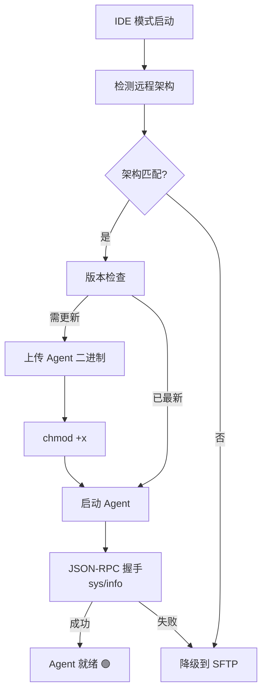

### 6.6 支持的目标架构

#### 主要架构（CI 自动构建，内嵌应用包）

| 架构 | 二进制名 | 大小 |
|------|---------|------|
| x86_64 (Intel/AMD) | `oxideterm-agent-x86_64-linux-musl` | ~670 KB |
| aarch64 (ARM64) | `oxideterm-agent-aarch64-linux-musl` | ~600 KB |

#### 扩展架构（位于 `agents/extra/`，按需使用）

| 架构 | 二进制名 |
|------|---------|
| aarch64-android | `oxideterm-agent-aarch64-android` |
| arm (32-bit) | `oxideterm-agent-arm-linux-musleabihf` |
| armv7 | `oxideterm-agent-armv7-linux-musleabihf` |
| i686 (32-bit x86) | `oxideterm-agent-i686-linux-musl` |
| loongarch64 | `oxideterm-agent-loongarch64-linux-gnu` |
| powerpc64le | `oxideterm-agent-powerpc64le-linux-gnu` |
| riscv64 | `oxideterm-agent-riscv64gc-linux-gnu` |
| s390x | `oxideterm-agent-s390x-linux-gnu` |
| x86_64-freebsd | `oxideterm-agent-x86_64-freebsd` |

所有二进制均为静态链接（musl libc 或相应系统 libc），无外部运行时依赖。

### 6.7 安全性

| 安全措施 | 说明 |
|---------|------|
| 进程隔离 | Agent 以当前 SSH 用户权限运行，不提权 |
| 自清理 | SSH 连接断开后，Agent 通过 stdin EOF 检测并自行退出 |
| 无网络监听 | Agent 不打开任何网络端口，仅通过 stdin/stdout 通信 |
| 最小权限 | 只能访问 SSH 用户有权限的文件 |
| 静态链接 | 不依赖远程服务器的动态库，避免供应链问题 |

### 6.8 设计原则

1. **零异步运行时** — 使用 `std::thread` + 阻塞 I/O，不引入 tokio/async-std，保持二进制最小化
2. **最少依赖** — 仅依赖：`serde`、`serde_json`、`inotify`（Linux）、`libc`、`zstd`
3. **静态 musl 链接** — 生成完全静态的二进制，无需远程服务器安装任何库
4. **优雅降级** — Agent 不可用时自动回退到 SFTP（文件读写、目录列表），仅 Agent-only 功能（grep、watch、symbols、listTree、gitStatus）不可用

### 6.9 原子写入机制

Agent 的 `fs/writeFile` 实现原子写入以防止数据丢失：

```
1. 写入临时文件: /path/to/.file.tmp.XXXXXX
2. 如果提供 expected_hash:
   a. 读取目标文件当前内容
   b. 计算 SHA-256 哈希
   c. 与 expected_hash 比对
   d. 不匹配则返回冲突错误，删除临时文件
3. rename(临时文件 → 目标文件)  // 原子操作
4. 返回新文件的哈希值
```

`expected_hash` 机制用于乐观并发控制——当多人同时编辑同一文件时，检测并报告冲突。

### 6.10 inotify 文件监视

Agent 在 Linux 上使用 inotify 实现文件监视：

- **递归监视** — 自动为子目录创建 inotify watch
- **`.gitignore` 排除** — 解析 `.gitignore` 规则跳过不需要监视的路径（如 `node_modules/`）
- **非阻塞 fd** — 使用 `O_NONBLOCK` 文件描述符，通过 `poll()` 等待事件
- **事件去重** — 同一文件的快速连续变更会被合并
- **平台回退** — 非 Linux 系统（如 FreeBSD、Android）不支持 inotify，`watch/*` 方法返回错误

### 6.11 构建说明

```bash
# 添加交叉编译目标
rustup target add x86_64-unknown-linux-musl
rustup target add aarch64-unknown-linux-musl

# 使用构建脚本（需安装 musl-cross 工具链）
./scripts/build-agent.sh

# 手动构建
cd agent
cargo build --release --target x86_64-unknown-linux-musl
```

CI 自动构建两个主要架构（x86_64、aarch64），扩展架构按需手动构建。

### 6.12 前端集成

#### 6.12.1 状态指示

IDE 模式界面显示 Agent 连接状态：

| 指示 | 含义 |
|------|------|
| 🟢 Agent | Agent 已部署并就绪 |
| 🟡 Deploying | Agent 正在部署中 |
| ⚪ SFTP | Agent 不可用，使用 SFTP 回退 |

#### 6.12.2 agentStore

`agentStore`（`src/store/agentStore.ts`）是专用 Zustand store，管理 Agent 任务状态与历史记录。

#### 6.12.3 agentService 门面层

`agentService.ts`（`src/lib/agentService.ts`）导出 14 个函数，提供统一的 Agent 操作接口，内置 Agent → SFTP 自动降级逻辑：

| 函数 | 说明 | 降级行为 |
|------|------|---------|
| `isAgentReady(nodeId)` | 检查 Agent 可用性（带缓存） | — |
| `ensureAgent(nodeId)` | 部署 Agent（幂等去重） | — |
| `invalidateAgentCache(nodeId)` | 清除可用性缓存 | — |
| `removeAgent(nodeId)` | 移除远程 Agent | — |
| `readFile(nodeId, path)` | 读取文件 | → SFTP 回退 |
| `writeFile(nodeId, path, content, expectHash?)` | 写入文件 | → SFTP 回退 |
| `listDir(nodeId, path)` | 列出目录 | → SFTP 回退 |
| `listTree(nodeId, path, maxDepth?, maxEntries?)` | 递归目录树 | Agent only |
| `grep(nodeId, pattern, path, opts?)` | 文本搜索 | Agent only |
| `gitStatus(nodeId, path)` | Git 状态 | Agent only |
| `watchDirectory(nodeId, path, onEvent, ignore?)` | 文件监视 | Agent only |
| `symbolIndex(nodeId, path, maxFiles?)` | 符号索引 | Agent only |
| `symbolComplete(nodeId, path, prefix, limit?)` | 符号补全 | Agent only |
| `symbolDefinitions(nodeId, path, name)` | 符号定义查找 | Agent only |

#### 6.12.4 底层 Agent API（api.ts）

| 前端函数 | 后端命令 |
|---------|---------|
| `nodeAgentDeploy(nodeId)` | `node_agent_deploy` |
| `nodeAgentRemove(nodeId)` | `node_agent_remove` |
| `nodeAgentStatus(nodeId)` | `node_agent_status` |
| `nodeAgentReadFile(nodeId, path)` | `node_agent_read_file` |
| `nodeAgentWriteFile(nodeId, path, content, expectHash?)` | `node_agent_write_file` |
| `nodeAgentListTree(nodeId, path, maxDepth?, maxEntries?)` | `node_agent_list_tree` |
| `nodeAgentGrep(nodeId, pattern, path, caseSensitive?, maxResults?)` | `node_agent_grep` |
| `nodeAgentGitStatus(nodeId, path)` | `node_agent_git_status` |
| `nodeAgentWatchStart(nodeId, path, ignore?)` | `node_agent_watch_start` |
| `nodeAgentWatchStop(nodeId, path)` | `node_agent_watch_stop` |
| `nodeAgentStartWatchRelay(nodeId)` | `node_agent_start_watch_relay` |
| `nodeAgentSymbolIndex(nodeId, path, maxFiles?)` | `node_agent_symbol_index` |
| `nodeAgentSymbolComplete(nodeId, path, prefix, limit?)` | `node_agent_symbol_complete` |
| `nodeAgentSymbolDefinitions(nodeId, path, name)` | `node_agent_symbol_definitions` |

#### 6.12.5 设计要点

- **按需加载** — 不做深度预取，用户展开目录时才加载子级
- **AbortController 去重** — 防止同时发起重复的 Agent 请求
- **路径解析** — Agent 内部 `resolve_path()` 将 `~` 展开为 `$HOME`

### 6.13 故障排查

| 症状 | 原因 | 解决方案 |
|------|------|---------|
| 始终使用 SFTP，不部署 Agent | 远程架构不在支持列表 | 检查 `uname -m`，可手动放置对应架构的二进制到 `agents/extra/` |
| Agent 部署失败 | SELinux 或 `noexec` 挂载选项 | 检查 `/tmp` 或 Agent 部署目录的挂载选项和 SELinux 策略 |
| 文件监视不工作 | inotify watch 数量达到系统限制 | 增大 `fs.inotify.max_user_watches`（`echo 65536 > /proc/sys/fs/inotify/max_user_watches`） |
| Agent 未自动退出 | stdin EOF 未正确传播 | 检查 SSH 连接是否正常关闭；Agent 在 stdin 关闭后自行退出 |

---

## 7. SSH Agent 认证

> 合并来源: `SSH_AGENT_STATUS.md`

### 7.1 实现概览

OxideTerm 完整支持 SSH Agent 认证方式，允许用户通过系统 SSH Agent（如 `ssh-agent`、gpg-agent、1Password SSH Agent 等）进行免密码认证。该功能覆盖了从类型系统、UI、持久化到核心认证流程的完整链路。

### 7.2 类型系统支持

#### 7.2.1 Rust 后端类型

```rust
// 认证方式枚举
enum AuthMethod {
    Password(String),
    PrivateKey { key_path: String, passphrase: Option<String> },
    Agent,  // ← SSH Agent 认证
    // ...
}

// 持久化保存的认证信息
enum SavedAuth {
    Password(String),
    PrivateKey { key_path: String, passphrase: Option<String> },
    Agent,  // ← 保存为 Agent 方式
    // ...
}

// 加密存储的认证信息（.oxide 文件导入导出）
enum EncryptedAuth {
    Password(EncryptedString),
    PrivateKey { key_path: String, passphrase: Option<EncryptedString> },
    Agent,  // ← 加密导出支持
    // ...
}
```

#### 7.2.2 TypeScript 前端类型

SSH Agent 认证在以下前端类型中均有支持：

- `ConnectRequest` — 连接请求
- `ConnectionInfo` — 连接信息
- `ProxyHopConfig` — 跳板机配置（跳板机同样支持 Agent 认证）
- `SaveConnectionRequest` — 保存连接请求

### 7.3 UI 支持

以下 UI 组件完整支持 SSH Agent 认证方式的选择和配置：

| 组件 | 说明 |
|------|------|
| `NewConnectionModal` | 新建连接时可选择 "SSH Agent" 认证方式 |
| `EditConnectionModal` | 编辑已有连接时可切换认证方式 |
| `AddJumpServerDialog` | 跳板机认证同样支持 Agent 方式 |

选择 Agent 认证时，UI 不显示密码或密钥文件输入框，仅显示 Agent 可用性状态提示。

### 7.4 持久化与导入导出

- 连接配置中 `auth_method: "agent"` 被持久化到本地数据库（redb）
- `.oxide` 加密导出文件中包含 Agent 认证标记（`EncryptedAuth::Agent`）
- 导入 `.oxide` 文件时正确恢复 Agent 认证配置

### 7.5 跨平台检测

| 平台 | 检测方式 | Agent Socket |
|------|---------|-------------|
| Unix (macOS/Linux) | 检查 `SSH_AUTH_SOCK` 环境变量 | Unix domain socket |
| Windows | 检测 named pipe | `\\.\pipe\openssh-ssh-agent` |

```rust
// connect_v2.rs
pub fn is_ssh_agent_available() -> bool {
    #[cfg(unix)]
    { std::env::var("SSH_AUTH_SOCK").is_ok() }
    #[cfg(windows)]
    { /* named pipe 检测 */ }
}
```

### 7.6 错误处理

Agent 认证可能遇到的错误及处理：

| 错误场景 | 处理方式 |
|---------|---------|
| Agent 不可用（`SSH_AUTH_SOCK` 未设置） | 提示用户启动 ssh-agent 或检查环境变量 |
| Agent 中无匹配密钥 | 遍历所有公钥后返回认证失败 |
| Agent 连接中断 | 返回 I/O 错误，用户可重试 |
| 服务器不支持 publickey 认证 | 提示切换其他认证方式 |

### 7.7 核心认证流程（AgentSigner）

认证实现位于 `src-tauri/src/ssh/agent.rs`，核心组件：

- **`SshAgentClient`** — 与系统 SSH Agent 通信的客户端
- **`AgentSigner`** — 实现 russh `Signer` trait 的包装器

#### 认证时序

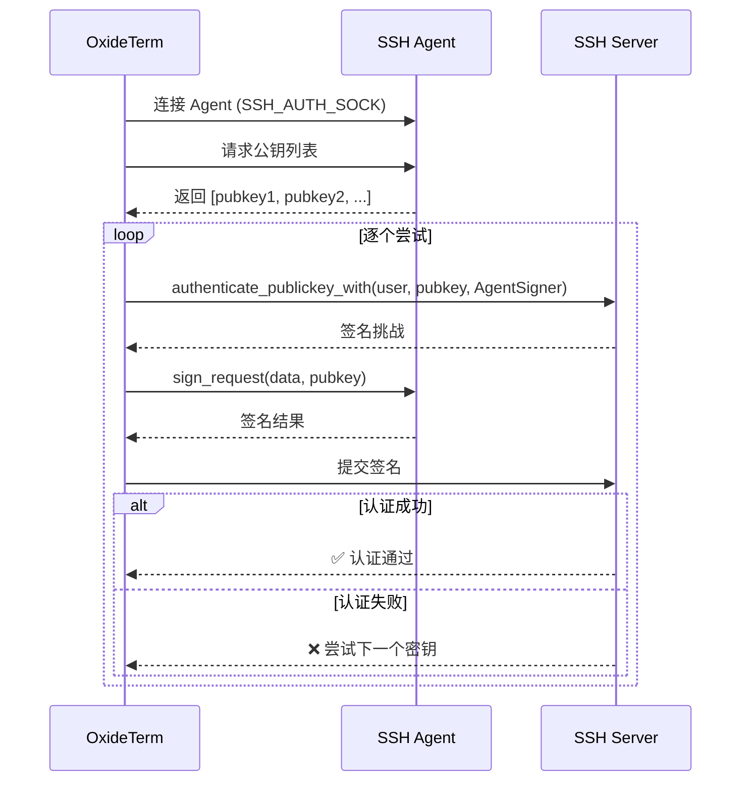

**关键实现细节：**

- 使用 `authenticate_publickey_with()` 而非 `authenticate_publickey()`，因为需要传入自定义 `Signer`
- `AgentSigner` 解决了 russh RPITIT 中 `&PublicKey` 引用跨 async 边界的 `Send` 问题：通过克隆 `PublicKey` 为 owned 值，避免 future 中持有非 `Send` 引用

### 7.8 验收标准

| 验收项 | 状态 |
|-------|------|
| 新建连接可选择 Agent 认证 | ✅ |
| 编辑连接可切换至/从 Agent | ✅ |
| 跳板机支持 Agent | ✅ |
| Agent 认证成功连接 | ✅ |
| 连接持久化保存 Agent 方式 | ✅ |
| .oxide 导入导出 Agent 配置 | ✅ |
| Agent 不可用时给出提示 | ✅ |
| 跨平台检测 (Unix/Windows) | ✅ |

### 7.9 未来计划

| 计划 | 说明 |
|------|------|
| Agent Forwarding | SSH Agent 转发，允许在远程服务器上使用本地 Agent 密钥 |
| 跨平台集成测试 | 自动化测试覆盖 macOS、Linux、Windows |
| Windows Named Pipe 预检测 | 在连接前更准确地检测 Windows Agent 可用性 |

### 7.10 参考资料

- [RFC 4251](https://tools.ietf.org/html/rfc4251) — SSH 协议架构
- [RFC 4252](https://tools.ietf.org/html/rfc4252) — SSH 认证协议
- [PROTOCOL.agent](https://github.com/openssh/openssh-portable/blob/master/PROTOCOL.agent) — SSH Agent 协议规范
- [russh 文档](https://docs.rs/russh/) — Rust SSH 库

### 7.11 开发者注意事项

修改 SSH Agent 认证相关代码时，需注意以下文件的一致性：

| 文件 | 作用 |
|------|------|
| `src-tauri/src/ssh/agent.rs` | `SshAgentClient` + `AgentSigner` 核心实现 |
| `src-tauri/src/session/connection_registry.rs` | `AuthMethod::Agent` 变体处理 |
| `src-tauri/src/ssh/proxy.rs` | 跳板机 Agent 认证支持 |
| `src-tauri/src/ssh/client.rs` | SSH 客户端 Agent 认证分支 |
| `src-tauri/src/ssh/connect_v2.rs` | `is_ssh_agent_available()` 检测函数 |

### 7.12 更新日志

| 日期 | 变更 |
|------|------|
| 2026-01-14 | 完整类型系统、UI 支持、持久化与导入导出 |
| 2026-02-07 | 核心认证流程（AgentSigner）完成 |

---

## 8. 资源监控器（Resource Profiler）

> 合并来源: `RESOURCE_PROFILER.md`
> 代码验证: 2026-03-24

实时采样远程主机的 CPU、内存、负载和网络指标，通过持久化 SSH Shell 通道实现低开销监控。同时集成**智能端口检测**功能，扫描远程监听端口并检测变更，支持一键端口转发（类似 VS Code Remote SSH）。

### 8.1 核心特性

| 特性 | 说明 |
|------|------|
| **持久化通道** | 整个生命周期仅打开 **1 个** Shell Channel，避免 MaxSessions 耗尽 |
| **轻量采样** | 精简命令输出 ~500-1.5KB（仅读取 `/proc` 中的关键行） |
| **自动生命周期** | SSH 断连 → 自动停止；重连 → 可重新启动 |
| **优雅降级** | 非 Linux 主机或连续失败后自动降级为 RTT-Only 模式 |
| **Delta 计算** | CPU% 和网络速率基于两次采样的差值，首次采样返回 `None` |
| **智能端口检测** | 平台分发端口扫描 + Docker 容器检测，差异事件驱动前端通知 |

### 8.2 架构概览

```
┌──────────────────────────────────────────────────────────────┐
│                        Frontend                              │
│                                                              │
│  profilerStore ◄──── Tauri Event ◄──── "profiler:update:{id}"│
│  (Zustand)           (JSON payload)                          │
│       │                                                      │
│       ├─ metrics: ResourceMetrics | null                     │
│       ├─ history: ResourceMetrics[] (max 60)                 │
│       ├─ isRunning / isEnabled / error                       │
│       └─ _generations: Map (防 StrictMode 竞态)              │
│                                                              │
│  usePortDetection(connId) ◄── "port-detected:{id}" ◄───┐    │
│       ├─ newPorts / allPorts / dismissPort              │    │
│       └─ 12s 轮询 api.getDetectedPorts()               │    │
│                                                         │    │
│  api.startResourceProfiler(connId)  ──► Tauri IPC ──►  │    │
│  api.stopResourceProfiler(connId)   ──► Tauri IPC ──►  │    │
│  api.getResourceMetrics(connId)     ──► Tauri IPC ──►  │    │
│  api.getResourceHistory(connId)     ──► Tauri IPC ──►  │    │
│  api.getDetectedPorts(connId)       ──► Tauri IPC ──►  │    │
│  api.ignoreDetectedPort(connId, p)  ──► Tauri IPC ──►  │    │
├──────────────────────────────────────────────────────────┤    │
│                        Backend (Rust)                    │    │
│                                                          │    │
│  ProfilerRegistry (DashMap<String, ResourceProfiler>)    │    │
│       │                                                  │    │
│       └─ ResourceProfiler::spawn(connId, controller,     │    │
│              app, os_type)                                │    │
│              │                                           │    │
│              ├─ open_shell_channel()  → 1 persistent shell    │
│              ├─ sampling_loop()      → 每 10s 一次采样        │
│              │     ├─ shell_sample() → 写入命令 + 读取输出    │
│              │     ├─ parse_metrics()→ 解析 /proc 数据        │
│              │     ├─ emit_metrics() → AppHandle.emit()       │
│              │     ├─ parse_listening_ports() → 端口解析 ─────┘
│              │     └─ 端口差异检测 → emit port-detected 事件
│              │
│              ├─ ignored_ports: HashSet<u16> (用户忽略)
│              ├─ detected_ports: Vec<DetectedPort> (最新快照)
│              └─ stop 信号: oneshot / disconnect_rx / 手动
└──────────────────────────────────────────────────────────────┘
```

### 8.3 采集指标

#### 8.3.1 ResourceMetrics 数据结构

```typescript
type ResourceMetrics = {
  timestampMs: number;         // 采样时间戳 (ms since epoch)
  cpuPercent: number | null;   // CPU 使用率 (0-100)，首次无数据
  memoryUsed: number | null;   // 已用内存 (bytes)
  memoryTotal: number | null;  // 总内存 (bytes)
  memoryPercent: number | null;// 内存使用率 (0-100)
  loadAvg1: number | null;     // 1 分钟负载
  loadAvg5: number | null;     // 5 分钟负载
  loadAvg15: number | null;    // 15 分钟负载
  cpuCores: number | null;     // CPU 核心数
  netRxBytesPerSec: number | null; // 网络接收速率 (bytes/s)
  netTxBytesPerSec: number | null; // 网络发送速率 (bytes/s)
  sshRttMs: number | null;     // SSH RTT (ms)
  source: MetricsSource;       // 数据质量标识
}

type MetricsSource = 'full' | 'partial' | 'rtt_only' | 'failed';
```

#### 8.3.2 数据源对照

| 指标 | 数据源 | 命令 |
|------|--------|------|
| CPU% | `/proc/stat` 首行 | `head -1 /proc/stat` |
| 内存 | `/proc/meminfo` 两行 | `grep -E '^(MemTotal\|MemAvailable):' /proc/meminfo` |
| 负载 | `/proc/loadavg` | `cat /proc/loadavg` |
| 网络 | `/proc/net/dev` 全文 | `cat /proc/net/dev`（排除 lo 回环接口） |
| 核心数 | `nproc` | `nproc` |

> CPU% 和网络速率采用 **Delta 计算**：需要两次采样之间的差值。因此首次采样的这两个指标为 `null`（参见不变量 P5）。

### 8.4 后端设计

#### 8.4.1 持久化 Shell 通道

与常规的 `exec` 模式（每次命令打开新 Channel）不同，Profiler 采用**持久 Shell 通道**：

```
┌───────────────────────────────────────────────────────────────┐
│  shell_channel (1 个, 存活全程)                               │
│                                                               │
│  1. request_shell(false)                                      │
│  2. init: export PS1=''; export PS2='';                       │
│           stty -echo 2>/dev/null; export LANG=C               │
│  3. 循环:                                                     │
│     → 写入 build_sample_command(os_type) 动态命令 (stdin)     │
│     ← 读取输出直到 ===END===                                 │
│     → 解析指标段 (===STAT=== ~ ===NPROC===)                  │
│     → 解析端口段 (===PORTS=== ~ ===PORTS_END===)             │
│     → 解析 Docker 段 (===DOCKER=== ~ ===DOCKER_END===)       │
│     → 计算 Delta → 发射 profiler:update 事件                 │
│     → 端口差异 → 发射 port-detected 事件                     │
│     → sleep 10s                                               │
└───────────────────────────────────────────────────────────────┘
```

**优势**：
- 避免频繁开关 Channel → 不触发 MaxSessions 限制
- 无额外的 shell 启动开销
- 输出通过 `===MARKER===` 分隔符精确提取

#### 8.4.2 采样命令

采样命令不再是单一固定字符串，而是通过 `METRICS_COMMAND_LINUX` 常量 + `build_sample_command(os_type)` 函数动态组装。指标采集部分固定，端口扫描命令根据远程主机 `os_type` 平台分发。

**指标采集部分**（`METRICS_COMMAND_LINUX` 常量）：

```bash
echo '===STAT==='; head -1 /proc/stat 2>/dev/null
echo '===MEMINFO==='; grep -E '^(MemTotal|MemAvailable):' /proc/meminfo 2>/dev/null
echo '===LOADAVG==='; cat /proc/loadavg 2>/dev/null
echo '===NETDEV==='; cat /proc/net/dev 2>/dev/null
echo '===NPROC==='; nproc 2>/dev/null
```

**端口扫描部分**（平台分发，详见 8.6 节）拼接在指标命令之后，最终以 `echo '===END==='` 结尾。

**标记分隔符一览**：

| 标记 | 用途 |
|------|------|
| `===STAT===` | `/proc/stat` CPU 数据段 |
| `===MEMINFO===` | `/proc/meminfo` 内存数据段 |
| `===LOADAVG===` | `/proc/loadavg` 负载数据段 |
| `===NETDEV===` | `/proc/net/dev` 网络数据段 |
| `===NPROC===` | CPU 核心数段 |
| `===PORTS===` / `===PORTS_END===` | 监听端口扫描段 |
| `===DOCKER===` / `===DOCKER_END===` | Docker 容器端口段 |
| `===END===` | 整体输出结束标记 |

- 每条子命令均带 `2>/dev/null` → 非 Linux 系统上静默失败
- 指标采集输出：**~500-1.5KB**（相比读取完整 `/proc` 的 10-30KB，减少约 90%）
- 加上端口扫描和 Docker 检测后，总输出量通常 **~2-8KB**

#### 8.4.3 性能参数

| 参数 | 值 | 说明 |
|------|-----|------|
| `DEFAULT_INTERVAL` | 10s | 采样间隔，平衡精度与 SSH 带宽开销 |
| `SAMPLE_TIMEOUT` | 5s | 单次采样读取超时 |
| `MAX_OUTPUT_SIZE` | **64KB** (65,536 bytes) | 输出截断上限，防止异常输出；扩容以容纳端口扫描 + Docker 输出 |
| `HISTORY_CAPACITY` | 60 | 环形缓冲区大小（10 分钟历史） |
| `MAX_CONSECUTIVE_FAILURES` | 3 | 连续失败阈值 → 降级为 RttOnly |
| `CHANNEL_OPEN_TIMEOUT` | 10s | 初始 Shell Channel 打开超时 |

#### 8.4.4 锁策略

使用 `parking_lot::RwLock`（非 `tokio::sync::RwLock`），原因：
- 临界区极短（仅读写几个字段，无 await）
- `parking_lot` 提供更高效的自旋/休眠混合策略
- 避免 async RwLock 的 Waker/调度开销
- 减少与终端 PTY I/O 的 tokio 调度器竞争

#### 8.4.5 停止机制（三路信号）

```rust
tokio::select! {
    _ = interval.tick() => { /* 采样 */ }
    _ = disconnect_rx.recv() => { break; }  // SSH 断连
    _ = &mut stop_rx => { break; }          // 手动停止
}
```

1. **disconnect_rx** — `HandleController::subscribe_disconnect()` 的广播，SSH 物理断连时触发
2. **stop_rx** — `tokio::sync::oneshot`，调用 `profiler.stop()` 时发送
3. **ProfilerRegistry::stop_all()** — 应用退出时统一清理

停止后将 `ProfilerState` 设为 `Stopped`，并关闭持久 Shell Channel。

#### 8.4.6 ProfilerState 枚举

```rust
#[derive(Debug, Clone, Copy, PartialEq, Eq, Serialize, Deserialize)]
#[serde(rename_all = "snake_case")]
pub enum ProfilerState {
    Running,   // 正常采样中
    Stopped,   // 已停止（手动或断连）
    Degraded,  // 降级模式（仅 RTT）
}
```

- `start_resource_profiler` 命令检查当前状态：若为 `Running` 则幂等返回，若为 `Stopped`/`Degraded` 则移除旧实例并重新 spawn

### 8.5 前端设计

#### 8.5.1 profilerStore (Zustand)

```
src/store/profilerStore.ts
```

每个连接独立状态：`ConnectionProfilerState { metrics, history, isRunning, isEnabled, error }`

**关键操作**：

| 方法 | 说明 |
|------|------|
| `startProfiler(connId)` | 调用后端 API + 订阅 Tauri 事件；递增 `_generations` 令牌防竞态 |
| `stopProfiler(connId)` | 递增令牌 + 取消订阅 + 调用后端 API + 清理状态 |
| `_updateMetrics(connId, m)` | `new Map(get().connections)` 浅拷贝后 `.set()` 触发 Zustand 更新 |
| `removeConnection(connId)` | 递增令牌 + 取消订阅 + 从 `connections` Map 中删除 + 清理 `_generations` 条目 |
| `getSparklineHistory(connId)` | 返回最近 12 个数据点用于迷你图 |
| `isEnabled(connId)` | 查询特定连接的监控启用状态 |

**竞态防护 — `_generations` Map**：

`profilerStore` 使用 `_generations: Map<string, number>` 为每个连接维护一个递增的"世代令牌"。当 `startProfiler` 或 `stopProfiler` 被调用时，令牌递增。异步回调在完成时检查当前令牌是否与启动时一致——若不一致，说明存在更新的操作（例如 React StrictMode 双重挂载导致的二次 start），此时丢弃本次回调结果，避免竞态覆盖新状态。

**渲染优化**：

`_updateMetrics` 采用 `new Map(get().connections)` 创建浅拷贝后对新 Map 执行 `.set()` — 仅触发订阅了对应 connectionId 数据的组件。避免全量 Map 深拷贝导致的无关连接组件重渲染。

#### 8.5.2 API 层

```typescript
// src/lib/api.ts — 6 个 API 包装函数
api.startResourceProfiler(connectionId: string): Promise<void>
api.stopResourceProfiler(connectionId: string): Promise<void>
api.getResourceMetrics(connectionId: string): Promise<ResourceMetrics | null>
api.getResourceHistory(connectionId: string): Promise<ResourceMetrics[]>
api.getDetectedPorts(connectionId: string): Promise<DetectedPort[]>
api.ignoreDetectedPort(connectionId: string, port: number): Promise<void>
```

#### 8.5.3 事件通道

**指标更新事件**：
```
事件名: "profiler:update:{connectionId}"
载荷: ResourceMetrics (JSON)
方向: Backend → Frontend (单向)
频率: 每 10 秒
```

**端口检测事件**：
```
事件名: "port-detected:{connectionId}"
载荷: PortDetectionEvent (JSON)
方向: Backend → Frontend (单向)
频率: 端口变更时（非首次扫描）
```

### 8.6 智能端口检测（Smart Port Detection）

智能端口检测是 Profiler 的重要扩展功能模块。每次采样周期内，除了收集系统指标外，还会扫描远程主机的监听端口并检测变更，驱动前端提供"是否转发此端口？"的通知体验。

#### 8.6.1 数据结构

```rust
/// 远程主机上检测到的监听端口
pub struct DetectedPort {
    pub port: u16,                    // 端口号
    pub bind_addr: String,            // 绑定地址 (如 "0.0.0.0", "127.0.0.1", "::")
    pub process_name: Option<String>, // 进程名 (如 "node", "python3", "docker:my-app")
    pub pid: Option<u32>,             // 进程 ID
}

/// 端口变更事件
pub struct PortDetectionEvent {
    pub connection_id: String,        // 所属连接
    pub new_ports: Vec<DetectedPort>, // 新增端口（上次扫描中不存在）
    pub closed_ports: Vec<DetectedPort>, // 已关闭端口（上次存在本次不存在）
    pub all_ports: Vec<DetectedPort>,    // 当前全部监听端口
}
```

#### 8.6.2 平台分发的端口扫描命令

`build_sample_command(os_type)` 根据远程主机的 `os_type` 拼接平台特定的端口扫描命令：

| 平台 | 命令 | 常量 |
|------|------|------|
| **Linux** / MinGW / MSYS / Cygwin | `ss -tlnp` (fallback `netstat -tlnp`) | `PORT_CMD_LINUX` |
| **macOS** / Darwin | `lsof -iTCP -sTCP:LISTEN -nP` | `PORT_CMD_MACOS` |
| **Windows** (原生) | `PowerShell Get-NetTCPConnection -State Listen` | `PORT_CMD_WINDOWS` |
| **FreeBSD** / OpenBSD / NetBSD | `sockstat -4 -6 -l -P tcp` | `PORT_CMD_FREEBSD` |
| 其他 | 回退至 Linux 命令 | `PORT_CMD_LINUX` |

所有平台的端口输出均包裹在 `===PORTS===` ... `===PORTS_END===` 标记对中。

#### 8.6.3 Docker 容器端口检测

除常规端口扫描外，还会执行 `docker ps --format '{{.ID}}\t{{.Names}}\t{{.Ports}}'` 检测容器映射端口（通过 iptables DNAT 的端口可能在 `ss` 中不可见）。输出包裹在 `===DOCKER===` ... `===DOCKER_END===` 标记对中。

- Docker 端口的 `process_name` 字段格式为 `"docker:{container_name}"`
- 支持 `sudo -n docker ps` 回退（无密码 sudo）
- 仅解析带 `->` 的主机映射端口，跳过仅暴露（`EXPOSE`）但未映射的端口
- 多映射端口（如 `0.0.0.0:3000->3000/tcp, 0.0.0.0:3001->3001/tcp`）逐一解析
- Docker 端口与 `ss`/`netstat` 结果按端口号去重（`ss` 结果优先）

#### 8.6.4 端口差异与变更事件

采样循环在每个周期执行以下逻辑：

1. 解析 `===PORTS===` 段和 `===DOCKER===` 段，合并为 `current_ports`
2. 与 `prev_ports`（上次扫描的端口号集合）求差集：
   - `new_port_numbers = current - prev`
   - `closed_port_numbers = prev - current`
3. 过滤新端口：排除端口 22（SSH）和用户已忽略端口（`ignored_ports`）
4. 若存在可见的新增或关闭端口，发射 `port-detected:{connectionId}` 事件
5. 更新 `prev_ports` 和 `detected_ports` 快照

**截断保护**：若采样输出被 `MAX_OUTPUT_SIZE` 截断（不含 `===END===` 标记），则跳过该周期的端口差异计算，避免部分输出导致的误报。

#### 8.6.5 用户忽略端口机制

- `ResourceProfiler` 持有 `ignored_ports: Arc<RwLock<HashSet<u16>>>` 忽略集合
- 用户在前端点击"忽略"时，调用 `api.ignoreDetectedPort(connectionId, port)`
- 后端 `ignore_port()` 将端口号加入 `ignored_ports`，后续差异计算时过滤
- 忽略状态持续到 Profiler 重启（即下次连接时重置）
- 前端 `usePortDetection` hook 通过 `dismissedRef` 维护本地已忽略列表

#### 8.6.6 前端 usePortDetection Hook

```typescript
// src/hooks/usePortDetection.ts
export function usePortDetection(connectionId: string | undefined): {
  newPorts: DetectedPort[];     // 新检测到的、未被用户忽略的端口
  allPorts: DetectedPort[];     // 当前全部监听端口
  dismissPort: (port: number) => void; // 忽略端口
  isActive: boolean;            // 是否正在接收端口数据
}
```

- 订阅 `port-detected:{connectionId}` 事件接收实时差异
- 每 12 秒轮询 `api.getDetectedPorts()` 刷新全量快照（覆盖首次静默扫描）
- 自动确保 Profiler 已启动（幂等调用 `api.startResourceProfiler`）
- `connectionId` 变更时清除本地忽略状态
- 在 `ForwardsView` 组件中使用，提供"检测到新端口，是否创建转发？"的 UI

#### 8.6.7 Tauri 命令

| 命令 | 参数 | 返回 | 说明 |
|------|------|------|------|
| `get_detected_ports` | `connection_id: String` | `Vec<DetectedPort>` | 获取最新端口快照 |
| `ignore_detected_port` | `connection_id: String, port: u16` | `()` | 将端口加入忽略列表 |

### 8.7 不变量

| 编号 | 不变量 | 说明 |
|------|--------|------|
| **P1** | 无强引用 | Profiler 不持有连接的强引用，仅通过 `HandleController`（弱引用）操作 |
| **P2** | 断连自停 | SSH 断连 → `disconnect_rx` 触发 → Profiler 自动停止并释放 Channel |
| **P3** | 单通道 | 整个生命周期仅打开 1 个 Shell Channel，不会导致 MaxSessions 耗尽 |
| **P5** | 首采空值 | 首次采样的 CPU% 和网络速率为 `None`（无 Delta 基线） |
| **P6** | 首次端口扫描静默 | 首次端口扫描仅建立基线（`is_initial_scan = true`），不发射 `port-detected` 事件，避免连接建立时的大量噪音通知 |

### 8.8 测试

后端包含丰富的单元测试，覆盖指标解析和端口检测两大模块：

```bash
cd src-tauri && cargo test profiler    # 运行 profiler 相关测试
```

**指标解析测试**：

| 测试 | 验证内容 |
|------|---------|
| `test_parse_cpu_snapshot` | `/proc/stat` 解析正确性 |
| `test_parse_meminfo` | MemTotal / MemAvailable 计算 |
| `test_parse_loadavg` | 负载平均值解析 |
| `test_parse_net_snapshot` | 网络接口聚合（排除 lo） |
| `test_parse_nproc` | CPU 核心数解析 |
| `test_parse_metrics_first_sample_no_delta` | P5：首次无 CPU%/网络速率 |
| `test_parse_metrics_with_delta` | Delta 计算正确性 |
| `test_extract_section` | 标记分隔符提取 |
| `test_empty_output` | 空输出 → RttOnly 降级 |

**端口检测测试**：

| 测试 | 验证内容 |
|------|---------|
| `test_parse_ports_ss` | `ss -tlnp` 输出解析（含进程名/PID 提取） |
| `test_parse_ports_netstat` | `netstat -tlnp` 输出解析 |
| `test_parse_ports_lsof` | macOS `lsof` 输出解析 |
| `test_parse_ports_powershell` | Windows `Get-NetTCPConnection` 输出解析 |
| `test_parse_ports_sockstat` | FreeBSD `sockstat` 输出解析 |
| `test_parse_addr_port_ipv4` | IPv4 地址:端口 解析 |
| `test_parse_addr_port_ipv6_brackets` | IPv6 带括号格式 `[::]:3000` |
| `test_parse_addr_port_wildcard` | 通配符 `*:22` → `0.0.0.0:22` |
| `test_parse_addr_port_ipv6_no_brackets` | IPv6 无括号格式 `:::80` |
| `test_dedup_ports` | IPv4/IPv6 同端口去重 |
| `test_parse_ports_docker` | Docker `docker ps` 映射端口解析 |
| `test_parse_ports_docker_multi_mapping` | Docker 多端口映射 |
| `test_parse_ports_docker_empty` | 空 Docker 输出 |
| `test_parse_ports_docker_no_section` | 无 Docker 段时不报错 |
| `test_parse_listening_ports_full_output` | 完整采样输出同时解析指标和端口 |
| `test_parse_listening_ports_with_docker_merge` | ss + Docker 合并 |
| `test_parse_listening_ports_docker_dedup_with_ss` | ss 与 Docker 重复端口去重（ss 优先） |

### 8.9 文件清单

| 文件 | 职责 |
|------|------|
| `src-tauri/src/session/profiler.rs` | 核心采样引擎 + 端口检测（**~1570 行**） |
| `src-tauri/src/session/health.rs` | `ResourceMetrics` / `MetricsSource` 类型定义 |
| `src-tauri/src/commands/health.rs` | `ProfilerRegistry` + **6 个** Tauri 命令 |
| `src-tauri/src/lib.rs` | `.manage(ProfilerRegistry)` + 命令注册 + 退出清理 |
| `src/store/profilerStore.ts` | 前端 Zustand Store（含 `_generations` 竞态防护） |
| `src/hooks/usePortDetection.ts` | 智能端口检测 React Hook |
| `src/lib/api.ts` | **6 个** API 包装函数 |
| `src/types/index.ts` | TypeScript 类型定义（`DetectedPort` / `PortDetectionEvent`） |
| `src/locales/*/profiler.json` | 11 种语言的 i18n 文件 |

### 8.10 性能影响

#### SSH 带宽

- 每次采样命令（指标 + 端口扫描 + Docker）+ 输出：**~2-8 KB**
- 10s 间隔 → **~12-48 KB/min** 额外带宽
- 远低于终端 PTY 的典型吞吐量（滚屏时可达 MB/s 级）
- 端口较多的服务器（100+ 监听端口）输出可能增至 ~15-20KB/次，仍远低于 `MAX_OUTPUT_SIZE`（64KB）

#### 系统资源

- **1 个 Shell Channel** — 不占用额外的 SSH Session 额度
- **`parking_lot::RwLock`** — 极低锁开销，自旋+休眠混合策略，不与 tokio 调度器竞争
- **环形缓冲区**（60 条）— 内存占用恒定（~30 KB/连接，不含端口快照）
- **端口快照**：`detected_ports` + `ignored_ports` + `prev_ports` 额外占用极少（通常 < 1KB/连接）

#### 端口检测开销

- 端口解析在采样主线程内同步完成，耗时通常 < 1ms
- `HashSet` 差集计算为 O(n) 复杂度，即使 100+ 端口也在微秒级别
- 端口变更事件通过 `app_handle.emit()` 异步发送，不阻塞采样循环

#### 降级策略

连续 3 次采样失败后自动降级：
- **RttOnly 模式**：停止 `/proc` 采样和端口扫描，仅保留 SSH RTT 数据
- 降级后仍会每 10s 发射一次空指标（前端可据此显示降级状态）
- Channel 关闭时会尝试一次重开（`open_shell_channel`）

### 8.11 集成示例

#### 资源指标

```typescript
import { useProfilerStore } from '../store/profilerStore';

// 启动监控
await useProfilerStore.getState().startProfiler(connectionId);

// 读取最新指标
const metrics = useProfilerStore.getState().connections.get(connectionId)?.metrics;
if (metrics?.cpuPercent !== null) {
  console.log(`CPU: ${metrics.cpuPercent.toFixed(1)}%`);
}

// 停止监控
await useProfilerStore.getState().stopProfiler(connectionId);
```

> **幂等性**：`startProfiler` 和 `stopProfiler` 均为幂等操作，重复调用不会产生副作用。React StrictMode 的双重挂载通过 `_generations` 令牌机制安全处理，不会产生重复 Profiler。

#### 智能端口检测

```typescript
import { usePortDetection } from '../hooks/usePortDetection';

function ForwardingPanel({ connectionId }: { connectionId: string }) {
  const { newPorts, allPorts, dismissPort, isActive } = usePortDetection(connectionId);

  return (
    <>
      {newPorts.map((p) => (
        <PortNotification
          key={p.port}
          port={p.port}
          processName={p.process_name}
          onForward={() => createForward(connectionId, p.port)}
          onDismiss={() => dismissPort(p.port)}
        />
      ))}
    </>
  );
}
```

---

## 9. 远程环境探测器（Environment Detector）

> 合并来源: `ENV_DETECTOR.md`
> 代码验证: 2026-03-24

**目标**：SSH 连接建立后自动探测远程主机的 OS / 架构 / Shell 类型，注入 AI 上下文，让 Inline Panel 和 Sidebar Chat 给出正确的平台命令。

### 9.1 问题

| 面板 | 当前做法 | 缺陷 |
|------|---------|------|
| Inline Panel | `navigator.platform` → 本地 OS | SSH 到 CentOS 时 prompt 说 `Current OS: macOS` |
| Sidebar Chat | `guessRemoteOS()` 靠 hostname 模式匹配 | `192.168.1.100` 返回 `null`，多数服务器无法识别 |

### 9.2 架构概览

```
SSH 连接 Active
     │
     ▼  (tokio::spawn, ~1s)
┌────────────────────┐
│  env_detector.rs   │  ← 新模块，仿照 profiler.rs
│  open_shell()      │
│  Phase A: 判平台   │  if [ -n "$PSModulePath" ]; ...
│  Phase B: 分支探测 │  Linux: uname + /etc/os-release
│                    │  Windows: PSVersionTable + ver
│  close_shell()     │
└────────┬───────────┘
         │ RemoteEnvInfo
         ▼
  ConnectionEntry.remote_env  ← OnceLock 缓存（一次写入，不可变读取）
         │
         ├──→ Tauri Event "env:detected"
         │         ↓
         │    appStore.connections[id].remoteEnv
         │
         ├──→ sidebarContextProvider.ts
         │    formatSystemPromptSegment()
         │    "Remote OS: Linux (Ubuntu 22.04)"
         │
         └──→ AiInlinePanel.tsx
              "Remote: Linux x86_64 /bin/bash"
```

### 9.3 数据结构

#### Rust（`session/env_detector.rs` — 580 行）

```rust
#[derive(Debug, Clone, Serialize, Deserialize)]
#[serde(rename_all = "camelCase")]
pub struct RemoteEnvInfo {
    /// "Linux" | "macOS" | "Windows" | "FreeBSD" | "OpenBSD" | "NetBSD" | "SunOS" | "Unknown"
    /// 特殊值: "Windows_MinGW" (Git Bash), "Windows_MSYS", "Windows_Cygwin"
    pub os_type: String,

    /// PRETTY_NAME from /etc/os-release, ver output, sw_vers, etc.
    pub os_version: Option<String>,

    /// uname -r
    pub kernel: Option<String>,

    /// uname -m or PROCESSOR_ARCHITECTURE
    pub arch: Option<String>,

    /// $SHELL or PowerShell version
    pub shell: Option<String>,

    /// chrono::Utc::now().timestamp()
    pub detected_at: i64,
}

impl RemoteEnvInfo {
    /// 便捷构造函数：创建 "Unknown" 结果，用于探测失败场景。
    pub fn unknown() -> Self {
        Self {
            os_type: "Unknown".to_string(),
            os_version: None,
            kernel: None,
            arch: None,
            shell: None,
            detected_at: Utc::now().timestamp(),
        }
    }
}
```

**关键常量**：

```rust
const CHANNEL_OPEN_TIMEOUT: Duration = Duration::from_secs(5);
const PHASE_A_TIMEOUT: Duration      = Duration::from_secs(3);
const PHASE_B_TIMEOUT: Duration      = Duration::from_secs(5);
const TOTAL_TIMEOUT: Duration        = Duration::from_secs(8);
const MAX_OUTPUT_SIZE: usize         = 8192; // 8KB 最大输出限制
```

#### `ConnectionEntry` 中的缓存字段

```rust
remote_env: std::sync::OnceLock<RemoteEnvInfo>,
```

> **语义说明**：使用 `OnceLock` 而非 `RwLock<Option<…>>`——探测结果只写入一次、此后不可变读取，由类型系统保证线程安全且无需每次读取加锁。

#### TypeScript（`types/index.ts`）

```typescript
export interface RemoteEnvInfo {
  osType: string;
  osVersion?: string;
  kernel?: string;
  arch?: string;
  shell?: string;
  detectedAt: number;
}

// 扩展已有类型
export interface SshConnectionInfo {
  // ...existing fields...
  remoteEnv?: RemoteEnvInfo;
}
```

### 9.4 探测命令设计

#### Phase A: 平台判别（原子化，单行安全）

```bash
echo '===DETECT==='; if [ -n "$PSModulePath" ]; then echo 'PLATFORM=windows'; else echo "PLATFORM=$(uname -s 2>/dev/null || echo unknown)"; fi; echo '===END==='
```

**为什么用 `$PSModulePath`**：所有 Windows 环境（PowerShell、cmd+pwsh、OpenSSH Server）都设置此变量，而 Unix 系统不会设置。比 `$PSVersionTable` 更可靠（后者在 cmd 中不可用）。

#### Phase B-Unix

```bash
echo '===ENV==='; uname -s 2>/dev/null; echo '===ARCH==='; uname -m 2>/dev/null; \
echo '===KERNEL==='; uname -r 2>/dev/null; echo '===SHELL==='; echo $SHELL 2>/dev/null; \
echo '===DISTRO==='; cat /etc/os-release 2>/dev/null | grep -E '^(PRETTY_NAME|ID)=' | head -2; \
echo '===END==='
```

#### Phase B-Windows（PowerShell）

```powershell
echo '===ENV==='; [System.Environment]::OSVersion.VersionString; echo '===ARCH==='; \
$env:PROCESSOR_ARCHITECTURE; echo '===SHELL==='; "PowerShell $($PSVersionTable.PSVersion)"; \
echo '===END==='
```

#### "伪装" Windows 识别规则

`uname -s` 返回值中包含以下模式时，识别为 Windows 变体环境：

| `uname -s` 输出 | 映射 |
|----------------|------|
| `MINGW64_NT-*` / `MINGW32_NT-*` | `Windows_MinGW`（Git Bash） |
| `MSYS_NT-*` | `Windows_MSYS` |
| `CYGWIN_NT-*` | `Windows_Cygwin` |

AI Prompt 注入示例：`"Remote environment: Windows (MinGW/Git Bash) — paths use /c/Users format"`

#### OS 分类完整映射

`classify_unix_os()` 函数支持以下 `uname -s` 到 `os_type` 的映射：

| `uname -s` | `os_type` |
|-------------|-----------|
| `Linux` | `Linux` |
| `Darwin` | `macOS` |
| `FreeBSD` | `FreeBSD` |
| `OpenBSD` | `OpenBSD` |
| `NetBSD` | `NetBSD` |
| `SunOS` | `SunOS` |
| `MINGW64_NT-*` / `MINGW32_NT-*` | `Windows_MinGW` |
| `MSYS_NT-*` | `Windows_MSYS` |
| `CYGWIN_NT-*` | `Windows_Cygwin` |
| 空字符串 / `"unknown"` | `Unknown` |
| 其他非空值 | 原样保留 |

### 9.5 触发时机

在 `SshConnectionRegistry` 中，`ConnectionEntry` 创建并插入 `connections` DashMap 后，共有 **3 处**触发点：

| 触发点 | 方法 | 说明 |
|--------|------|------|
| 直连 | `connect()` | 常规 SSH 直连成功后 |
| 隧道连接 | `establish_tunneled_connection()` | 通过跳板机建立的隧道连接 |
| 注册已有连接 | `register_existing()` | 将外部已建立的 SSH 连接注册到连接池 |

#### `spawn_env_detection` 签名

主方法：

```rust
pub fn spawn_env_detection(self: &Arc<Self>, connection_id: &str)
```

- 从 `self.connections` 中获取 `ConnectionEntry`
- Clone `handle_controller`
- `tokio::spawn` 异步执行 `detect_remote_env()`
- 结果通过 `OnceLock::set()` 写入 `entry.remote_env`
- Emit `env:detected` 事件

对于 `register_existing()`（不持有 `Arc<Self>`），使用内部静态版本：

```rust
fn spawn_env_detection_inner(
    conn: Arc<ConnectionEntry>,
    connection_id: String,
    app_handle: Option<AppHandle>,
)
```

### 9.6 超时与失败

| 阶段 | 超时 | 失败处理 |
|------|------|---------|
| Channel 打开 | 5s | `os_type = "Unknown"`，warn 日志 |
| Phase A 输出等待 | 3s | 同上 |
| Phase B 输出等待 | 5s | 只填 `os_type`，其余 `None` |
| 总探测 | 8s | 强制终止，标记 Unknown |
| 单次输出上限 | 8KB (`MAX_OUTPUT_SIZE`) | 截断输出，防止异常服务器撑爆内存 |

失败时仍然 emit 事件，payload `os_type = "Unknown"`，前端 AI prompt 注入：

```
- Remote OS: Unknown (detection failed, provide platform-agnostic commands when possible)
```

### 9.7 异步竞态处理

用户可能在探测完成前就打开 AI 面板。

#### 前端策略

`SshConnectionInfo.remoteEnv` 有三种状态：
- `undefined` — 探测尚未开始/进行中
- `null` — 无 SSH 连接（本地终端）
- `RemoteEnvInfo` — 探测完成

**AiInlinePanel** 和 **sidebarContextProvider** 注入逻辑：

```typescript
if (remoteEnv === undefined) {
  prompt += '- Remote OS: [detecting...] (provide platform-agnostic commands)\n';
} else if (remoteEnv === null) {
  prompt += `- Terminal: Local (${localOS})\n`;
} else {
  prompt += `- Remote OS: ${remoteEnv.osType}\n`;
}
```

#### Rust 侧

`ConnectionEntry.remote_env` 类型为 `std::sync::OnceLock<RemoteEnvInfo>`：
- 初始状态为空（未设置 — 探测进行中）
- 探测完成后通过 `OnceLock::set()` 写入一次
- 后续所有读取通过 `OnceLock::get()` 获取不可变引用，无锁开销
- `to_info()` 序列化时包含此字段

### 9.8 前端改动清单

#### `src/lib/sidebarContextProvider.ts`

1. `EnvironmentSnapshot` 增加 `remoteEnv?: RemoteEnvInfo`（替代 `remoteOSHint: string | null`）
2. `gatherSidebarContext()` 从 `appStore.connections[id]` 读取 `remoteEnv`
3. `formatSystemPromptSegment()` 输出详细环境信息
4. 保留 `guessRemoteOS()` 作为 `remoteEnv === undefined` 时的 fallback
5. 探测中标注 `[detecting...]`

#### `AiInlinePanel.tsx`

1. 新增 props: `sessionId?: string`
2. 通过 `sessionId` → `appStore` → `remoteEnv` 获取环境
3. System prompt 根据状态切换：
   - SSH + 已探测: `"Remote environment: Linux (Ubuntu 22.04), arch: x86_64, shell: /bin/bash"`
   - SSH + 探测中: `"Remote environment: detecting..."`
   - SSH + 失败: `"Remote environment: unknown"`
   - 本地终端: `"Local OS: macOS"`

#### 其他文件

- `TerminalView.tsx` / `LocalTerminalView.tsx` — 传入 `sessionId` prop 给 `AiInlinePanel`
- `useConnectionEvents.ts` — 新增监听 `env:detected` 事件
- `api.ts` — 新增 `getRemoteEnv(connectionId): Promise<RemoteEnvInfo | null>`
- `types/index.ts` — 新增 `RemoteEnvInfo` 接口，扩展 `SshConnectionInfo`

### 9.9 文件清单

| 文件 | 说明 |
|------|------|
| `src-tauri/src/session/env_detector.rs` | 核心探测逻辑（580 行，含 8 个单元测试） |
| `src-tauri/src/session/mod.rs` | `pub mod env_detector;` |
| `src-tauri/src/ssh/connection_registry.rs` | `OnceLock<RemoteEnvInfo>` 字段 + `spawn_env_detection()` |
| `src-tauri/src/commands/ssh.rs` | `get_remote_env` 命令 |
| `src-tauri/src/lib.rs` | 注册新命令 |
| `src/types/index.ts` | `RemoteEnvInfo` 接口 + `SshConnectionInfo` 扩展 |
| `src/lib/api.ts` | `getRemoteEnv()` wrapper |
| `src/lib/sidebarContextProvider.ts` | 替换 `guessRemoteOS()`，增强 AI prompt |
| `src/components/terminal/AiInlinePanel.tsx` | `sessionId` prop，OS 感知 |
| `src/components/terminal/TerminalView.tsx` | 传 `sessionId` |
| `src/components/terminal/LocalTerminalView.tsx` | 传标记 |
| `src/hooks/useConnectionEvents.ts` | 监听 `env:detected` |

### 9.10 测试

#### 集成测试场景

| 场景 | 预期 |
|------|------|
| SSH → Ubuntu 22.04 | `Linux / Ubuntu 22.04.3 LTS / x86_64 / /bin/bash` |
| SSH → macOS | `macOS / Darwin / arm64 / /bin/zsh` |
| SSH → Windows (OpenSSH + PowerShell) | `Windows / Microsoft Windows NT 10.0 / AMD64 / PowerShell 7.x` |
| SSH → Windows (Git Bash) | `Windows_MinGW / MINGW64_NT... / x86_64 / /usr/bin/bash` |
| SSH → FreeBSD | `FreeBSD / uname 输出 / amd64 / /bin/sh` |
| SSH → 路由器 (受限 shell) | `Unknown` + warn 日志 |
| SSH → 隧道连接 | 隧道目标的环境，非跳板机 |
| 本地终端 | 不触发探测，使用 `navigator.platform` |
| 连接后 0.1s 打开 AI | `[detecting...]` → 稍后自动更新 |
| 探测超时 | `Unknown` + 标注 |

#### 单元测试（`env_detector.rs` — 8 个 `#[test]`）

| 测试函数 | 覆盖范围 |
|---------|---------|
| `test_classify_unix_os` | OS 分类映射（Linux、Darwin→macOS、FreeBSD、MinGW、MSYS、Cygwin、SunOS、空值） |
| `test_parse_unix_env` | 标准 Linux 输出解析（Ubuntu 22.04） |
| `test_parse_unix_env_macos` | macOS（Darwin）输出解析 |
| `test_parse_unix_env_mingw` | MinGW/Git Bash 环境输出解析 |
| `test_parse_windows_env` | Windows PowerShell 输出解析 |
| `test_extract_os_release_field` | `/etc/os-release` 字段提取 |
| `test_extract_section` | 分隔符标记之间的文本提取 |
| `test_unknown` | `RemoteEnvInfo::unknown()` 便捷构造函数 |

### 9.11 安全考量

- 探测命令均为**只读操作**（`uname`, `cat`, `echo`），无副作用
- **不写入任何文件**到远程主机
- Shell channel 探测完即关闭，**不持久占用** `MaxSessions` 配额
- 探测结果**不包含敏感信息**（无密码、无密钥）
- 结果仅缓存在内存中（`OnceLock`），**不持久化到磁盘**
- 输出截断保护：`MAX_OUTPUT_SIZE = 8192`（8KB），防止恶意/异常远程主机撑爆内存

### 9.12 设计不变量

| 编号 | 不变量 | 说明 |
|------|--------|------|
| **E1** | 探测通道即用即关 | 不占用远程 `MaxSessions` 配额 |
| **E2** | 每连接只探测一次 | 结果通过 `OnceLock` 缓存，类型系统保证单次写入 |
| **E3** | 断连期间优雅中止 | SSH 断开时探测任务不会 panic，返回 `Unknown` |

---

## 10. IDE 模式（轻量级远程开发）

> 合并来源: `IDE_MODE.md` (v0.13.2)  
> 代码验证: 2026-03-24

IDE 模式在 SSH 会话之上提供轻量级远程文件编辑能力——基于 CodeMirror 6 的编辑器、按需加载的文件树、Git 状态集成和搜索缓存，无需在远程主机安装任何 IDE 后端。核心策略为 **Agent-first with SFTP fallback**：当远程代理可用时优先使用 Agent 的原子读写和乐观锁机制，否则自动降级至 SFTP 操作。

### 10.1 概述

#### 核心优势

| 特性 | 说明 |
|------|------|
| **双模后端（Agent / SFTP）** | Agent 可用时走 JSON-RPC 原子操作 + 乐观锁；不可用时自动降级到 SFTP，用户无感 |
| **轻量级** | 无需远程安装 Language Server 或 IDE 后端，CodeMirror 6 前端渲染 |
| **CodeMirror 6 编辑器** | 语法高亮（40+ 语言）、搜索替换、行号、缩进指南、括号匹配 |
| **Git 集成** | Agent-first 策略获取 `git status`，文件树颜色标注修改状态 |
| **重连韧性** | 断线重连后自动恢复项目、标签页、未保存内容（`dirtyContents`） |
| **按需加载** | 文件树惰性展开，500 条大目录保护，搜索结果 LRU 缓存 |
| **LRU 标签管理** | 最多 20 个标签，自动驱逐最久未访问的非固定非脏标签 |

#### 快速开始

1. 在已连接的会话节点上点击 **IDE** 图标进入 IDE 模式
2. 选择远程目录作为项目根路径（或从缓存恢复上次路径）
3. 文件树按需展开，单击文件即可打开编辑
4. `Ctrl/Cmd+S` 保存，Agent 自动检测冲突

### 10.2 界面布局与组件架构

#### 布局结构

```
┌───────────────────────────────────────────────┐
│  IdeWorkspace                                 │
│ ┌──────────┬─────────────────────────────────┐│
│ │          │ IdeEditorTabs                    ││
│ │          ├─────────────────────────────────┤│
│ │ IdeTree  │ IdeEditorArea                   ││
│ │          │   └─ IdeEditor                  ││
│ │          │       └─ CodeEditorSearchBar    ││
│ │          │                                 ││
│ │          ├─────────────────────────────────┤│
│ │          │ IdeTerminal                     ││
│ ├──────────┴─────────────────────────────────┤│
│ │ IdeStatusBar                               ││
│ └────────────────────────────────────────────┘│
└───────────────────────────────────────────────┘
```

#### 组件清单

**组件（11 个）**

| 组件 | 文件 | 职责 |
|------|------|------|
| `IdeWorkspace` | `IdeWorkspace.tsx` | 顶层容器，布局编排，Agent opt-in 对话框触发 |
| `IdeTree` | `IdeTree.tsx` | 文件树（按需加载 + Git 状态颜色 + 右键菜单） |
| `IdeEditor` | `IdeEditor.tsx` | CodeMirror 6 编辑器容器 |
| `IdeEditorArea` | `IdeEditorArea.tsx` | 编辑器区域（空状态、加载状态） |
| `IdeEditorTabs` | `IdeEditorTabs.tsx` | 标签栏（拖拽排序、Pin、关闭、dirty 标记） |
| `IdeSearchPanel` | `IdeSearchPanel.tsx` | 全项目搜索（Agent/grep 双后端 + 缓存） |
| `IdeStatusBar` | `IdeStatusBar.tsx` | 底部状态栏（语言、行列号、Git 分支） |
| `IdeTerminal` | `IdeTerminal.tsx` | 内嵌终端面板 |
| `IdeInlineInput` | `IdeInlineInput.tsx` | 行内输入框（重命名、新建文件） |
| `IdeTreeContextMenu` | `IdeTreeContextMenu.tsx` | 文件树右键菜单 |
| `CodeEditorSearchBar` | `CodeEditorSearchBar.tsx` | 编辑器内搜索替换栏 |

**Hooks（4 个）**

| Hook | 文件 | 职责 |
|------|------|------|
| `useCodeMirrorEditor` | `hooks/useCodeMirrorEditor.ts` | CodeMirror 6 实例管理（创建、销毁、内容同步） |
| `useGitStatus` | `hooks/useGitStatus.ts` | Git 状态轮询 + Agent-first 获取 + 事件驱动刷新 |
| `useAgentStatus` | `hooks/useAgentStatus.ts` | Agent 部署状态监听 |
| `useIdeTerminal` | `hooks/useIdeTerminal.ts` | IDE 内嵌终端生命周期管理 |

**对话框（5 个）**

| 对话框 | 文件 | 职责 |
|--------|------|------|
| `IdeAgentOptInDialog` | `dialogs/IdeAgentOptInDialog.tsx` | Agent 部署确认（`agentMode === 'ask'` 时） |
| `IdeConflictDialog` | `dialogs/IdeConflictDialog.tsx` | 文件冲突处理（覆盖 / 重新加载） |
| `IdeDeleteConfirmDialog` | `dialogs/IdeDeleteConfirmDialog.tsx` | 文件 / 目录删除确认 |
| `IdeRemoteFolderDialog` | `dialogs/IdeRemoteFolderDialog.tsx` | 远程目录选择 |
| `IdeSaveConfirmDialog` | `dialogs/IdeSaveConfirmDialog.tsx` | 未保存内容确认（关闭标签/项目时） |

#### 组件树层级

```
IdeWorkspace
├─ IdeTree
│  ├─ GitStatusContext.Provider
│  ├─ FetchLockContext.Provider
│  ├─ TreeNode (recursive)
│  │  └─ IdeInlineInput (rename/create)
│  └─ IdeTreeContextMenu
├─ IdeEditorTabs
├─ IdeEditorArea
│  └─ IdeEditor
│     ├─ useCodeMirrorEditor
│     └─ CodeEditorSearchBar
├─ IdeTerminal
│  └─ useIdeTerminal
├─ IdeStatusBar
├─ IdeSearchPanel
└─ Dialogs (conditional)
   ├─ IdeAgentOptInDialog
   ├─ IdeConflictDialog
   ├─ IdeDeleteConfirmDialog
   ├─ IdeRemoteFolderDialog
   └─ IdeSaveConfirmDialog
```

### 10.3 核心架构

IDE 模式遵循连接池章节（第 1 章）定义的三大系统不变量，并在此基础上做了 IDE 特定的适配。

#### State Gating（状态门禁）

所有 SFTP / Agent I/O 操作前均调用 `assertNodeReady(nodeId)`：

```typescript
function assertNodeReady(nodeId: string): void {
  const node = useSessionTreeStore.getState().getNode(nodeId);
  if (!node) throw new Error('Node not found in session tree');
  const status = node.runtime?.status;
  if (status !== 'active' && status !== 'connected') {
    throw new Error(`Node is not connected (status: ${status ?? 'unknown'})`);
  }
}
```

关键设计：直接从 `sessionTreeStore.getNode()` 读取状态，**避免一次 IPC 往返**——IDE 操作频繁（每次保存、文件树展开都会触发），性能敏感。

#### Key-Driven Reset

IDE 组件使用 `key={nodeId}` 挂载：当重连编排器分配新 `connectionId`（映射到新 nodeId 关联的运行时状态）时，React 自动卸载旧组件树、remount 新实例。

#### 多 Store 协同

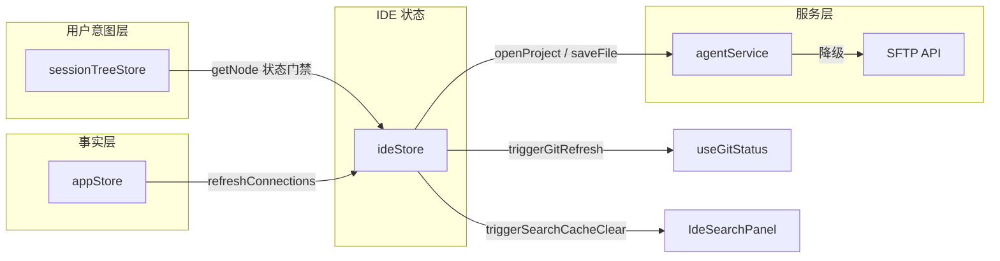

IDE 模式涉及三个 Store 的协同：

| Store | 角色 | IDE 中的作用 |
|-------|------|-------------|
| `sessionTreeStore` | 用户意图层 | 提供 `getNode()` 供 `assertNodeReady` 检查连接状态 |
| `appStore` | 事实层 | `refreshConnections()` 驱动全局 UI 更新 |
| `ideStore` | IDE 专用状态 | 项目、标签、文件树、冲突、布局的完整状态管理 |

### 10.4 文件树与按需加载

#### 按需加载策略

文件树采用惰性展开模式：只有用户点击展开目录时才通过 SFTP / Agent 获取子节点列表。这避免了对大型远程文件系统的全量扫描。

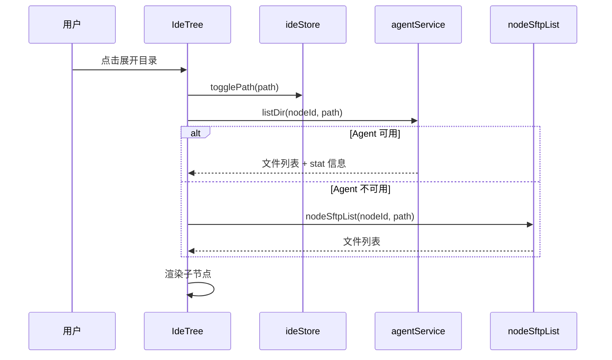

#### FetchLockContext 与 AbortController

为防止并发展开同一目录导致重复请求，`IdeTree` 使用 `FetchLockContext` 管理每个路径的请求锁：

- 每次展开操作创建一个 `AbortController`
- 如果用户快速折叠再展开同一目录，上一次请求被 abort
- 锁粒度为路径级别，不同目录可并行加载

#### 大目录保护

当目录包含超过 **500** 个条目时，IdeTree 截断显示并提示用户，防止渲染性能问题。

#### 路径规范化

IDE 模式处理多种远程环境的路径差异：

| 来源 | 规范化方式 |
|------|-----------|
| 后端 `canonicalize` | Rust `std::path::Path::canonicalize()` 解析符号链接 |
| Agent `resolve_path` | Agent 侧解析 `~` 和相对路径 |
| Windows SSH | 正斜杠/反斜杠统一处理 |
| 前端 `normalizePath` | 移除尾部斜杠、合并重复分隔符 |

#### treeRefreshSignal（按路径刷新）

```typescript
treeRefreshSignal: Record<string, number>  // { 规范化路径: 版本计数器 }
```

文件操作（创建、删除、重命名）后，`refreshTreeNode(parentPath)` 递增对应路径的版本计数器。`IdeTree` 通过 `useEffect` 监听 `treeRefreshSignal` 变化，**仅重新加载受影响的目录**而非整棵树。

### 10.5 Git 状态集成

#### Agent-first 策略

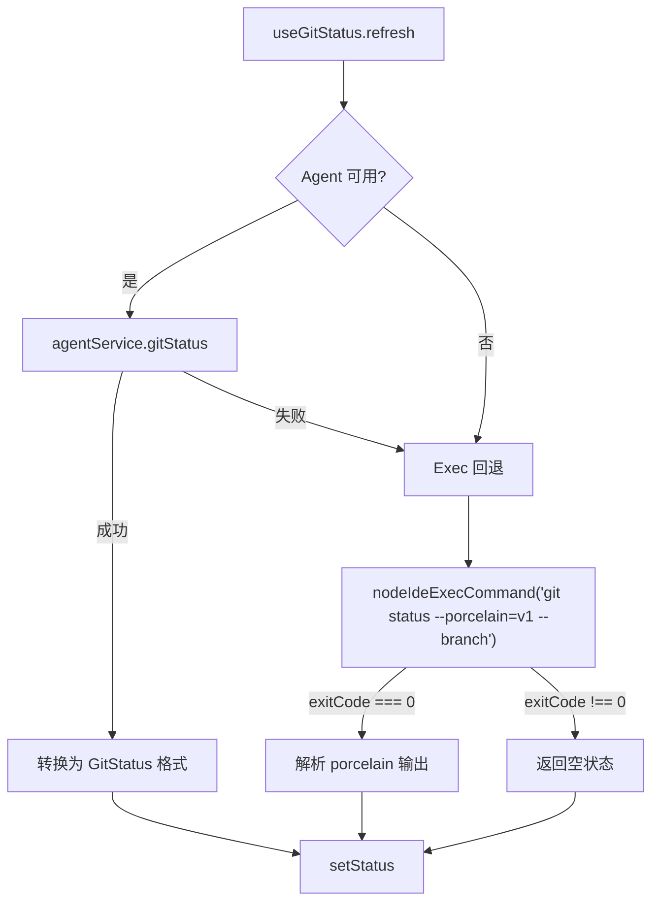

`useGitStatus` hook 的完整流程：

1. **Agent 优先**：调用 `agentService.gitStatus(nodeId, rootPath)`
2. **Exec 回退**：Agent 不可用或失败时，通过 `nodeIdeExecCommand` 执行 `git status --porcelain=v1 --branch 2>/dev/null`
3. **输出解析**：`parseBranchInfo()` 解析分支/ahead/behind，`parseGitStatusOutput()` 解析文件状态

#### GitStatusContext

`IdeTree` 通过 React Context 向整棵树分发 Git 状态，避免每个树节点独立查询：

```typescript
interface GitStatusContextValue {
  getFileStatus: (relativePath: string) => GitFileStatus | undefined;
  // ...
}
const GitStatusContext = createContext<GitStatusContextValue | null>(null);
```

树节点通过 `useGitStatusContext()` 获取状态，O(1) 查询。

#### 文件状态颜色

| 状态 | GitFileStatus | 颜色 |
|------|--------------|------|
| 已修改 | `modified` | 黄色 |
| 新增 | `added` | 绿色 |
| 已删除 | `deleted` | 红色 |
| 重命名 | `renamed` | 蓝色 |
| 未跟踪 | `untracked` | 灰色 |
| 冲突 | `conflict` | 深红色 |
| 忽略 | `ignored` | 不显示 |

#### 行为驱动刷新

| 触发事件 | 时机 | 机制 |
|---------|------|------|
| 保存文件 | `saveFile` 成功后 | `triggerGitRefresh()` → 防抖 1s |
| 文件操作 | 创建 / 删除 / 重命名后 | `triggerGitRefresh()` → 防抖 1s |
| 终端回车 | 用户在 IDE 终端执行命令后 | `triggerGitRefresh()` → 防抖 1s |
| 窗口聚焦 | `window.focus` 事件 | 防抖 1s |
| 保底轮询 | `setInterval` | 60s (`REFRESH_INTERVAL_MS`) |

刷新回调通过模块级 `registerGitRefreshCallback` / `triggerGitRefresh` 桥接 ideStore 与 useGitStatus hook（见 10.9 节）。

### 10.6 编辑器与标签管理

#### CodeMirror 6 集成

`useCodeMirrorEditor` hook 管理 CodeMirror 6 实例的完整生命周期：

- **创建**：根据文件语言加载对应的语法高亮扩展
- **内容同步**：双向绑定——编辑器变更 → `updateTabContent()`，外部内容变更 → `EditorView.dispatch()`
- **光标恢复**：标签切换时恢复光标位置（`cursor.line`, `cursor.col`）
- **搜索跳转**：响应 `pendingScroll` 触发滚动到指定行列
- **销毁**：组件卸载时 `EditorView.destroy()`，防止内存泄漏

#### IdeTab 接口

```typescript
interface IdeTab {
  id: string;                        // UUID
  path: string;                      // 远程文件完整路径
  name: string;                      // 文件名（显示用）
  language: string;                  // CodeMirror 语言标识
  content: string | null;            // null = 尚未加载
  originalContent: string | null;    // 打开时的原始内容（dirty 检测基准）
  isDirty: boolean;                  // 是否有未保存更改
  isLoading: boolean;                // 是否正在加载
  isPinned: boolean;                 // 是否已 Pin（不参与 LRU 驱逐）
  cursor?: { line: number; col: number };
  serverMtime?: number;              // 服务器文件修改时间（Unix 秒）
  agentHash?: string;                // Agent 乐观锁 hash
  lastAccessTime: number;            // 最后访问时间（LRU 驱逐依据）
  contentVersion: number;            // 内容版本号（冲突 reload 时递增强制刷新）
}
```

#### LRU 标签驱逐

常量 `MAX_OPEN_TABS = 20`。当打开新文件导致标签数超过上限时：

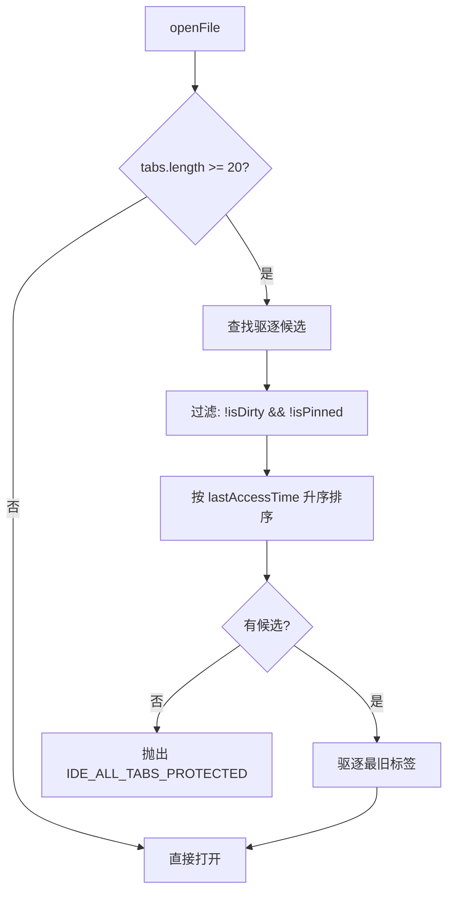

驱逐规则：

| 条件 | 受保护 |
|------|--------|
| `isDirty === true` | 有未保存内容，不驱逐 |
| `isPinned === true` | 用户已固定，不驱逐 |
| 最小 `lastAccessTime` | 最久未访问的非保护标签被驱逐 |

#### pendingScroll（搜索跳转）

```typescript
pendingScroll: { tabId: string; line: number; col?: number } | null
```

搜索面板点击结果时，调用 `setPendingScroll(tabId, line, col)`——如果目标文件尚未打开，先 `openFile`，然后 `useCodeMirrorEditor` 在编辑器就绪后消费 `pendingScroll` 并滚动到指定位置，最后 `clearPendingScroll()`。

#### 标签固定

`togglePinTab(tabId)` 切换 `isPinned` 状态。固定标签在 UI 上有视觉标记，且不参与 LRU 驱逐。

### 10.7 文件冲突处理

IDE 模式采用 **Agent hash 乐观锁（主路径）** + **SFTP mtime 对比（回退路径）** 的双层冲突检测策略。

#### 保存流程

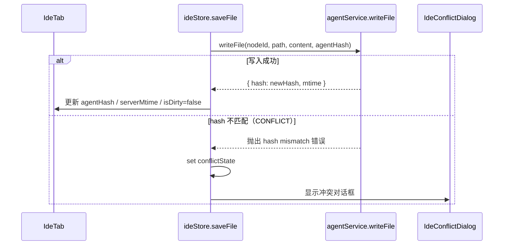

#### Agent Hash 乐观锁（主路径）

当 Agent 可用时，每次读取文件获得内容 hash（`agentHash`）。保存时将此 hash 作为 `expectHash` 传入 `agentService.writeFile()`。如果远程文件在此期间被修改（hash 已变），Agent 返回冲突错误。

- **优势**：精确到内容级别，hash 不一致立即检测
- **局限**：仅 Agent 在线时可用

#### SFTP mtime 对比（回退路径）

Agent 不可用时，`agentService.writeFile` 内部降级到 SFTP 写入。此时使用 `serverMtime` 字段进行时间戳对比作为辅助冲突检测。

#### 冲突解决

`IdeConflictDialog` 提供两种解决方式：

| 操作 | 行为 |
|------|------|
| **覆盖（overwrite）** | 强制保存当前内容（不传 `expectHash`），更新 `agentHash` |
| **重新加载（reload）** | 丢弃本地修改，重新读取远程内容，递增 `contentVersion` |

#### contentVersion 强制刷新

`resolveConflict('reload')` 时递增 `tab.contentVersion`，触发 `useCodeMirrorEditor` 重新 dispatch 编辑器内容，确保 CodeMirror 视图与新内容同步。

### 10.8 搜索缓存

`IdeSearchPanel` 使用模块级 `Map` 缓存搜索结果，组件卸载后缓存依然保留。

#### 缓存键格式

```
${rootPath}:${searchQuery}
```

示例：`/home/user/project:TODO`

#### 缓存参数

| 参数 | 值 | 说明 |
|------|-----|------|
| TTL | 60s | `SEARCH_CACHE_TTL = 60 * 1000` |
| 最大条目数 | 50 | `MAX_SEARCH_CACHE_SIZE = 50` |
| 驱逐策略 | LRU（Map 插入序）| 删除最早插入的条目 |

#### LRU 驱逐机制

利用 ES `Map` 的插入顺序保证实现 LRU：

```typescript
function searchCacheSet(key: string, entry: SearchCacheEntry) {
  searchCache.delete(key);   // 命中时先删除，再重新插入移到末尾
  searchCache.set(key, entry);
  while (searchCache.size > MAX_SEARCH_CACHE_SIZE) {
    const oldest = searchCache.keys().next().value;
    if (oldest !== undefined) searchCache.delete(oldest);
    else break;
  }
}
```

#### 缓存失效

文件写入操作（`saveFile`）触发 `triggerSearchCacheClear()` → 回调执行 `searchCache.clear()` 清空全部缓存。此设计确保搜索结果不会返回过期内容。

### 10.9 ideStore 状态与持久化

#### IdeState 完整接口

```typescript
interface IdeState {
  // 会话关联
  nodeId: string | null;
  terminalSessionId: string | null;

  // 项目状态
  project: IdeProject | null;   // { rootPath, name, isGitRepo, gitBranch? }

  // 编辑器状态
  tabs: IdeTab[];
  activeTabId: string | null;

  // 布局状态
  treeWidth: number;            // 默认 280
  terminalHeight: number;       // 默认 200
  terminalVisible: boolean;

  // 文件树状态
  expandedPaths: Set<string>;
  treeRefreshSignal: Record<string, number>;  // { 规范化路径: 版本号 }

  // 冲突状态
  conflictState: {
    tabId: string;
    localMtime: number;
    remoteMtime: number;
  } | null;

  // 搜索跳转
  pendingScroll: { tabId: string; line: number; col?: number } | null;

  // 重连恢复缓存
  cachedProjectPath: string | null;
  cachedTabPaths: string[];
  cachedNodeId: string | null;

  // 用户意图追踪
  lastClosedAt: number | null;
}
```

#### IdeActions 接口

```typescript
interface IdeActions {
  // 项目操作
  openProject: (nodeId: string, rootPath: string) => Promise<void>;
  closeProject: (force?: boolean) => void;
  changeRootPath: (newRootPath: string) => Promise<void>;

  // 文件操作
  openFile: (path: string) => Promise<void>;
  closeTab: (tabId: string) => Promise<boolean>;
  closeAllTabs: () => Promise<boolean>;
  saveFile: (tabId: string) => Promise<void>;
  saveAllFiles: () => Promise<void>;

  // 标签操作
  setActiveTab: (tabId: string) => void;
  updateTabContent: (tabId: string, content: string) => void;
  updateTabCursor: (tabId: string, line: number, col: number) => void;
  togglePinTab: (tabId: string) => void;

  // 布局操作
  setTreeWidth: (width: number) => void;
  setTerminalHeight: (height: number) => void;
  toggleTerminal: () => void;

  // 文件树操作
  togglePath: (path: string) => void;
  refreshTreeNode: (parentPath: string) => void;

  // 终端操作
  setTerminalSession: (sessionId: string | null) => void;

  // 冲突处理
  resolveConflict: (resolution: 'overwrite' | 'reload') => Promise<void>;
  clearConflict: () => void;

  // 搜索跳转
  setPendingScroll: (tabId: string, line: number, col?: number) => void;
  clearPendingScroll: () => void;

  // 文件系统操作
  createFile: (parentPath: string, name: string) => Promise<string>;
  createFolder: (parentPath: string, name: string) => Promise<string>;
  deleteItem: (path: string, isDirectory: boolean) => Promise<void>;
  renameItem: (oldPath: string, newName: string) => Promise<string>;
  getAffectedTabs: (path: string) => { affected: IdeTab[]; unsaved: IdeTab[] };
}
```

#### Persist 中间件配置

```typescript
persist(
  (set, get) => ({ /* ... */ }),
  {
    name: 'oxideterm-ide',
    partialize: (state) => ({
      treeWidth: state.treeWidth,
      terminalHeight: state.terminalHeight,
      cachedProjectPath: state.cachedProjectPath,
      cachedTabPaths: state.cachedTabPaths,
      cachedNodeId: state.cachedNodeId,
    }),
  }
)
```

仅持久化布局配置和恢复缓存，**不持久化运行时状态**（项目、标签、文件内容等）。运行时状态在 `openProject` 时从远程重建，或在重连时从 snapshot 恢复。

#### 模块级回调系统

ideStore 通过模块级变量桥接外部组件的回调，避免循环依赖：

| 回调 | 注册方 | 触发方 | 用途 |
|------|--------|--------|------|
| `onSearchCacheClear` | `IdeSearchPanel`（`registerSearchCacheClearCallback`） | `ideStore.saveFile`（`triggerSearchCacheClear`） | 文件保存后清空搜索缓存 |
| `onGitRefresh` | `useGitStatus`（`registerGitRefreshCallback`） | `ideStore.saveFile` / 文件操作（`triggerGitRefresh`） | 文件变更后刷新 Git 状态 |

#### 自动保存

`useIdeStore.subscribe` 监听 `activeTabId` 变化——切换标签时自动保存上一个 dirty 标签（需 `ide.autoSave` 启用）。窗口 `blur` 事件触发 `saveAllFiles()`。

#### 常量

| 常量 | 值 | 位置 |
|------|-----|------|
| `MAX_OPEN_TABS` | 20 | `ideStore.ts` |
| `SEARCH_CACHE_TTL` | 60000 (ms) | `IdeSearchPanel.tsx` |
| `MAX_SEARCH_CACHE_SIZE` | 50 | `IdeSearchPanel.tsx` |
| `REFRESH_INTERVAL_MS` | 60000 (ms) | `useGitStatus.ts` |
| `DEBOUNCE_DELAY_MS` | 1000 (ms) | `useGitStatus.ts` |

### 10.10 重连恢复

#### ideSnapshot 结构

重连编排器在 `phaseSnapshot` 阶段捕获 IDE 状态：

```typescript
ideSnapshot?: {
  projectPath: string;                    // 当前项目根路径
  tabPaths: string[];                     // 所有打开标签的路径
  connectionId: string;                   // 实际存储 nodeId（历史字段名）
  dirtyContents: Record<string, string>;  // 未保存文件内容快照
};
```

`dirtyContents` 遍历所有 `isDirty && content !== null` 的标签，以 `tab.path → tab.content` 形式保存。这确保断线重连后未保存的编辑内容不会丢失。

#### phaseRestoreIde 流程

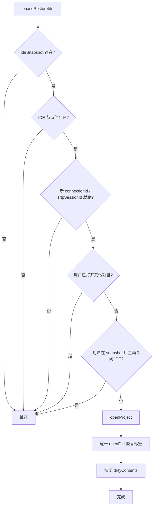

#### lastClosedAt 用户意图追踪

`closeProject()` 时设置 `lastClosedAt = Date.now()`。重连编排器在 `phaseRestoreIde` 中对比 `lastClosedAt` 与 `snapshot.snapshotAt`——如果用户在快照之后手动关闭了 IDE，则不恢复，尊重用户意图。

#### dirtyContents 恢复

恢复时遍历 `ideSnapshot.dirtyContents`，找到已重新打开的标签，将保存的内容写入 `tab.content` 并标记 `isDirty: true`，确保用户可以继续编辑或保存。

#### 持久化缓存字段

| 字段 | 类型 | 用途 |
|------|------|------|
| `cachedProjectPath` | `string \| null` | 上次打开的项目路径（用于 UI 快速恢复建议） |
| `cachedTabPaths` | `string[]` | 上次打开的标签路径列表 |
| `cachedNodeId` | `string \| null` | 上次关联的节点 ID |

这些字段通过 persist 中间件保存到 `localStorage`（key: `oxideterm-ide`），跨会话保留。与 `ideSnapshot` 的区别在于：缓存字段是长期持久化的 UI 便利功能，`ideSnapshot` 是短暂的重连恢复数据，存在于 `reconnectOrchestratorStore` 内存中。

### 10.11 Node-first API

IDE 模式使用 4 个 `node_ide_*` Tauri IPC 命令，全部通过 `nodeId` 路由：

| 前端 API | Tauri 命令 | 参数 | 用途 |
|----------|-----------|------|------|
| `nodeIdeOpenProject(nodeId, path)` | `node_ide_open_project` | `nodeId`, `path` | 打开项目，返回 `{ rootPath, name, isGitRepo, gitBranch? }` |
| `nodeIdeExecCommand(nodeId, command, cwd?, timeoutSecs?)` | `node_ide_exec_command` | `nodeId`, `command`, `cwd?`, `timeoutSecs?` | 在远程执行命令（Git status 回退等） |
| `nodeIdeCheckFile(nodeId, path)` | `node_ide_check_file` | `nodeId`, `path` | 检查文件可编辑性（大小/二进制/权限） |
| `nodeIdeBatchStat(nodeId, paths)` | `node_ide_batch_stat` | `nodeId`, `paths[]` | 批量获取文件 stat 信息 |

这些命令与 SFTP API 平行存在。`nodeIdeCheckFile` 在 `openFile` 流程中提前检查文件是否可编辑，避免先加载内容再发现问题：

| 检查结果 | 类型 | 行为 |
|---------|------|------|
| `too_large` | 超过大小限制 | 关闭标签，抛出错误 |
| `binary` | 二进制文件 | 静默关闭标签 |
| `not_editable` | 不可编辑 | 关闭标签，抛出错误 |
| 其他 | 可编辑 | 继续加载内容 |

### 10.12 设计不变量

| 编号 | 不变量 | 说明 |
|------|--------|------|
| **I1** | Agent-first, SFTP fallback | 所有文件操作优先走 Agent，不可用时自动降级到 SFTP，用户无感 |
| **I2** | State Gating 前置校验 | 每次 I/O 操作前调用 `assertNodeReady()`，从 sessionTreeStore 读取状态（零 IPC） |
| **I3** | 标签 LRU 驱逐保护 | `isDirty` 或 `isPinned` 的标签不被驱逐；所有标签都受保护时抛出错误而非覆盖 |
| **I4** | 冲突检测双层保障 | Agent hash 乐观锁为主，SFTP mtime 为辅；冲突必须经用户确认才能解决 |
| **I5** | 搜索缓存按写失效 | 任何 `saveFile` 操作清空全部搜索缓存，不存在过期结果 |
| **I6** | dirtyContents 跨重连保留 | 重连 snapshot 保存所有未保存标签内容，恢复后标记 `isDirty` |
| **I7** | lastClosedAt 用户意图优先 | 用户主动关闭 IDE 后重连不恢复，即使 snapshot 中有 IDE 状态 |
| **I8** | treeRefreshSignal 路径粒度 | 文件操作仅刷新受影响目录，不触发全树重载 |
| **I9** | 模块级回调无循环依赖 | ideStore ↔ IdeSearchPanel / useGitStatus 通过注册回调解耦，不直接 import 对方 |

### 10.13 已知限制与路线图

#### 当前限制

| 限制 | 说明 |
|------|------|
| 文件大小 | 仅支持 <10MB 的文本文件（`nodeIdeCheckFile` 预检） |
| 二进制文件 | 不支持编辑，打开时静默跳过 |
| 实时协作 | 不支持多用户同时编辑同一文件 |
| LSP | 不支持 Language Server Protocol，无补全/诊断/跳转定义 |
| 文件监听 | 无远程 `inotify`/`fsevents`，依赖手动刷新和保底轮询 |

#### 路线图

| 方向 | 说明 |
|------|------|
| LSP 集成 | 通过 Agent 中继 LSP 协议，提供补全和诊断能力 |
| 文件监听 | Agent 侧 `inotify` 推送文件变更事件 |
| Diff 视图 | 基于 `originalContent` 的 inline diff 显示 |
| 多文件搜索替换 | 全项目替换 + 预览确认 |
| 大文件分段加载 | 超过 10MB 的文件按需加载可视区域 |

---

## 附录

### A. 跨章引用索引

以下概念跨多个章节出现，列出所有涉及章节以便交叉参考：

| 概念 | 涉及章节 | 说明 |
|------|---------|------|
| **nodeId 路由** | 2, 3, 4, 5, 6, 10 | 所有 API 均通过 nodeId 路由到具体连接，取代旧的 sessionId 寻址；重连编排器按 nodeId 调度恢复；IDE 模式 4 个 `node_ide_*` 命令 |
| **State Gating（状态门禁）** | 1, 2, 3, 4, 5, 10 | UI 操作须检查 `connectionState === 'active'`；连接池、拓扑、端口转发和 SFTP 均遵守此规则；IDE 模式通过 `assertNodeReady()` 零 IPC 实现 |
| **Key-Driven Reset** | 1, 2, 3, 4, 5, 10 | 连接重建触发组件重挂载机制；连接池核心策略，拓扑级联、重连编排、端口转发和 SFTP 均利用此机制恢复状态；IDE 组件 `key={nodeId}` 触发全树重建 |
| **强一致性同步** | 1, 2, 3, 4, 5, 10 | appStore 刷新驱动 UI 更新；第 1 章定义核心流程，后续章节为各模块的具体应用；IDE 模式三 Store 协同 |
| **重连编排器（Reconnect Orchestrator）** | 1, 3, 4, 5, 10 | 管理断线重连后的恢复流程，含 `restore-forwards`、`resume-transfers` 和 `restore-ide` 阶段；第 1 章历史债务清理提及，第 3 章完整设计，第 10 章 IDE 恢复含 `dirtyContents` 保留 |
| **sessionTreeStore / appStore 双 Store** | 1, 4, 5, 10 | 用户意图层与事实层分离，第 1 章定义架构拓扑，所有功能模块从 appStore 读取连接状态；IDE 模式额外引入 ideStore 形成三 Store 协同 |
| **级联故障传播** | 2, 3 | 跳板机断开时下游节点级联标记 link_down；第 2 章级联故障处理，第 3 章 snapshot 阶段捕获 |
| **transferStore** | 5 | SFTP 专用传输队列 Zustand store |
| **agentService / agentStore** | 6 | Remote Agent 状态管理与门面层 |
| **原子写入** | 5, 6 | SFTP `nodeSftpWrite` 和 Agent `fs/writeFile` 均支持原子写入（tmpfile → rename） |
| **Agent → SFTP 降级** | 5, 6, 10 | agentService 中文件操作自动降级到 SFTP；SFTP 是基础能力层；IDE 模式不变量 I1：Agent-first, SFTP fallback |
| **SSH 连接** | 1, 2, 3, 4, 5, 6, 7, 8, 9, 10 | 全系统基础设施；第 8 章 Profiler 通过 SSH Shell Channel 采样，第 9 章 Detector 通过 SSH Shell Channel 探测，第 10 章 IDE 通过 SFTP/Agent 操作远程文件 |
| **Tauri IPC** | 1, 3, 4, 5, 6, 8, 9, 10 | 前端通过 `invoke()` 调用后端命令；第 8 章 6 个 Profiler 命令，第 9 章 `get_remote_env`，第 10 章 4 个 `node_ide_*` 命令 |
| **Tauri Event** | 1, 3, 4, 5, 8, 9 | 连接状态变更事件驱动全系统响应；第 8 章 `profiler:update` / `port-detected`，第 9 章 `env:detected` |
| **ForwardStatus::Suspended** | 3, 4 | 端口转发在断线时进入 Suspended，重连编排器在 restore-forwards 阶段恢复 |
| **`useNodeState` hook** | 4, 5 | 前端组件通过此 hook 感知连接就绪状态 |
| **ideStore** | 10 | IDE 专用 Zustand store，管理项目、标签、文件树、冲突状态，persist 中间件跨会话缓存布局 |
| **CodeMirror 6** | 10 | 前端编辑器引擎，通过 `useCodeMirrorEditor` hook 管理实例生命周期 |
| **LRU 驱逐** | 10 | 标签页 `MAX_OPEN_TABS=20`，搜索缓存 `MAX_SEARCH_CACHE_SIZE=50`，均基于访问时间 / 插入序驱逐 |
| **dirtyContents** | 3, 10 | 重连 snapshot 保存未保存的编辑内容；第 3 章 `ideSnapshot.dirtyContents`，第 10 章恢复流程 |
| **Agent Hash 乐观锁** | 6, 10 | Agent `writeFile` 的 `expectHash` 参数；第 6 章 Agent 协议，第 10 章冲突检测主路径 |
| **JSON-RPC 协议** | 6 | Agent 通信协议，行分隔 JSON-RPC via SSH exec stdin/stdout |
| **russh** | 7 | SSH 协议库，Agent 认证中 `Signer` trait 的实现基础 |
| **跳板机（Proxy Hop）** | 2, 7 | 第 2 章 proxy_chain 路由配置，第 7 章 Agent 认证跳板机支持 |
| **OS Keychain** | 7 | 密码存储在系统钥匙串，Agent 认证不涉及密码 |
| **`.oxide` 加密文件** | 7 | ChaCha20-Poly1305 加密的连接配置导出格式，支持 Agent 认证方式 |
| **RefCount 引用计数** | 1 | 连接池引用计数系统，控制 Active ↔ Idle 状态转换和空闲回收 |
| **Dijkstra 路径计算** | 2 | 网络拓扑最短路径算法，计算 local → target 的最优跳板链路 |
| **Grace Period** | 3 | v1.11.1 新增，重连前探测旧连接是否仍存活（30s），避免不必要地销毁 TUI 应用 |
| **WsBridge 心跳** | 1 | WebSocket 本地心跳，超时 300s（容忍 macOS App Nap） |
| **ConnectionPoolConfig** | 1 | 连接池配置结构体：idleTimeoutSecs、maxConnections、protectOnExit |
| **proxy_chain** | 2 | 多跳 SSH 跳板机链路配置，存储于 SessionTreeStore 的连接定义中 |
| **ReconnectSnapshot** | 3 | 重连快照结构，捕获断线时的完整会话状态用于恢复 |
| **持久化 Shell Channel** | 8 | Profiler 采用单个持久 Shell Channel 采样，避免 MaxSessions 耗尽 |
| **profilerStore** | 8 | 资源监控器前端 Zustand Store，含 `_generations` 竞态防护 |
| **智能端口检测** | 4, 8 | 第 8 章检测远程监听端口，第 4 章端口转发可一键创建转发规则 |
| **HandleController（弱引用）** | 8, 9 | Profiler 和 Detector 均通过 `HandleController` 弱引用操作 SSH 连接 |
| **RemoteEnvInfo** | 8, 9 | 第 9 章探测结果用于第 8 章 `build_sample_command(os_type)` 平台分发 |
| **OnceLock** | 9 | `ConnectionEntry.remote_env` 使用 `OnceLock` 实现单次写入、不可变读取 |
| **AI 上下文注入** | 9 | Detector 结果注入 Sidebar Chat 和 Inline Panel 的 system prompt |
| **parking_lot::RwLock** | 8 | Profiler 使用 parking_lot 替代 std/tokio RwLock，减少调度器竞争 |
| **Delta 计算** | 8 | CPU% 和网络速率基于两次采样差值，首次采样返回 None |

### B. API 快速参考汇总表

全部 API 函数一览，按功能域分类。

#### B.1 端口转发 API

| 前端函数 | 后端命令 | 参数 |
|---------|---------|------|
| `api.nodeListForwards(nodeId)` | `node_list_forwards` | `nodeId` |
| `api.nodeCreateForward(request)` | `node_create_forward` | `nodeId, forwardType, bindAddress, bindPort, targetHost, targetPort, description?, checkHealth?` |
| `api.nodeStopForward(nodeId, id)` | `node_stop_forward` | `nodeId, forwardId` |
| `api.nodeDeleteForward(nodeId, id)` | `node_delete_forward` | `nodeId, forwardId` |
| `api.nodeRestartForward(nodeId, id)` | `node_restart_forward` | `nodeId, forwardId` |

#### B.2 SFTP 文件管理 API

| 前端函数 | 后端命令 |
|---------|---------|
| `nodeSftpInit(nodeId)` | `node_sftp_init` |
| `nodeSftpListDir(nodeId, path)` | `node_sftp_list_dir` |
| `nodeSftpStat(nodeId, path)` | `node_sftp_stat` |
| `nodeSftpPreview(nodeId, path, maxSize?)` | `node_sftp_preview` |
| `nodeSftpPreviewHex(nodeId, ...)` | `node_sftp_preview_hex` |
| `nodeSftpWrite(nodeId, path, content, encoding?)` | `node_sftp_write` |
| `nodeSftpDownload(nodeId, remotePath, localPath, transferId?)` | `node_sftp_download` |
| `nodeSftpUpload(nodeId, localPath, remotePath, transferId?)` | `node_sftp_upload` |
| `nodeSftpDelete(nodeId, path)` | `node_sftp_delete` |
| `nodeSftpDeleteRecursive(nodeId, path)` | `node_sftp_delete_recursive` |
| `nodeSftpMkdir(nodeId, path)` | `node_sftp_mkdir` |
| `nodeSftpRename(nodeId, ...)` | `node_sftp_rename` |
| `nodeSftpDownloadDir(nodeId, remotePath, localPath, transferId?)` | `node_sftp_download_dir` |
| `nodeSftpUploadDir(nodeId, localPath, remotePath, transferId?)` | `node_sftp_upload_dir` |
| `nodeSftpTarProbe(nodeId)` | `node_sftp_tar_probe` |
| `nodeSftpTarCompressionProbe(nodeId)` | `node_sftp_tar_compression_probe` |
| `nodeSftpTarUpload(nodeId, localPath, remotePath, transferId?, compression?)` | `node_sftp_tar_upload` |
| `nodeSftpTarDownload(nodeId, remotePath, localPath, transferId?, compression?)` | `node_sftp_tar_download` |
| `nodeSftpListIncompleteTransfers(nodeId)` | `node_sftp_list_incomplete_transfers` |
| `nodeSftpResumeTransfer(nodeId, transferId)` | `node_sftp_resume_transfer` |
| `cleanupSftpPreviewTemp(path?)` | `cleanup_sftp_preview_temp` |
| `sftpCancelTransfer(transferId)` | `sftp_cancel_transfer` |
| `sftpPauseTransfer(transferId)` | `sftp_pause_transfer` |
| `sftpResumeTransfer(transferId)` | `sftp_resume_transfer` |
| `sftpTransferStats()` | `sftp_transfer_stats` |
| `sftpUpdateSettings(maxConcurrent?, speedLimitKbps?)` | `sftp_update_settings` |

#### B.3 Remote Agent API

| 前端函数 | 后端命令 |
|---------|---------|
| `nodeAgentDeploy(nodeId)` | `node_agent_deploy` |
| `nodeAgentRemove(nodeId)` | `node_agent_remove` |
| `nodeAgentStatus(nodeId)` | `node_agent_status` |
| `nodeAgentReadFile(nodeId, path)` | `node_agent_read_file` |
| `nodeAgentWriteFile(nodeId, path, content, expectHash?)` | `node_agent_write_file` |
| `nodeAgentListTree(nodeId, path, maxDepth?, maxEntries?)` | `node_agent_list_tree` |
| `nodeAgentGrep(nodeId, pattern, path, caseSensitive?, maxResults?)` | `node_agent_grep` |
| `nodeAgentGitStatus(nodeId, path)` | `node_agent_git_status` |
| `nodeAgentWatchStart(nodeId, path, ignore?)` | `node_agent_watch_start` |
| `nodeAgentWatchStop(nodeId, path)` | `node_agent_watch_stop` |
| `nodeAgentStartWatchRelay(nodeId)` | `node_agent_start_watch_relay` |
| `nodeAgentSymbolIndex(nodeId, path, maxFiles?)` | `node_agent_symbol_index` |
| `nodeAgentSymbolComplete(nodeId, path, prefix, limit?)` | `node_agent_symbol_complete` |
| `nodeAgentSymbolDefinitions(nodeId, path, name)` | `node_agent_symbol_definitions` |

#### B.4 agentService 门面层 API

| 函数 | 降级行为 |
|------|---------|
| `isAgentReady(nodeId)` | — |
| `ensureAgent(nodeId)` | — |
| `invalidateAgentCache(nodeId)` | — |
| `removeAgent(nodeId)` | — |
| `readFile(nodeId, path)` | → SFTP |
| `writeFile(nodeId, path, content, expectHash?)` | → SFTP |
| `listDir(nodeId, path)` | → SFTP |
| `listTree(nodeId, path, maxDepth?, maxEntries?)` | Agent only |
| `grep(nodeId, pattern, path, opts?)` | Agent only |
| `gitStatus(nodeId, path)` | Agent only |
| `watchDirectory(nodeId, path, onEvent, ignore?)` | Agent only |
| `symbolIndex(nodeId, path, maxFiles?)` | Agent only |
| `symbolComplete(nodeId, path, prefix, limit?)` | Agent only |
| `symbolDefinitions(nodeId, path, name)` | Agent only |

#### B.5 资源监控器 API

| 前端函数 | 后端命令 | 参数 |
|---------|---------|------|
| `api.startResourceProfiler(connId)` | `start_resource_profiler` | `connectionId` |
| `api.stopResourceProfiler(connId)` | `stop_resource_profiler` | `connectionId` |
| `api.getResourceMetrics(connId)` | `get_resource_metrics` | `connectionId` |
| `api.getResourceHistory(connId)` | `get_resource_history` | `connectionId` |
| `api.getDetectedPorts(connId)` | `get_detected_ports` | `connectionId` |
| `api.ignoreDetectedPort(connId, port)` | `ignore_detected_port` | `connectionId, port` |

#### B.6 环境探测器 API

| 前端函数 | 后端命令 | 参数 |
|---------|---------|------|
| `api.getRemoteEnv(connId)` | `get_remote_env` | `connectionId` |

#### B.7 IDE 模式 API

| 前端函数 | 后端命令 | 参数 |
|---------|---------|------|
| `nodeIdeOpenProject(nodeId, path)` | `node_ide_open_project` | `nodeId`, `path` |
| `nodeIdeExecCommand(nodeId, command, cwd?, timeoutSecs?)` | `node_ide_exec_command` | `nodeId`, `command`, `cwd?`, `timeoutSecs?` |
| `nodeIdeCheckFile(nodeId, path)` | `node_ide_check_file` | `nodeId`, `path` |
| `nodeIdeBatchStat(nodeId, paths)` | `node_ide_batch_stat` | `nodeId`, `paths[]` |
