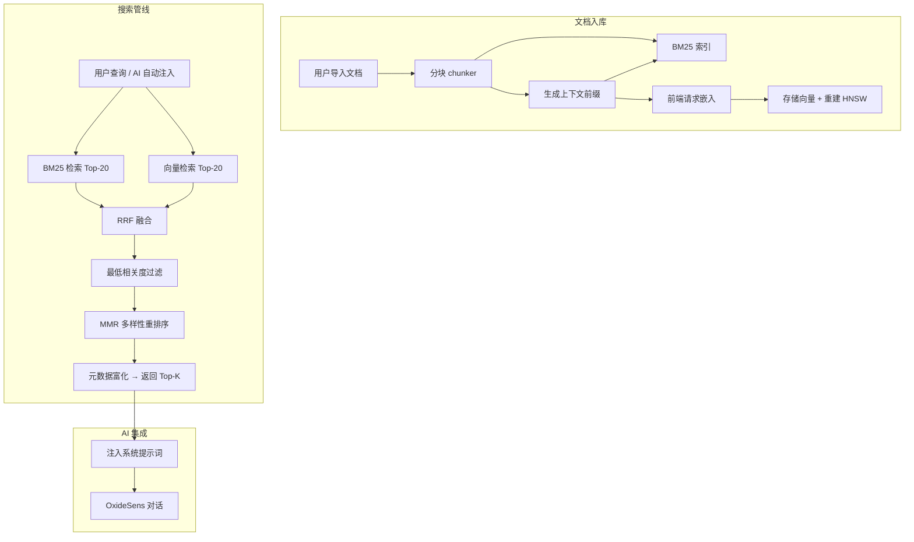
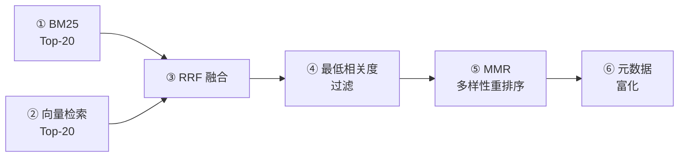

# RAG 本地知识库系统

> **版本**: v0.20.1
> **上次更新**: 2026-02-13
> 本文档描述 OxideTerm 的 RAG（Retrieval-Augmented Generation）本地知识库系统的架构设计、核心算法与实现细节。

## 目录

1. [设计目标](#设计目标)
2. [系统架构](#系统架构)
3. [数据模型](#数据模型)
4. [文档处理管线](#文档处理管线)
5. [稀疏检索：BM25](#稀疏检索bm25)
6. [稠密检索：向量搜索与 HNSW](#稠密检索向量搜索与-hnsw)
7. [混合搜索管线](#混合搜索管线)
8. [上下文检索增强](#上下文检索增强)
9. [持久化层](#持久化层)
10. [前端集成](#前端集成)
11. [IPC 命令接口](#ipc-命令接口)
12. [安全与限制](#安全与限制)
13. [调优参数总览](#调优参数总览)

---

## 设计目标

### 核心定位

为 OxideSens（OxideTerm 内置 AI 助手）提供**纯本地、可检索的知识库**，让用户将自有文档（运维手册、部署文档、API 文档等）索引后，在 AI 对话中自动注入高相关性的上下文段落，提升回答准确性。

### 设计约束

| 约束 | 说明 |
|------|------|
| **纯 Rust** | 所有索引与检索逻辑在后端完成，不依赖外部服务或 C 库 |
| **本地优先** | 数据与索引落在本机应用数据目录，支持离线使用 |
| **嵌入式规模** | 设计目标 <1000 文档，单用户桌面端场景 |
| **零 LLM 依赖** | 索引阶段不调用 LLM，上下文增强采用静态头生成 |
| **嵌入可选** | BM25 始终可用；向量搜索仅在用户配置嵌入模型后启用 |

---

## 系统架构

### 模块结构

后端模块位于 [`src-tauri/src/rag/`](../../src-tauri/src/rag/)，共 8 个子模块：

```
rag/
├── mod.rs          # 模块导出
├── types.rs        # 领域类型定义
├── error.rs        # 统一错误枚举（15 个变体）
├── chunker.rs      # 文档分块（Markdown 标题感知 + 纯文本段落切分）
├── bm25.rs         # BM25 稀疏检索（CJK 二字组 + Snowball 词干化 + 停用词）
├── embedding.rs    # 向量检索调度（HNSW 优先 + 暴力扫描回退）
├── hnsw.rs         # HNSW 近似最近邻索引（instant-distance）
├── search.rs       # 混合搜索编排（RRF 融合 + 阈值过滤 + MMR 重排序）
└── store.rs        # 持久化层（redb 嵌入式 KV，9 张表）
```

### 数据流概览



---

## 数据模型

### 核心类型

```rust
// 文档集合：按作用域隔离
DocCollection { id, name, scope: Global | Connection(id), created_at, updated_at }

// 文档元数据：含版本号用于乐观锁
DocMetadata { id, collection_id, title, source_path, format, content_hash, indexed_at, chunk_count, version: u64 }

// 文档分块：检索最小单位
DocChunk { id, doc_id, section_path, content, tokens_estimate, offset, length, context_prefix: Option<String> }

// 向量嵌入
EmbeddingRecord { chunk_id, vector: Vec<f32>, model_name, dimensions }

// 搜索结果
SearchResult { chunk_id, doc_id, doc_title, section_path, content, score, source: Bm25Only | VectorOnly | Both }
```

### 实体关系

```
Collection (1)
  └── Document (n)  ← content_hash 集合内去重
        └── Chunk (n)  ← 每个 chunk 可选挂载 EmbeddingRecord
```

---

## 文档处理管线

### 分块策略

| 参数 | 值 | 说明 |
|------|----|------|
| `MAX_CHUNK_TOKENS` | 1500 | 单块 token 上限（按 4 字符/token 估算） |
| `OVERLAP_CHARS` | 200 | 相邻块重叠字符数，保持语义连续性 |

**Markdown 处理**：按标题层级（`#`–`######`）递归切分，维护 `section_path`（如 `"部署 > Docker > 故障排查"`），用于检索时的定位与上下文前缀生成。

**纯文本处理**：按段落边界（双换行）切分。

**超大段落**：当单段落超过 `MAX_CHUNK_TOKENS` 时，按句子边界硬切分。

**重叠窗口**：每个块尾部 200 字符作为下一块的开头，保证跨块内容可被检索命中。

### 内容去重

入库时对文档内容计算 SHA-256 哈希（取前 128 位），同集合内若哈希冲突则拒绝，返回 `DuplicateDocument` 错误，防止重复导入。

---

## 稀疏检索：BM25

### 算法参数

| 参数 | 值 | 说明 |
|------|----|------|
| `k1` | 1.2 | 词频饱和度参数 |
| `b` | 0.75 | 文档长度归一化因子 |

**BM25 分数公式**：

$$\text{score}(D, Q) = \sum_{i=1}^{n} \text{IDF}(q_i) \cdot \frac{tf_{q_i, D} \cdot (k_1 + 1)}{tf_{q_i, D} + k_1 \cdot \left(1 - b + b \cdot \frac{|D|}{\text{avgdl}}\right)}$$

### 分词策略

采用**双轨分词**以同时支持 CJK 与拉丁语系：

1. **CJK（中日韩）**：字符级**重叠二字组**（bigram）。连续的 CJK 字符 `ABC` 生成 token `AB`、`BC`。无停用词过滤。
2. **ASCII / 拉丁语**：按空白和标点切分 → 小写化 → 停用词过滤 → **Snowball 词干化**。

### 停用词表

采用 `LazyLock<HashSet<&str>>` 静态初始化，包含 125+ 常见英文停用词（a, about, after, all, also, an, and, any, are, as, at, be, because, been, but, by, can, could, …）。

> CJK 不设停用词——高频虚词在 bigram 粒度下信息量仍足够，且中文停用词争议较大。

### Snowball 词干化

使用 [`rust-stemmers`](https://crates.io/crates/rust-stemmers) 的 Snowball English 算法，仅对非停用词的 ASCII token 执行：

```
deployments / deploying / deployed → deploy
containers → contain
running → run
```

词干化在索引和查询两端同步执行，保证召回一致性。

### 上下文感知索引

索引时若 chunk 存在 `context_prefix`，会将前缀拼接在内容前再分词（`context_prefix + " " + content`），使文档标题和章节路径参与 BM25 评分。

---

## 稠密检索：向量搜索与 HNSW

### 嵌入工作流

嵌入向量由**前端生成**（通过用户配置的 AI Provider），后端仅负责存储与索引：

1. 前端调用 `rag_get_pending_embeddings` 获取未嵌入的 chunk 列表
2. 前端批量生成向量（chunk 内容 = `context_prefix + " " + content`）
3. 前端调用 `rag_store_embeddings` 写入后端
4. 后端异步重建 HNSW 索引（`tokio::task::spawn_blocking`）

### HNSW 配置

| 参数 | 值 | 说明 |
|------|----|------|
| `EF_CONSTRUCTION` | 200 | 构建时搜索范围，越大越精准、构建越慢 |
| `EF_SEARCH` | 100 | 查询时搜索深度 |
| `OVERFETCH_FACTOR` | 3 | 过取因子——请求 3×top_k 候选，补偿集合过滤损耗 |

**距离度量**：`1 - cosine_similarity`（余弦距离），向量预计算 L2 范数以加速点积。

**搜索策略**：
- **首选 HNSW**：若索引可用且维度匹配 → O(log n) 近似搜索
- **回退暴力扫描**：若 HNSW 不可用或返回空结果 → O(n) 遍历所有嵌入

### 持久化

| 参数 | 值 |
|------|----|
| 序列化格式 | MessagePack (`rmp-serde`) + zstd 压缩（level 3） |
| 最大压缩文件 | 512 MB |
| 最大解压数据 | 2 GB |
| 写入策略 | 临时文件 → `sync_all()` → `rename`（崩溃安全的原子写入） |
| 文件权限 | `0o600`（Unix，仅所有者读写） |

### 索引失效

以下操作触发 HNSW 索引标记为失效，下次嵌入存储时异步重建：
- 存储新的嵌入向量
- 删除集合或文档

使用 `AtomicBool` 防止并发重建冲突。

---

## 混合搜索管线

### 六阶段管线



### 阶段详解

**① BM25 检索**：在全局倒排索引上执行 BM25 评分，取 Top-20。

**② 向量检索**（可选）：用查询向量在 HNSW/暴力扫描中取 Top-20 余弦相似度最高的候选。

**③ RRF（Reciprocal Rank Fusion）融合**：

$$\text{RRF}(d) = \sum_{r \in \text{rankers}} \frac{1}{K + \text{rank}_r(d) + 1}, \quad K = 60$$

来自两条检索路径的排名按倒数排名公式合并。同时出现在两条路径中的结果累加分数，并标记为 `Both`。

**④ 最低相关度过滤**：

$$\text{threshold} = \text{max\_score} \times 0.15$$

丢弃得分低于最高分 15% 的结果，剔除噪声。

**⑤ MMR（Maximal Marginal Relevance）重排序**（仅混合模式下启用）：

$$\text{MMR}(d) = \lambda \cdot \text{relevance}(d) - (1 - \lambda) \cdot \max_{d_j \in S} \text{sim}(d, d_j), \quad \lambda = 0.7$$

先过取 2×top_k 候选，然后贪心选择：每步选 MMR 分数最高的结果加入结果集，直至达到 top_k。`sim` 为候选之间嵌入向量的余弦相似度。效果：在保持高相关性（70% 权重）的同时引入结果多样性（30% 惩罚冗余）。

**⑥ 元数据富化**：批量加载 chunk 内容、文档标题等元信息，组装最终 `SearchResult`。

### 搜索模式

| 模式 | 条件 | 行为 |
|------|------|------|
| `KeywordOnly` | 无查询向量 | 仅执行 BM25，跳过向量检索和 MMR |
| `Hybrid` | 提供查询向量 | BM25 + 向量 → RRF → 阈值 → MMR → 富化 |

### 来源标记

每条结果标记 `SearchSource`：
- `Bm25Only`：仅命中关键词
- `VectorOnly`：仅命中语义
- `Both`：两条路径均命中（通常相关性最高）

---

## 上下文检索增强

借鉴 [Anthropic Contextual Retrieval](https://www.anthropic.com/news/contextual-retrieval) 的思想，但**不依赖 LLM**，采用零成本的静态头生成：

### 上下文前缀生成

```rust
fn build_context_prefix(title: &str, section_path: Option<&str>) -> String {
    // 有章节路径：
    // → "From document 'Deploy Guide', section: Docker > Troubleshooting."
    // 无章节路径：
    // → "From document 'Deploy Guide'."
}
```

该前缀在以下三处发挥作用：

1. **BM25 索引**：前缀 + 内容一起分词，使标题和章节关键词参与评分
2. **嵌入生成**：前缀 + 内容的拼接文本送入嵌入模型，向量编码了文档级上下文
3. **搜索展示**：前缀存储在 `DocChunk.context_prefix`，可在 UI 中展示定位信息

**效果**：根据 Anthropic 的公开数据，上下文检索可将检索失败率降低 **20-35%**（本项目采用静态头方案，效果略低于 LLM 生成的上下文，但成本为零且无外部依赖）。

---

## 持久化层

### 存储引擎

使用 [redb](https://crates.io/crates/redb)（嵌入式 KV 存储），数据库文件位于应用数据目录。

### 9 张表

| 表名 | Key | Value | 说明 |
|------|-----|-------|------|
| `doc_collections` | collection_id | `DocCollection` | 文档集合 |
| `collection_docs` | collection_id | `Vec<String>` | 集合 → 文档 ID 列表 |
| `doc_metadata` | doc_id | `DocMetadata` | 文档元数据 |
| `doc_chunks` | chunk_id | `DocChunk` | 分块内容 |
| `doc_chunk_index` | doc_id | `Vec<String>` | 文档 → 分块 ID 列表 |
| `bm25_postings` | term | `Vec<PostingEntry>` | BM25 倒排索引 |
| `bm25_meta` | "global" | `Bm25Stats` | BM25 全局统计（文档数、平均长度） |
| `embeddings` | chunk_id | `EmbeddingRecord` | 向量嵌入 |
| `doc_raw_content` | doc_id | `String` | 文档原始内容（供外部编辑） |

### 序列化与压缩

- **序列化**：MessagePack（`rmp-serde`），比 JSON 更紧凑，支持二进制
- **压缩策略**：value 大于 `4096` 字节时启用 zstd 压缩
- **标记位**：`0x00` = 原始数据，`0x01` = 压缩数据（1 字节前缀）
- **解压**：读取时按标记位惰性解压

### 文件权限

数据库文件和 HNSW 索引文件在 Unix 下设置 `0o600`（仅所有者可读写）。

---

## 前端集成

### AI 对话自动注入

在 [`aiChatStore.ts`](../../src/store/aiChatStore.ts) 中，每次用户发送消息时自动执行 RAG 检索并注入结果：

1. **触发条件**：消息长度 ≥ 4 字符
2. **查询截断**：取前 500 字符作为查询
3. **超时控制**：整体 3 秒超时
4. **嵌入生成**（可选）：使用用户配置的嵌入模型生成查询向量，内嵌 3 秒超时
5. **搜索参数**：`topK = 5`，搜索全部 Global 集合
6. **结果注入**：Top-5 片段格式化为 `### {文档标题}{章节路径}\n{内容}`，包裹在 `<documents>...</documents>` 标签中追加到系统提示词
7. **降级策略**：嵌入失败时回退到纯关键词搜索；RAG 超时时静默跳过

### 工具调用搜索

在 [`toolExecutor.ts`](../../src/lib/ai/tools/toolExecutor.ts) 中，AI 可通过 `search_docs` 工具主动搜索知识库：

- **参数**：`query`（截断至 500 字符）、`top_k`（限制 [1, 10]，默认 5）
- **混合搜索**：与自动注入相同的模式——有嵌入则 Hybrid，无则 KeywordOnly
- **结果格式**：带序号、标题、章节、分数的结构化文本

### 文档管理 UI

在 [`DocumentManager.tsx`](../../src/components/settings/DocumentManager.tsx) 中提供完整管理界面：

- 创建/删除集合（Global 或 Connection 作用域）
- 导入文件（Markdown/PlainText，最大 5 MB）
- 文档预览与外部编辑器编辑
- 生成嵌入（异步后台任务）
- BM25 重索引（带进度事件与取消支持）
- 统计数据展示（文档数/分块数/已嵌入数）

### 状态管理

[`ragStore.ts`](../../src/store/ragStore.ts) 管理前端 RAG 状态：

- `collections`、`documents`、`searchResults`
- `selectCollection()` 批量加载文档与统计
- `syncExternalEdits()` 检测外部编辑并乐观锁更新
- `statsStale` 标记触发统计刷新

---

## IPC 命令接口

通过 [`commands/rag.rs`](../../src-tauri/src/commands/rag.rs) 暴露 17 个 Tauri IPC 命令，前端通过 [`api.ts`](../../src/lib/api.ts) 调用：

### 集合管理

| 命令 | 说明 |
|------|------|
| `rag_create_collection` | 创建集合（指定 Global 或 Connection 作用域） |
| `rag_list_collections` | 列出集合（可按作用域过滤） |
| `rag_delete_collection` | 删除集合及其所有文档、分块、嵌入 |
| `rag_get_collection_stats` | 获取集合统计（文档数、分块数、已嵌入数） |

### 文档管理

| 命令 | 说明 |
|------|------|
| `rag_add_document` | 添加文档（含去重检查 + 上下文前缀生成 + BM25 索引） |
| `rag_remove_document` | 删除文档及其分块与嵌入 |
| `rag_list_documents` | 分页列出文档 |
| `rag_update_document` | 更新文档内容（支持乐观锁 `expected_version`） |
| `rag_create_blank_document` | 创建空白文档 |
| `rag_get_document_content` | 获取文档原始内容 |
| `rag_open_document_external` | 在外部编辑器中打开文档 |

### 嵌入与索引

| 命令 | 说明 |
|------|------|
| `rag_get_pending_embeddings` | 获取待嵌入的 chunk 列表 |
| `rag_store_embeddings` | 存储嵌入向量并异步重建 HNSW |
| `rag_reindex_collection` | BM25 全量重索引（每 10 块发送进度事件） |
| `rag_cancel_reindex` | 取消进行中的重索引 |
| `rag_rebuild_hnsw_index` | 手动重建 HNSW 索引 |

### 搜索

| 命令 | 说明 |
|------|------|
| `rag_search` | 执行混合/关键词搜索 |

### 输入校验

| 限制 | 值 |
|------|----|
| 名称最大长度 | 1000 字符 |
| 文档最大大小 | 10 MB |
| 搜索查询最大长度 | 10,000 字符 |

### 并发控制

- `REINDEX_RUNNING: AtomicBool` — 防止并发重索引
- `HNSW_REBUILD_RUNNING: AtomicBool` — 防止并发 HNSW 重建
- 重建在 `tokio::task::spawn_blocking` 中异步执行

---

## 安全与限制

### 安全措施

- **文件权限**：数据库和 HNSW 文件 `0o600`（Unix）
- **崩溃恢复**：HNSW 持久化采用临时文件 + `sync_all()` + `rename` 原子写入
- **输入校验**：UUID 格式、内容大小、名称长度均在命令入口处验证
- **版本冲突检测**：文档更新使用乐观锁（`expected_version`）
- **内容去重**：SHA-256 哈希防止同集合内重复导入

### 已知限制

| 限制 | 说明 |
|------|------|
| 规模天花板 | 设计目标 <1000 文档，未优化大规模场景 |
| BM25 停用词 | 仅英文，中日韩无停用词 |
| 词干化 | 仅英文 Snowball 算法，不支持其他语种 |
| 嵌入依赖前端 | 向量生成需用户配置 AI Provider |
| 无增量嵌入 | 存储嵌入后全量重建 HNSW 索引 |

---

## 调优参数总览

集中列出可影响检索质量的核心常量及其位置：

| 参数 | 值 | 文件 | 作用 |
|------|----|------|------|
| `K1` | 1.2 | `bm25.rs` | BM25 词频饱和度 |
| `B` | 0.75 | `bm25.rs` | BM25 长度归一化 |
| `MAX_CHUNK_TOKENS` | 1500 | `chunker.rs` | 单块 token 上限 |
| `OVERLAP_CHARS` | 200 | `chunker.rs` | 相邻块重叠字符数 |
| `RRF_K` | 60.0 | `search.rs` | RRF 融合平滑常数 |
| `CANDIDATES_PER_PATH` | 20 | `search.rs` | 每条检索路径取 Top-N |
| `MMR_LAMBDA` | 0.7 | `search.rs` | MMR 相关性 vs 多样性权衡 |
| `MIN_RELEVANCE_RATIO` | 0.15 | `search.rs` | 最低相关度阈值（最高分的 15%） |
| `EF_CONSTRUCTION` | 200 | `hnsw.rs` | HNSW 构建精度 |
| `EF_SEARCH` | 100 | `hnsw.rs` | HNSW 查询深度 |
| `OVERFETCH_FACTOR` | 3 | `hnsw.rs` | HNSW 过取倍数 |
| `COMPRESSION_THRESHOLD` | 4096 B | `store.rs` | zstd 压缩触发阈值 |
| `topK` | 5 | `aiChatStore.ts` | AI 注入结果数量 |

---

*文档到此结束。如需了解 OxideSens AI 整体架构，请参阅 [AICHAT.md](./AICHAT.md)。*
